# QuantAI Full Architecture Audit (Pre–Phase 7)

**Date:** May 2026  
**Scope:** Entire intelligence stack wired through `app/api/search/route.ts`, P4.8–P6.9 controlled layers, pre-stack ranking infrastructure, and evaluation/CI harness.  
**Method:** Read-only codebase audit — no implementation changes.

---

## Executive Summary

Smartbuy QuantAI is not a single “AI model.” It is a **deep, deterministic commerce ranking operating system** with ~32 product-mutating stages, 20 controlled apply layers (P5.0–P6.9), extensive rollback/governance/replay machinery, and rich meta telemetry — almost all **production-OFF by default**.

**Bottom line:** The architecture is **research-grade and CI-mature**, but **production-invisible** today. Ranking users actually see is dominated by **cached enrichment + heuristic pre-stack layers** (persona, semantic rerank, commerce quality), not by P6 cognition/governance/simulation. **Phase 7 should not start until architecture stabilization and retrieval/normalization foundations are addressed.**

---

## 1. Complete System Map

### 1.1 End-to-end execution order

```mermaid
flowchart TD
  subgraph fetch["Product sourcing"]
    A[SerpAPI + fallbacks] --> B[Live commerce discovery fusion]
    B --> C[Cached pipeline]
  end

  subgraph cached["Cached pipeline (~120s TTL)"]
    C --> D[enrichProductsWithIntelligence]
    D --> E[attachCommerceAiLayer]
    E --> F[dealClusters + searchIntelligence v1]
  end

  subgraph pre["Per-request pre-controlled (always active)"]
    F --> G[predictiveCommerce]
    G --> H[personaRanking + sessionMemory]
    H --> I[marketAwarenessRanking]
    I --> J[hardIdentityGate]
    J --> K[semanticRerank]
    K --> L[commerceQualityLayer]
    L --> M[buyingDecisionLayer]
    M --> N[dealClusters + searchIntelligence v2 STALE after here]
  end

  subgraph meta["Meta builders (no reorder)"]
    N --> O[taste / intent / governance / calibration meta]
  end

  subgraph controlled["Controlled apply chain P5.0–P6.9"]
    O --> P5[Runtime → Orchestration → Memory → Coordination → Fusion]
    P5 --> P55[Reasoning → Decision → Strategy → Market]
    P55 --> P59[Behavioral → Cognition → Intent Cognition]
    P59 --> P62[Multi-Objective → Strategic Ranking]
    P62 --> P64[Memoryless Learning → Market Reality]
    P64 --> P66[Commerce Decision → Reasoning Graph]
    P66 --> P68[Cognitive Governance → Economic Simulation]
  end

  P68 --> OUT[Final products + meta]
```



### 1.2 Product-mutating layers (32 total)

#### A. Cached pipeline (`runSearchPipeline`, ~120s TTL)

| # | Function | Reassigns `products`? | Notes |
|---|----------|----------------------|-------|
| 1 | `enrichProductsWithIntelligence` | Yes | Core scoring, `qiRank`, merchant/trust/style engines |
| 2 | Empty-tray guard | Conditional | |
| 3 | `attachCommerceAiLayer` | Yes | Commerce AI on top-N |

Also produces: `dealClusters`, `searchIntelligence`, `liveDiscovery` meta.

#### B. Per-request pre-controlled stack (always active)

| # | Function | Reassigns `products`? |
|---|----------|----------------------|
| 4 | `applyPredictiveCommerceToTray` | Yes |
| 5 | `applyPersonaRanking` | Yes |
| 6 | `applyMarketAwarenessRanking` | Yes |
| 7 | `applyHardIdentityGate` | Yes (may shrink) |
| 8 | `recoverSafeIdentityBreadth` | Conditional |
| 9 | `semanticRerankSearchResults` | Yes |
| 10 | Semantic empty guard | Conditional |
| 11 | `buildCommerceQualityLayer` | Yes |
| 12 | `buildBuyingDecisionLayer` | Yes |

**Stale snapshot point:** After #12, `dealClusters` and `searchIntelligence` are rebuilt — but 20 more controlled layers run afterward without refresh.

#### C. Controlled apply chain (P5.0–P6.9)

| # | Phase | Apply function | Meta key | Default prod |
|---|-------|----------------|----------|--------------|
| 13 | P5.0 | `applyControlledIntentRuntime` | `intentRuntime` | OFF |
| 14 | P5.1 | `applyControlledIntentOrchestration` | `intentOrchestration` | OFF |
| 15 | P5.2 | `applyControlledIntentMemory` | `intentMemory` | OFF |
| 16 | P5.3 | `applyControlledIntentCoordination` | `intentCoordination` | OFF |
| 17 | P5.4 | `applyControlledIntentFusion` | `intentFusion` | OFF |
| 18 | P5.5 | `applyControlledAdaptiveReasoning` | `adaptiveReasoning` | OFF |
| 19 | P5.6 | `applyControlledDecisionIntelligence` | `decisionIntelligence` | OFF |
| 20 | P5.7 | `applyControlledStrategyIntelligence` | `strategyIntelligence` | OFF |
| 21 | P5.8 | `applyControlledMarketIntelligence` | `marketIntelligence` | OFF |
| 22 | P5.9 | `applyControlledBehavioralCommerce` | `behavioralCommerce` | OFF |
| 23 | P6.0 | `applyControlledCognitionEngine` | `cognitionEngine` | OFF |
| 24 | P6.1 | `applyControlledIntentCognition` | `intentCognition` | OFF |
| 25 | P6.2 | `applyControlledMultiObjectiveCommerce` | `multiObjectiveCommerce` | OFF |
| 26 | P6.3 | `applyControlledAdaptiveStrategicRanking` | `adaptiveStrategicRanking` | OFF |
| 27 | P6.4 | `applyControlledMemorylessCommerceLearning` | `memorylessCommerceLearning` | OFF |
| 28 | P6.5 | `applyControlledMarketRealityIntelligence` | `marketRealityIntelligence` | OFF |
| 29 | P6.6 | `applyControlledCommerceDecisionIntelligence` | `commerceDecisionIntelligence` | OFF |
| 30 | P6.7 | `applyControlledAutonomousCommerceReasoningGraph` | `autonomousCommerceReasoningGraph` | OFF |
| 31 | P6.8 | `applyControlledUnifiedCognitiveGovernance` | `unifiedCognitiveGovernance` | OFF |
| 32 | P6.9 | `applyControlledEconomicWorldSimulation` | `economicWorldSimulation` | OFF |

**Advisory-only (meta, no apply reorder):** P4.8 `intentGovernance`, P4.9 `intentCalibration`, plus intent evaluation/optimization/canary/observability blocks.

### 1.3 Orchestration chain pattern (repeated 20×)

Each controlled layer follows the same OS-grade template:

```
flags/profiles → engine (detect → stabilize/fuse → confidence → contradictions → balance → influence)
→ optional stabilization ranking → mutation gate → rollback/replay integrity → telemetry meta
```

**Governance flow:** P4.8 `intentGovernance` dampens downstream layers; P6.8 `cognitiveGovernance` arbitrates cross-layer contradictions; P6.9 `economicWorldSimulation` adds ecosystem/economic governors on top of P6.8.

**Rollback cascade:** Each layer's `*_EMERGENCY_SHUTDOWN` and upstream shutdown flags propagate via `is*HardRollback()` — P6.9 cascades from P6.8 → P6.7 → … → intent runtime shutdowns.

**Replay safety chain:** Every layer: `preOrderLinks` snapshot → projected ranking → `compute*ReplayIntegrity` → rollback if integrity < 70 or drift exceeded → deterministic replay validators in CI.

**Confidence propagation:** Layer N produces `*Confidence` in balance result; layer N+1 may read upstream meta but **does not always receive all upstream metas in `route.ts` args** (see §2).

### 1.4 Routing lane inventory (approximate)

| Domain | Lanes |
|--------|------:|
| Intent fusion | 8 |
| Reasoning | 8 |
| Decision | 9 |
| Strategy | 10 |
| Market | 12 |
| Behavioral | 10 |
| Cognition | 11 |
| Intent cognition | 11 |
| Multi-objective | 11 |
| Strategic ranking | 11 |
| Memoryless learning | 11 |
| Market reality | 14 |
| Commerce decision | 13 |
| Reasoning graph | 12 |
| Cognitive governance | 13 |
| Economic simulation | 15 |

**Total distinct lane names: ~150+.** Most layers share primitives (`hold`, `stabilize`, `reinforce`, `compare`, `replay-protect`, `*-check`, `ranking-safe`, `rollback-safe`) but each domain reimplements resolution independently.

### 1.5 Telemetry / meta outputs

Final `data.meta` exposes **60+ intelligence fields**, including duplicate/debug mirrors (`buyingDecision` = `buyingDecisionDebug`, seven keys aliasing `commerceQualityDebug`). Controlled layers each emit: score, delta, confidence, integrity, routing lane, rollback flags, protection governors, analytics, monitoring, signal hashes, snapshot hashes.

### 1.6 Evaluation runner chain

```
scripts/lib/intentEvaluationRunner.mjs
  governance/calibration (meta build)
  → runtime → orchestration → memory → coordination → fusion
  → reasoning → decision → strategy → market → behavioral → cognition → intentCognition
  → multiObjective → strategicRanking → memorylessLearning → marketReality → commerceDecision
  → commerceReasoningGraph → cognitiveGovernance → economicWorldSimulation
```

Runner env chain (inner → outer):

```
intentRuntimeRunner → orchestration → memory → coordination → fusion
→ reasoning → decision → strategy → market → behavioral → cognition
→ intent → multiObjective → strategicRanking → memorylessLearning → marketReality
→ commerceDecision → commerceReasoningGraph → cognitiveGovernance → economicWorldSimulation
```

---

## 2. Connection Audit

### 2.1 Truly connected ✅

| Connection | Status |
|------------|--------|
| All 20 controlled apply functions called sequentially in `route.ts` | ✅ Wired |
| `products` reassigned through entire controlled chain | ✅ |
| P6.7–P6.9 receive full upstream chain (through `cognitiveGovernance` / `reasoningGraph`) | ✅ |
| CI guard validates wiring + default OFF for every P5–P6.9 layer | ✅ |
| Runner chain `economicWorldSimulationRunner` extends full P6.8→…→P5.0 env | ✅ |
| Evaluation runner mirrors route apply order | ✅ |
| Emergency shutdown blocks mutation (validated per phase) | ✅ |

### 2.2 Partially connected ⚠️

| Issue | Detail |
|-------|--------|
| **Upstream meta not passed to mid-stack layers** | e.g. `applyControlledAdaptiveStrategicRanking` in route receives intent/multi-objective/strategic inputs but **not** reasoning/decision/strategy/market/behavioral/cognition metas — engines use only what route passes |
| **Meta computed on stale tray** | `dealClusters`, `searchIntelligence`, `bundleSuggestions`, `marketAwareness`, taste/intent meta builders run **before** 20 controlled layers — final product order can diverge |
| **Pre-stack vs controlled tension** | `applyPersonaRanking` + `commerceSessionMemory` always mutate ranking; P6+ explicitly forbids personalization — two philosophies coexist |
| **Engine runs when layer OFF** | Disabled layers still execute full engine (signals, hashes, confidence) then return baseline order — connected for telemetry, wasteful for perf |
| **`test:intent` scope** | Covers P6.1–P6.9 only; P4.8–P6.0 require separate scripts (`test:intent-p48`…`test:cognition`) — no single full-stack regression command |

### 2.3 Exists but unused / dead ⚠️

| Item | Location |
|------|----------|
| `buildLatencyBudgetReport` | Imported in route, never called; `latencyBudget` always null |
| Phase 7 | No references in repo |
| Duplicate meta keys | `buyingDecision`, `dealStrength`, etc. mirror same objects |
| Furniture taste canary `preOrderLinks` | Captured only for watch/fragrance; furniture gets `[]` |

### 2.4 Duplicate logic 🔁

Each P5.5–P6.9 domain reimplements ~14 modules with near-identical structure:

- Flags, profiles, detection, stabilization, fusion, confidence, contradictions, balancer, ranking, replay, telemetry, engine, intelligence, governors/guards

**~12 copies** of: mutation gate, CHECK_LANES blockade, drift rollback, replay integrity ≥ 70, prod opt-in gates, emergency shutdown.

This is **intentionally consistent** for phase isolation but creates **maintenance duplication** and subtle drift risk (e.g. P6.7 circular detection fix vs P6.8 governor thresholds).

### 2.5 Shadow orchestration

- **Pre-controlled stack** (persona, semantic, quality) effectively **overrides** controlled stack in production because P5–P6.9 are OFF.
- **Cached enrichment** (`enrichProductsWithIntelligence`) is the **primary score authority** — 20+ sub-engines inside scoring (merchant confidence, style, regret risk, discovery profiles).
- Controlled layers are **shadow infrastructure** until explicitly enabled + prod opt-in.

### 2.6 Governance gaps

| Gap | Risk |
|-----|------|
| No single cross-stack governance coordinator | P6.8 governs meta-signals but doesn't retroactively fix stale meta |
| Per-layer contradiction arbitration | No global contradiction resolver across pre-stack + controlled |
| `INTENT_GOVERNANCE` (P4.8) vs `COGNITIVE_GOVERNANCE` (P6.8) | Two governance concepts; only P6.8 participates in ranking apply |
| Check-lane blockade dominates | P6.6–P6.9 live partitions often show `mutation=false` even in bounded test env — safe but limits visible ranking change |

### 2.7 Unreachable / low-use routing lanes

Many `*-check` lanes exist per domain but only activate when detection/governor thresholds fire. In stable live partitions, lanes like `ranking-safe`, `reinforce`, or `hold` dominate. Check lanes are **reachable in code** but **rarely exercised in happy-path partitions** — CI validates lane enum membership, not full lane coverage.

### 2.8 Unused rollback protections

All rollback protections are **wired in code** and validated by unit/replay tests. In production (layers OFF), rollback paths are **never exercised at runtime** — protections are dormant but present.

---

## 3. Search Integration Audit

### 3.1 Does final ranking use latest intelligence?

**Partially.**

- **Product order:** Yes — `products` flows through all 20 controlled layers sequentially.
- **Effective influence in production:** **No** — with all `*_ENABLED=false`, controlled layers return **unchanged order** (engine telemetry only).
- **What actually ranks today:** Cached `enrichProductsWithIntelligence` → predictive → persona → market awareness → identity gate → semantic rerank → commerce quality → buying decision.

### 3.2 Bounded mutation

**Correct when enabled:** Each layer clamps delta, blocks CHECK lanes, rolls back on drift/replay failure, requires `bounded-*` / `protected-*` / `full-safe-*` mode + env allow + prod/canary opt-in.

**Production default:** Mutation path never reached — **safe by design**.

### 3.3 Telemetry-only mode

**Works as designed:** Enabled + `telemetry-only` mode → full meta, `mutationApplied: false`. Validated in every phase audit script.

### 3.4 Production OFF safety

**Strong:** `.env.example` documents `*_ENABLED=false` for all P5–P6.9 layers. CI guard (`scripts/intent-prod-ci-guard.mjs`) enforces wiring + default OFF + no hardcoded prod apply. Layer-specific `*_PROD_APPLY` / `*_CANARY_APPLY` gates exist.

Environment variables (all default OFF in `.env.example`):

```
INTENT_RUNTIME_ENABLED=false
INTENT_ORCHESTRATION_ENABLED=false
INTENT_MEMORY_ENABLED=false
INTENT_COORDINATION_ENABLED=false
INTENT_FUSION_ENABLED=false
ADAPTIVE_REASONING_ENABLED=false
DECISION_INTELLIGENCE_ENABLED=false
STRATEGY_INTELLIGENCE_ENABLED=false
MARKET_INTELLIGENCE_ENABLED=false
BEHAVIORAL_COMMERCE_ENABLED=false
COGNITION_ENGINE_ENABLED=false
INTENT_COGNITION_ENABLED=false
MULTI_OBJECTIVE_COMMERCE_ENABLED=false
ADAPTIVE_STRATEGIC_RANKING_ENABLED=false
MEMORYLESS_COMMERCE_LEARNING_ENABLED=false
MARKET_REALITY_INTELLIGENCE_ENABLED=false
COMMERCE_DECISION_INTELLIGENCE_ENABLED=false
AUTONOMOUS_COMMERCE_REASONING_GRAPH_ENABLED=false
COGNITIVE_GOVERNANCE_ENABLED=false
ECONOMIC_WORLD_SIMULATION_ENABLED=false
```

### 3.5 Critical integration bug class: stale downstream artifacts

`data.products` reflects post-P6.9 order, but `data.dealClusters`, `data.searchIntelligence`, and several meta fields reflect **pre-controlled** tray (~line 687–698 vs 838–1212 in `app/api/search/route.ts`). **Users/API consumers comparing clusters to final ranking will see inconsistency.**

### 3.6 Before intelligence stack (product sourcing)

1. Query normalization + cache key
2. Auth, rate limits, subscription tier
3. `fetchShoppingProductsWithFallback` (SerpAPI + multi-fallback, cap 60)
4. `runSafeLiveCommerceDiscovery` (internal + external merchant fusion)
5. Cached `enrichProductsWithIntelligence` — first real scoring/ranking authority

---

## 4. Performance + Complexity Audit

| Dimension | Assessment |
|-----------|------------|
| **Orchestration depth** | **Very deep** — 32 mutating stages + 20 sequential engines per request |
| **Architecture complexity** | **High** — ~504 files in `lib/`, ~12 parallel domain clones |
| **Recursive risk** | **Low in code** (explicitly forbidden) — but **recursive influence detection** exists as meta-signal |
| **Stability risk** | **Low in prod** (layers OFF) — **Medium in canary** (cumulative small deltas × 20 layers) |
| **Contradiction escalation** | **Managed** per layer; global escalation uncoordinated |
| **Confidence inflation** | **Detected** in P6.8/P6.9 governors; multiple layers each compute confidence independently |
| **Replay instability** | **Well guarded** per layer; cross-layer replay not unified |
| **Routing explosion** | **~150 lanes** — high cognitive load for operators |
| **Maintainability** | **Phase-isolated = good for rollout; bad for long-term DRY** |
| **Performance bottleneck** | **20 sequential engine runs per request even when OFF**; cached pipeline helps fetch/enrich but not controlled stack |

**Estimated controlled-stack cost:** Even disabled, each layer runs detection/fusion/confidence/balance — likely **milliseconds × 20** of pure computation per search, plus meta JSON assembly.

### 4.1 Test harness coverage

| Script | Coverage |
|--------|----------|
| `test:intent` | P6.9 → P6.1 + intent unit tests (newest-first) |
| `test:intent-p69` | Full `test:intent` |
| `test:intent-p68` | Through P6.8 (excludes P6.9) |
| `test:intent-p48` … `test:intent-p60` | Individual earlier phase gates |
| `test:intent-prod-ci-guard` | Wiring + default OFF + anti-patterns |

**Gap:** No single command runs P4.8 through P6.9 in one CI pass.

---

## 5. System Classification

### 5.1 What type of system is QuantAI now?

A **deterministic commerce intelligence operating system (CIOS)** — layered ranking middleware with:

- Bounded influence mutation
- Replay-safe rollback
- Multi-phase telemetry
- Production kill switches
- Canary/prod opt-in gates
- Extensive CI validation harness

It is **not** an embedding RAG system, **not** an autonomous agent shop, **not** a personalization engine (by P6 design intent, though pre-stack persona exists).

### 5.2 Capabilities already present

| Capability | Maturity |
|------------|----------|
| Deterministic ranking mutation with rollback | **Production-grade patterns** |
| Multi-layer governance & economic simulation meta | **Lab-grade (OFF in prod)** |
| Intent/cognition signal extraction | **Strong meta; weak ranking impact (OFF)** |
| Merchant/trust/reality scoring in enrichProducts | **Active in prod** |
| Semantic rerank + identity gating | **Active in prod** |
| Taste grammar (vertical canaries) | **Partial / category-scoped** |
| Session/persona ranking | **Active (conflicts with P6 no-personalization)** |
| Full-stack CI + replay validation | **Strong for P6.1–P6.9** |
| Live observability partitions | **Strong** |

### 5.3 Capabilities still missing (architecturally)

- Unified product normalization / canonical SKU graph
- Retailer intelligence graph (beyond merchant confidence heuristics)
- Query understanding that **feeds ranking** (not just meta sidecars)
- Retrieval layer (embeddings explicitly excluded from P6 — gap remains)
- Cross-layer meta synchronization (stale cluster problem)
- Single-stack integration test (P4.8 through P6.9 in one command)
- Production activation playbook with measurable ranking lift
- Trust graph / offer provenance chain
- Real-world price/availability infrastructure beyond SerpAPI

### 5.4 What separates it from ordinary AI shopping apps

1. **20-layer controlled apply chain** with explicit rollback — rare in consumer commerce
2. **Deterministic replay CI** across live partitions — research/engineering rigor
3. **Governance/simulation meta-layers** (P6.8/P6.9) — unusual depth for ranking middleware
4. **Production-safe-by-default** multi-phase rollout architecture

Ordinary apps: one LLM rerank or one scoring function. QuantAI: **an OS with phases**.

### 5.5 Operating-system-grade layers

| OS-grade | Layer |
|----------|-------|
| ✅ | Rollback/replay/emergency shutdown pattern (all P5–P6.9) |
| ✅ | Intent runtime/orchestration/memory/coordination/fusion (P5.0–P5.4) |
| ✅ | Cognitive governance + economic simulation (P6.8–P6.9) |
| ⚠️ Partial | Cross-layer orchestration (route arg gaps, stale meta) |
| ❌ Not yet | Unified kernel scheduler (single governor for entire stack) |

### 5.6 Domain module inventory (P4.8–P6.9)

| Phase | Folder | Files (approx) |
|-------|--------|----------------|
| P4.8–P5.4, P6.1 | `lib/intent/` | 67 (shared) |
| P5.5 | `lib/reasoning/` | 10 |
| P5.6 | `lib/decision/` | 12 |
| P5.7 | `lib/strategy/` | 14 |
| P5.8 | `lib/market/` | 14 |
| P5.9 | `lib/behavioral/` | 13 |
| P6.0 | `lib/cognition/` | 12 |
| P6.2 | `lib/multiObjective/` | 19 |
| P6.3 | `lib/strategicRanking/` | 13 |
| P6.4 | `lib/memorylessLearning/` | 13 |
| P6.5 | `lib/marketReality/` | 13 |
| P6.6 | `lib/commerceDecision/` | 13 |
| P6.7 | `lib/commerceReasoningGraph/` | 14 |
| P6.8 | `lib/cognitiveGovernance/` | 14 |
| P6.9 | `lib/economicWorldSimulation/` | 14 |

Plus pre-stack intelligence in `lib/intelligence/` (enrichProducts, semantic rerank, taste, etc.).

---

## 6. Visibility Audit

### 6.1 Why intelligence isn't visually noticeable

1. **All P5–P6.9 layers default OFF** — zero controlled ranking mutation in production.
2. **Even in test/canary**, CHECK lanes block mutation on unstable partitions (P6.6–P6.9 often `mutation=false`).
3. **No UI surfaces meta** — intelligence lives in `data.meta` JSON invisible to shoppers.
4. **Bounded deltas are tiny** (~0.06–0.10) — top-5 order often unchanged even when mutation applies.
5. **Pre-stack heuristics dominate** — user-perceived quality comes from enrichProducts + semantic rerank, not governance/simulation.
6. **Stale meta** — UI/debug views of clusters/intelligence may not match final ranking.

### 6.2 Backend-only systems (today)

All P4.8–P6.9 controlled layers, intent evaluation/optimization/canary blocks, reasoning graph, cognitive governance, economic simulation — **telemetry and safety infrastructure**, not user-visible features.

### 6.3 Systems that invisibly influence results today

| Active | System |
|--------|--------|
| ✅ | `enrichProductsWithIntelligence` (core scoring) |
| ✅ | Live commerce discovery fusion |
| ✅ | Predictive commerce tray adjust |
| ✅ | Persona ranking + session memory |
| ✅ | Market awareness ranking |
| ✅ | Hard identity gate |
| ✅ | Semantic rerank |
| ✅ | Commerce quality + buying decision layers |
| ⚠️ Canary-only | Taste grammar apply (category-scoped) |
| ⚠️ Canary-only | Intent intelligence apply bridge |

### 6.4 What must activate later for visible improvement

1. **Enable bounded mutation** for 1–2 layers at a time with canary + prod opt-in
2. **Fix stale meta** so downstream UX/debug reflects final ranking
3. **Product normalization** so ranking moves meaningfully between equivalent listings
4. **Query understanding → ranking** bridge (not meta-only)
5. **Consolidate pre-stack persona** with P6 no-personalization policy or isolate to explicit opt-in

---

## 7. Future Roadmap Recommendations

### 7.1 SHOULD come next (before Phase 7)

| Priority | Initiative | Why |
|----------|------------|-----|
| **P0** | **Architecture stabilization sprint** | Stale meta fix, route arg completeness, single full-stack test |
| **P0** | **Production activation framework** | Layer-by-layer canary with ranking lift metrics |
| **P1** | **Product normalization layer** | Canonical identity, dedup, variant collapse — biggest search quality ROI |
| **P1** | **Query understanding kernel** | Structured intent → scoring weights (deterministic, not embeddings-first) |
| **P1** | **Retailer/merchant trust graph** | Extend `merchantIntelligence` into persistent graph |
| **P2** | **Cross-stack governance kernel** | One coordinator vs 12 duplicated governor modules |
| **P2** | **Performance: lazy engine eval** | Skip engine when layer OFF (telemetry-lite path) |

### 7.2 SHOULD NOT be built (yet)

- Phase 7 **new intelligence layers** before stabilization
- Embeddings/autonomous agents (explicitly excluded; would violate phase contracts)
- More duplicated P6.x clones without consolidation
- UI redesign to “show AI thinking” before ranking actually improves
- Personalization memory expansion conflicting with P6.4–P6.9 constraints

### 7.3 Dangerous directions to avoid

- Enabling all 20 layers simultaneously in production (compounding micro-deltas + latency)
- Adding Phase 7 “super layer” atop unresolved stale-meta bug
- Bypassing CHECK lanes to force mutation (destabilizes replay CI guarantees)
- Embedding-based retrieval without normalization (garbage-in reranking)

### 7.4 Missing foundations (critical)

| Foundation | Current state |
|------------|---------------|
| Semantic understanding tied to ranking | Meta-only sidecars; not unified kernel |
| Product normalization | Partial in enrichProducts; not OS-unified |
| Retailer intelligence | Per-listing heuristics only |
| Taste/aesthetic intelligence | Fragmented (taste grammars + style profiles) |
| Commerce memory | Session memory active; P6.4 memoryless by design — policy conflict |
| Personalization architecture | Pre-stack persona vs P6 no-personalization |
| Trust graph | Merchant confidence only |
| Real-world commerce infrastructure | SerpAPI + heuristics; limited offer verification |
| Retrieval/search intelligence | Not implemented (embeddings excluded from P6) |
| Query understanding | `canonicalQuery` + intents exist; weak ranking coupling |

---

## 8. Final Strategic Decision

### Is QuantAI ready for Phase 7?

**No — architecture stabilization should come first.**

Phase 6.9 completed the **governance/simulation capstone** of the current design language. Adding Phase 7 now would **stack more duplicated modules** on top of known integration debt (stale meta, partial arg wiring, OFF-by-default invisibility, 20× sequential engine cost).

### Highest priority next move

**Stabilization Phase (Pre-P7 hardening):**

1. Fix stale `dealClusters` / `searchIntelligence` / meta-after-controlled mismatch
2. Add `test:intent-full-stack` covering P4.8→P6.9 in one CI command
3. Complete route.ts upstream meta propagation for P6.3–P6.5
4. Lazy-eval path when layers disabled
5. Document + execute **single-layer prod canary** (recommend starting with **P6.2 multi-objective** or **P6.5 market reality** — closest to commerce quality signals)

### Biggest real-world improvement

**Product normalization + canonical listing identity at tray build time**, wired into `enrichProductsWithIntelligence` and semantic rerank — not another meta layer.

### What would create visible search superiority

1. Normalize/dedup listings so top results aren't near-duplicates
2. Activate **one** bounded layer in canary with measurable top-3 lift
3. Query-intent → scoring weight injection (price-sensitive, trust-sensitive, compare-mode)
4. Fix meta/product consistency so optimization loops can learn from live traffic

---

## Strategic Report Card

| Dimension | Rating | Notes |
|-----------|--------|-------|
| **Strengths** | ⭐⭐⭐⭐⭐ | Rollback/replay/CI maturity unmatched for commerce ranking |
| **Weaknesses** | ⭐⭐ | Production invisibility, stale meta, duplication, perf overhead |
| **Architecture risks** | ⭐⭐⭐ | Medium — manageable with stabilization, high if Phase 7 adds layers |
| **Scalability** | ⭐⭐⭐ | Code scales by cloning phases; ops complexity grows linearly |
| **Intelligence maturity** | ⭐⭐⭐⭐ meta / ⭐⭐ prod impact | Deep signals, shallow activation |
| **Commercialization readiness** | ⭐⭐⭐ | Safe to ship (OFF defaults); not yet differentiated in UX |
| **Long-term direction** | Consolidate → normalize → activate → then Phase 7 retrieval/kernel |

---

## Strengths (summary)

- Deterministic, replay-safe ranking mutation with bounded influence
- Comprehensive rollback cascade and emergency shutdown per layer
- Production OFF-by-default with prod/canary opt-in gates
- Extensive CI validation (audit, drift, integrity, stability, replay, confidence, balance, routing per phase)
- Live observability partitions for regression detection
- Clear phase isolation enabling incremental rollout
- P6.8/P6.9 governance and economic simulation capstone architecture

## Weaknesses (summary)

- Controlled stack invisible in production (all layers OFF)
- Stale meta relative to final product order
- 20 sequential engine evaluations per request even when disabled
- ~12 duplicated domain module patterns (maintenance burden)
- Partial upstream meta propagation in route.ts
- Pre-stack persona/session memory conflicts with P6 no-personalization policy
- No unified cross-stack governance coordinator
- `test:intent` does not cover full P4.8–P6.9 stack in one command

## Architecture risks (summary)

- Layer proliferation without consolidation
- Cumulative latency from sequential engines
- Routing lane explosion (~150 lanes)
- Confidence inflation across independent layer computations
- Stale downstream artifacts causing incorrect optimization/debug signals
- Policy tension between personalization (pre-stack) and memoryless governance (P6+)

---

## Recommendation for Next Development Phase

**Do not start QuantAI Phase 7.**

Instead execute **QuantAI Architecture Stabilization (Pre-P7)** with these exit criteria:

- [ ] Zero stale meta relative to final `products` order
- [ ] `npm run test:intent-full-stack` green (P4.8–P6.9)
- [ ] One layer prod-canaried with documented ranking lift
- [ ] Product normalization spec + MVP wired into enrichment
- [ ] Governance kernel RFC (consolidate 12 governor modules vs continue cloning)

**After stabilization, Phase 7 should be retrieval/query-kernel oriented** — not another 14-file meta layer clone — building on normalized products and activated bounded mutation, with visible search quality as the acceptance metric.

---

## Appendix: Key file references

| Artifact | Path |
|----------|------|
| Search route (main pipeline) | `app/api/search/route.ts` |
| Core product enrichment | `lib/intelligence/enrichProducts.ts` |
| Intent evaluation runner | `scripts/lib/intentEvaluationRunner.mjs` |
| Production CI guard | `scripts/intent-prod-ci-guard.mjs` |
| Environment template | `.env.example` |
| Phase test composition | `package.json` (`test:intent`, `test:intent-p69`) |
| Outermost eval runner | `scripts/lib/economicWorldSimulationRunner.mjs` |

---

*Generated by QuantAI architecture audit. Audit-only — no code changes.*
