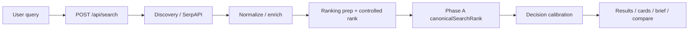

# QuantAI

**Commerce decision engine for online shopping** — not a product catalog, not a generic search widget.

Package name in npm/git: `smartbuy` (legacy/internal). Product brand: **QuantAI**.

---

## What it is

QuantAI helps a shopper decide **what to buy, where, and whether to wait** across multi-merchant offers. It combines upstream shopping discovery with proprietary ranking, product-truth signals, discount authenticity checks, merchant diversity safeguards, and calibrated shopper labels (`BUY` / `COMPARE` / `AVOID` / `BEST VALUE`).

## Problem it solves

Raw shopping search dumps listings. QuantAI turns a tray of offers into a **comparable decision surface**: trust, price realism, discount credibility, and query match — with a single canonical order that stays consistent across the grid, decision brief, and compare lane.

## Why this is not “just another shopping UI”

| Typical shopping aggregator | QuantAI |
|-----------------------------|---------|
| Sort by price / popularity | **Phase A canonical rank** (trust-driven composite) is the authority |
| “Sale!” badges from merchants | **Verified discount** path; weak/fake markdowns are not promoted as deals |
| One retailer dominance | **Merchant diversity** safeguards reorder top slots without deleting valid merchants |
| Ad-hoc “AI scores” | Post-rank **decision calibration** with regression locks |
| Opaque ranking | Ranking decision records + truth foundation for explainability |

Upstream listings come from **SerpAPI → Google Shopping**. QuantAI does **not** own merchant inventory.

---

## Production architecture (concise)



**Authoritative path for default “value” sort:** server Phase A order is preserved on the client; labels come from post-rank calibration — not a second ranking engine.

Details: [`docs/BUYER_ARCHITECTURE_ONE_PAGER.md`](docs/BUYER_ARCHITECTURE_ONE_PAGER.md) · [`docs/LIVE_CAPABILITY_MAP.md`](docs/LIVE_CAPABILITY_MAP.md)

---

## Core capabilities (LIVE / production)

| Capability | Role |
|------------|------|
| **Search / discovery** | SerpAPI shopping fetch, live discovery with timeouts, fusion without early merchant collapse |
| **Phase A ranking** | `resolveCanonicalSearchRank` — single order authority |
| **Decision labels** | `canonicalDecisionCalibration` → BUY / COMPARE / AVOID / BEST VALUE + confidence |
| **Discount authenticity** | Real-discount / discount-confidence engines; chips only for credible evidence |
| **Merchant diversity** | Safeguards reorder concentration; default sort does not dedupe away useful merchants |
| **Product truth** | SKU identity, availability/price observations (Supabase), ranking decision records |
| **Compare** | Compare tray + `/api/search/compare-verdict` |
| **Saved / memory** | Saved products, watchlist, history (Clerk + Supabase) |
| **Auth** | Clerk |
| **Billing** | Stripe checkout / portal / webhooks + plan entitlements |
| **Stabilization** | Pipeline cache, stale-tray prefer, circuit breaker, rate limits, heuristic commerce AI in beta |

## DORMANT / OFF (do not pitch as live)

Large “shadow” / phase stacks (commerce brain, autonomous commerce OS, normalization APPLY, controlled activation apply, etc.) default **OFF**. Production beta skips them when flags are disabled. See [`docs/LIVE_CAPABILITY_MAP.md`](docs/LIVE_CAPABILITY_MAP.md).

---

## Stack

| Layer | Technology |
|-------|------------|
| App | Next.js 16 (App Router), React 19 |
| Hosting | Vercel |
| Auth | Clerk |
| Database | Supabase (Postgres) |
| Search upstream | SerpAPI |
| AI (compare / copilot / optional batch) | OpenAI |
| Billing | Stripe |
| Rate limit (optional) | Upstash Redis |

---

## Quick start (developers)

```bash
cp .env.example .env.local   # fill CORE DEMO keys — see docs/ENVIRONMENT.md
npm install
npm run env:check
npm run dev
```

**Never** run bare `vercel env pull` (can wipe local secrets). Use `npm run env:pull`.

Buyer env guide: [`docs/ENVIRONMENT.md`](docs/ENVIRONMENT.md)

---

## Acquisition / Technical Due Diligence

For buyer due diligence, start here:  
[`docs/FINAL_BUYER_DATA_ROOM.md`](docs/FINAL_BUYER_DATA_ROOM.md)

| Doc | Purpose |
|-----|---------|
| [`docs/ACQUISITION_EXECUTIVE_SUMMARY.md`](docs/ACQUISITION_EXECUTIVE_SUMMARY.md) | ~2-page executive summary |
| [`LICENSE`](LICENSE) | Proprietary / transfer draft |
| [`docs/IP_AND_OWNERSHIP.md`](docs/IP_AND_OWNERSHIP.md) | What is owned vs third-party |
| [`docs/ACQUISITION_HANDOVER.md`](docs/ACQUISITION_HANDOVER.md) | Master handover |
| [`docs/ACCESS_AND_SECRETS_HANDOVER.md`](docs/ACCESS_AND_SECRETS_HANDOVER.md) | Credentials inventory |
| [`docs/BUYER_RISK_REGISTER.md`](docs/BUYER_RISK_REGISTER.md) | Material risks |
| [`docs/GOLDEN_DEMO_QUERIES.md`](docs/GOLDEN_DEMO_QUERIES.md) | Buyer demo query pack |
| [`docs/DEMO_LATENCY_PROOF.md`](docs/DEMO_LATENCY_PROOF.md) | Latency / stale-prefer evidence |

---

## Quality evidence (verified acquisition gates)

Do **not** claim that all ~477 `test:*` scripts run in CI. These gates were verified green in Acquisition Sprint 1:

| Gate | Result |
|------|--------|
| `npm run build` | PASS |
| `npx tsc --noEmit` | PASS |
| `npm run test:phase-a-rank-authority` | **11/11** |
| `npm run test:phase-a-decision-calibration` | **17/17** |
| `npm run test:phase4-ranking-validation` | **23/23** |
| `npm run test:p0-production-readiness` | PASS (includes merchant-diversity) |

---

## Known limitations (honest)

- Search quality and latency depend on **SerpAPI** (and network). Cold first search can be slow; warm/stale paths improve demo stability.
- Product inventory is **not** proprietary.
- Many intelligence modules exist in-repo but are **flagged off**.
- Platform coupling: Vercel + Clerk + Supabase (migration is non-trivial).

---

## License

Proprietary — see [`LICENSE`](LICENSE). Counsel confirmation required for closing. Open-source dependencies remain under their own licenses.
