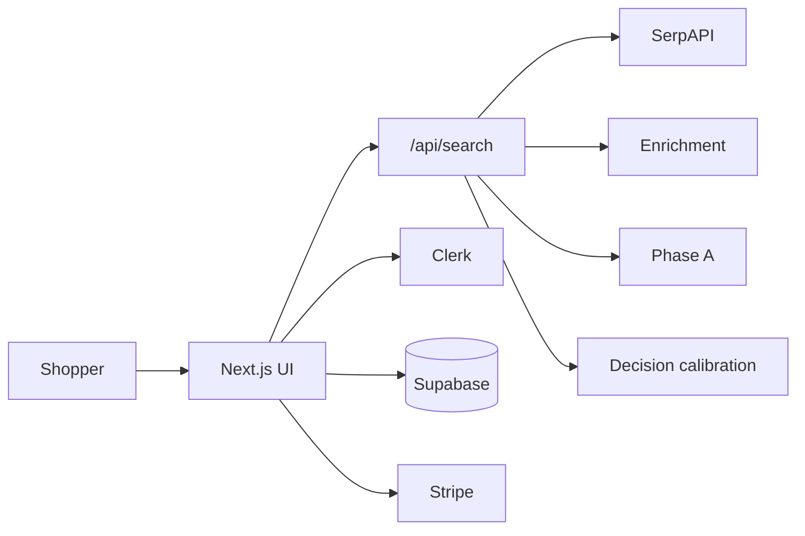

# 01 — Executive Summary

| Field | Value |
|-------|--------|
| Product brand | QuantAI |
| Repository package | `smartbuy@0.1.0` (`private: true`) |
| Document class | M&A technical / commercial diligence |
| Evidence basis | Repository only |
| Commercial status | **Pre-revenue** (no verified ARR/customers in-repo) |

Canonical counts and terms: see [`MASTER_INDEX.md`](./MASTER_INDEX.md).

---

## What QuantAI is

QuantAI is an AI-assisted **commerce decision web application**. A shopper submits a product query; the server:

1. Discovers multi-merchant offers via **SerpAPI** (`SERPAPI_KEY`)
2. Enriches products with commerce / trust / value signals
3. Orders results under **Phase A** (`lib/truth/canonicalSearchRank.ts`) — the final ranking authority
4. Applies **decision calibration** (`lib/ui/canonicalDecisionCalibration.ts`) producing labels: `BUY`, `STRONG BUY`, `BEST VALUE`, `COMPARE`, `AVOID`
5. Returns a tray consumed by the Next.js UI (results, compare, save, accounts)

QuantAI does **not** own retailer inventory or a proprietary global catalog. The transferable asset is the **decision system** (orchestration, ranking, calibration, UI, persistence, billing wiring).

---

## Commercial posture

| Topic | Repository evidence |
|-------|---------------------|
| Runnable surface | 12 pages + `GET`/`POST` `/api/search` |
| Subscription model coded | Free €0 / Pro €19 / Premium (Power Buyer) €49 in `lib/subscription/plans.ts`; Stripe checkout/portal/webhook routes |
| Revenue / users / GMV | **Not evidenced** → treat as pre-revenue |
| IP | Proprietary draft `LICENSE`; rights transfer only via acquisition agreement |

---

## What transfers (summary)

Included in a typical code/IP deal: repository, application code, migrations, scripts/gates, documentation (including this data room).  

**Not automatic:** third-party SaaS accounts, domains, quotas, production secrets (see [16 — Transfer Checklist](./16_Transfer_Checklist.md)).

---

## Technical snapshot

| Item | Value |
|------|--------|
| Next.js / React | 16.2.4 / 19.2.4 |
| Pages / API handlers | 12 / 21 |
| Migrations / tables | 7 / 15 |
| Intelligence engines (`lib/intelligence/*Engine.ts`) | 151 |
| Auth entrypoint | `proxy.ts` |
| Cron | `vercel.json` → daily `/api/cron/refresh-listings` |

---

## LIVE vs DORMANT

Many `QUANTAI_*` feature flags default **OFF**. Buyer-visible value is the **LIVE** path in `docs/LIVE_CAPABILITY_MAP.md`. Do not value the deal as if all 151 engines are production-active.

---

## Material risks

1. SerpAPI dependency (empty trays without key/quota)  
2. Cold/upstream search latency (multi-second possible)  
3. Vendor concentration (Clerk, Supabase, Vercel, Stripe, OpenAI; Upstash optional)  
4. Maintainability cost of a large search orchestrator + phase estate  
5. Pre-revenue / unproven GTM  

---

## Diligence stance

Treat as a **product + IP** acquisition of a commerce decision engine with a working beta surface. Require LIVE-map review, acquisition gates, and a written credential-transfer plan before close.
