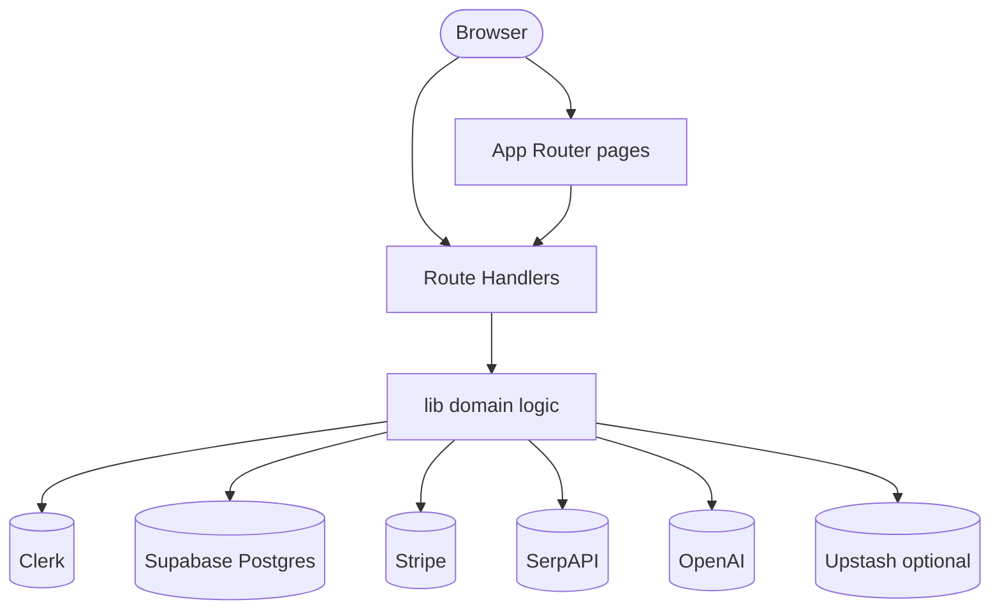
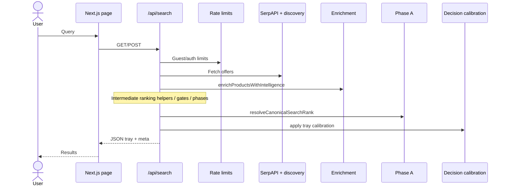

# 04 — System Architecture

Canonical facts: [`MASTER_INDEX.md`](./MASTER_INDEX.md).

---

## Style

QuantAI is a **Next.js App Router monolith**: UI and HTTP APIs co-located; domain logic in `lib/**`; persistence via Supabase. Search is one orchestrated server pipeline (`app/api/search/route.ts`), not a microservice mesh.

---

## Context

---

## Search path (simplified)

Detailed stage list: [07 — Search and Ranking](./07_Search_and_Ranking_System.md).

---

## Design decisions (evidenced)

| Decision | Why it appears in code |
|----------|------------------------|
| Single search orchestrator | Keeps ranking authority and tracing centralized |
| Phase A as final order authority | Prevents UI from inventing a second ranker |
| Experimental stacks behind flags default OFF | Limits production blast radius |
| Beta stabilization ON in production when unset | Prefers demo resilience under slow upstream |
| Clerk for identity, Supabase for app data | Separates auth vendor from Postgres |
| Stripe Checkout subscriptions | Standard SaaS path |

---

## Scalability

| Dimension | Posture |
|-----------|---------|
| Web tier | Serverless-friendly Route Handlers |
| Shared limits | Upstash when configured; **memory fallback is not multi-instance strong** |
| Data | Managed Postgres |
| Bottleneck | SerpAPI latency/quota on cold search |
| Cache | Pipeline `unstable_cache` helpers; optional CRC flag OFF |

Horizontal web scale ≠ discovery cost scale.

---

## Post-close architecture options (not shipped)

Modularize search route; diversify discovery; expose rank+calibrate API; canary dormant layers. See [17 — Roadmap](./17_Roadmap.md).
