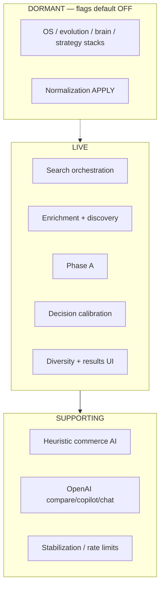

# 06 — AI and Intelligence System

Canonical facts: [`MASTER_INDEX.md`](./MASTER_INDEX.md).  
Production posture source: `docs/LIVE_CAPABILITY_MAP.md`.

---

## Positioning

QuantAI combines **deterministic ranking + signal engines + optional LLM surfaces**.

- **Final results order authority:** Phase A (`lib/truth/canonicalSearchRank.ts`)  
- **Shopper labels:** decision calibration (`lib/ui/canonicalDecisionCalibration.ts`)  
- **LLMs (OpenAI):** compare-verdict, AI chat, copilot, and optional commerce-AI attachment — **not** evidenced as the sole sorter of the primary tray  

---

## Capability classes

---

## Estate size

| Metric | Count |
|--------|------:|
| `*Engine.ts` under `lib/intelligence` | **151** |
| Top-level `lib/` directories | **42** |

File count = R&D inventory density, **not** live activation count.

---

## OpenAI-backed routes (evidenced)

| Route | Auth |
|-------|------|
| `POST /api/search/compare-verdict` | Required |
| `POST /api/ai-chat` | Required |
| `POST /api/copilot/chat` | Guest allowed with rate limits |

Require `OPENAI_API_KEY` for full function.

---

## Flag governance

Common pattern: `parseBool(env, false)` or strict `=== "true"` opt-in under `lib/**/flags.ts`.

Examples of dormant flags: `QUANTAI_IDENTITY_FOUNDATION_ENABLED`, `QUANTAI_TRUST_ENGINE_ENABLED`, `QUANTAI_COMMERCE_MEMORY_ENABLED`, `QUANTAI_RECOMMENDATION_COGNITION_ENABLED`, `QUANTAI_AUTONOMOUS_COMMERCE_OS_ENABLED`, `QUANTAI_CONTROLLED_ACTIVATION_ENABLED`, normalization APPLY flags, and related evolution/brain/strategy/emotional modules.

**Exception:** `QUANTAI_BETA_STABILIZATION` defaults **ON** in production when unset (`lib/search/productionStabilizationEnv.ts`).

When shadow stacks are disabled, production code paths skip them via stabilization helpers (see LIVE map).

---

## Diligence rule

Do not price “151 live AI engines.” Price the **LIVE decision core** plus optional dormant inventory.
