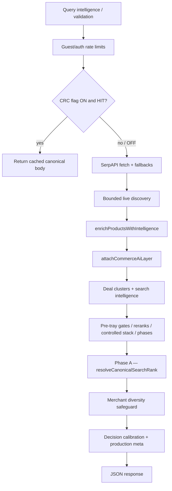

# 07 — Search and Ranking System

Canonical facts: [`MASTER_INDEX.md`](./MASTER_INDEX.md).

---

## Entry points

| Method | Path | Auth |
|--------|------|------|
| `GET` | `/api/search?q=` | Public (optional Clerk for tier) |
| `POST` | `/api/search` | Public; body `query`/`q`; optional `commerceMemory` |

Implementation: `app/api/search/route.ts`.

---

## Pipeline (evidenced structure)

Intermediate stages traced in-route include (non-exhaustive): predictive/persona/market ranking helpers, hard identity gate, semantic rerank, buying-decision order, controlled stack, optional shadow stages when flags allow, phase92/93/95 and later fusion/activation helpers, controlled ranking execution helpers. **Phase A remains the documented final order authority** (`docs/LIVE_CAPABILITY_MAP.md`).

Optional **canonical response cache** (`QUANTAI_SEARCH_CANONICAL_RESPONSE_CACHE`) defaults **OFF**.

---

## Ranking components

| Component | Path | Role |
|-----------|------|------|
| Phase A | `lib/truth/canonicalSearchRank.ts` | Final order authority |
| Trust-driven composite | `lib/truth/trustDrivenCompositeRank.ts` | Supports Phase A |
| Ranking decision records | `lib/truth/rankingDecisionRecord.ts` | Structured inputs |
| Controlled ranking helpers | `lib/ranking/*` | Execution helpers — not a second product authority |
| Merchant diversity | `lib/search/merchantDiversityRerank.ts` | Concentration safeguard |
| Top-3 diversity | `lib/search/top3DiversityIntegrity.ts` | Integrity helper |

---

## Decision labels

Module: `lib/ui/canonicalDecisionCalibration.ts`  

Recommendation labels: `BUY`, `STRONG BUY`, `BEST VALUE`, `COMPARE`, `AVOID`.  
Tray rules include buy-tier caps and mismatch → `AVOID` discipline (see source). Display mapping may surface phrases such as `BUY READY` for some BUY-tier labels.

Applied on tray via production readiness activation (`lib/ui/phase45ProductionReadinessActivation.ts`).

---

## Stabilization & abuse

| Mechanism | Module |
|-----------|--------|
| Beta stabilization env | `lib/search/productionStabilizationEnv.ts` |
| Pipeline cache wrappers | `lib/search/productionStabilization.ts` (`unstable_cache`) |
| Abuse limits | `lib/search/searchAbuseProtection.ts` + `lib/rate-limit.ts` |
| Reliability / degraded serve | `lib/search/searchReliabilityGuardrails.ts` |

---

## Quality gates (scripts exist)

| npm script | Focus |
|------------|--------|
| `test:phase-a-rank-authority` | Phase A |
| `test:phase-a-decision-calibration` | Calibration |
| `test:phase4-ranking-validation` | Ranking validation |
| `test:merchant-diversity` | Diversity |

CI runs a **subset** of all `test:*` scripts — diligence should invoke these gates explicitly.

---

## Scalability

Request handlers scale with the host; throughput and latency are dominated by SerpAPI. Multi-instance rate limiting requires Upstash.
