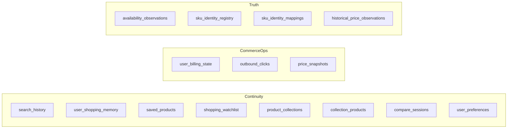

# 08 — Database Architecture

Canonical facts: [`MASTER_INDEX.md`](./MASTER_INDEX.md).

---

## Platform

| Item | Evidence |
|------|----------|
| Provider | Supabase (Postgres) |
| Server access | Service role via `lib/supabaseAdmin.ts` |
| End-user identity | Clerk user IDs (not Supabase Auth) |
| Migrations | 7 files under `supabase/migrations/` |
| Tables created | **15** distinct `public.*` tables |

---

## Tables

| Table | Migration family |
|-------|------------------|
| `search_history` | intelligence foundation (+ RLS re-assert) |
| `user_shopping_memory` | foundation (+ RLS) |
| `shopping_watchlist` | foundation; altered in launch retention |
| `product_collections` | foundation |
| `collection_products` | foundation |
| `saved_products` | saved/compare prefs |
| `compare_sessions` | saved/compare prefs |
| `user_preferences` | saved/compare prefs |
| `price_snapshots` | launch retention / billing attribution |
| `outbound_clicks` | launch retention |
| `user_billing_state` | launch retention (Stripe webhook target) |
| `availability_observations` | phase1b |
| `sku_identity_registry` | phase1c |
| `sku_identity_mappings` | phase1c |
| `historical_price_observations` | phase1d |

---

## RLS

Migrations enable/assert RLS on multiple continuity tables. Service-role server paths bypass RLS — Route Handlers must enforce `userId` checks.

---

## Gap (proven)

| Reference | Status |
|-----------|--------|
| `quantai_feedback` (used by `/api/feedback`) | **Not created** in the 7 migrations; API soft-fails persistence |

---

## Portability

SQL is portable in principle; the app assumes Supabase JS + service-role patterns. Transfer = project move or new project + migrate + rotate keys.
