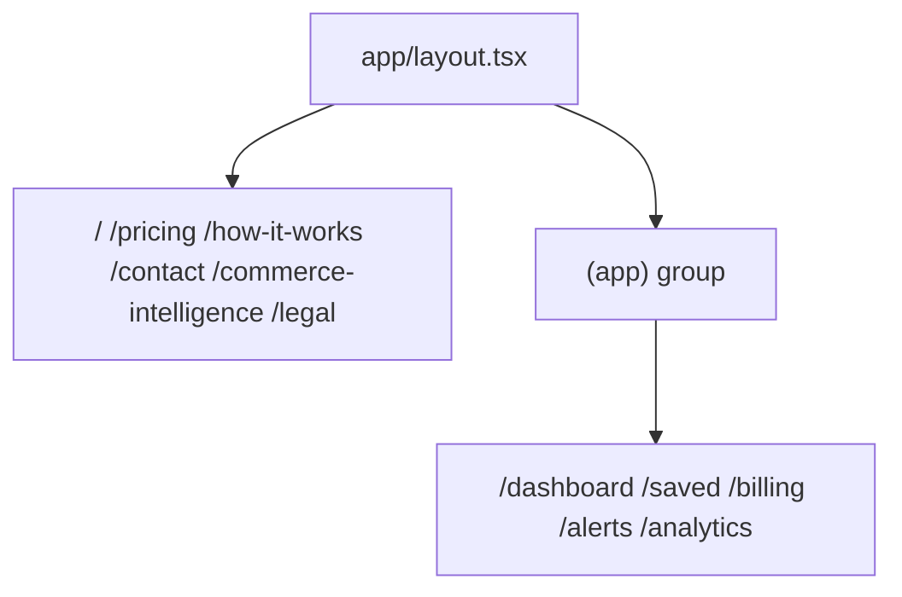

# 10 — Frontend Architecture

Canonical facts: [`MASTER_INDEX.md`](./MASTER_INDEX.md).

---

## Stack

- Next.js App Router + React 19  
- Root `app/layout.tsx` → `ClerkProvider`  
- Auth chrome: `app/(app)/layout.tsx` → `AppChrome`  
- Tailwind CSS 4 toolchain  

---

## Routing

`(app)` does not appear in URLs. Page protection: `proxy.ts` `auth.protect()` on the five protected prefixes.

---

## Components

**23** top-level directories under `components/`, including: `search` (17 `.tsx`), `landing`, `home`, `shell`, `subscription`, `copilot`, `trust`, `legal`, `system`, `loading`, `empty`, and others.

Primary product UI lives in `components/search/` (cards, results surface, hero search, compare panel, toolbars).

Clerk UI: modal `SignInButton` / `SignUpButton`, `UserButton`, `useUser` in nav/pricing components. **No** `app/sign-in` or `app/sign-up` route folders.

---

## Incomplete surface (proven)

`/analytics` renders placeholder copy (“will aggregate…”) — not a finished analytics product. Prefer describing watchlist `/alerts` and dashboard for continuity demos.

---

## Design decisions

| Decision | Effect |
|----------|--------|
| Search-first `/` | Demo funnel starts at home |
| Modal auth | Fewer dedicated auth pages |
| Labels on cards | Calibration becomes visible product value |

---

## Scale

Marketing pages may SSG where configured (`generateStaticParams` for commerce-intelligence pairs; legal slugs). Search UX latency follows `/api/search`.
