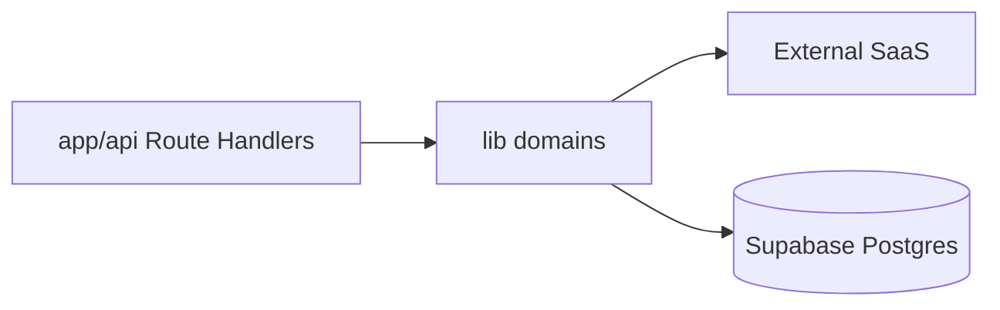

# 11 — Backend Architecture

Canonical facts: [`MASTER_INDEX.md`](./MASTER_INDEX.md).

---

## Model

Backend = **Next.js Route Handlers** + **`lib/**` modules**. No separate long-running app server is defined in-repo.

---

## `lib/` domains

**42** top-level directories under `lib/`, including: `analytics`, `api`, `cognition`, `commerce`, `copilot`, `deals`, `decision`, `governance`, `intelligence`, `intent`, `ranking`, `search`, `stripe`, `subscription`, `taste`, `truth`, `ui`, `redis`, `env`, and others.

Cross-cutting files include `lib/rate-limit.ts`, `lib/supabaseAdmin.ts`, `lib/redis/upstashClient.ts`, `lib/env/quantaiEnv.ts`, `lib/stripe/*`.

---

## Scheduled work

| Job | Mechanism |
|-----|-----------|
| Listing refresh | Vercel cron → `GET /api/cron/refresh-listings` → refresh worker |
| Auth | Bearer `CRON_SECRET` |

---

## Design decisions

1. Colocate API with UI — single deploy unit  
2. Fat search orchestrator — ranking authority centralized; file complexity high  
3. Service-role Supabase — simple writes; requires careful handler authz  

---

## Scale / resilience

| Concern | In-repo approach |
|---------|------------------|
| Enrichment CPU | Per-request on serverless |
| Shared rate limits | Upstash when configured |
| Pipeline cache | `unstable_cache` helpers |
| Upstream failure | Timeouts / stale-prefer / circuit patterns in search reliability modules |
