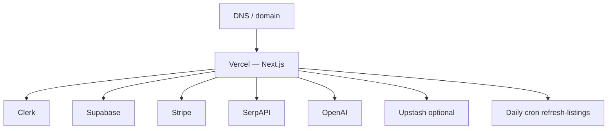

# 14 — Infrastructure

Canonical facts: [`MASTER_INDEX.md`](./MASTER_INDEX.md).

---

## Topology

---

## Components

| Component | Role |
|-----------|------|
| Vercel | App host + cron |
| Clerk | Auth |
| Supabase | Postgres |
| Stripe | Subscriptions |
| SerpAPI | Discovery (**critical**) |
| OpenAI | AI surfaces |
| Upstash | Shared rate limits (recommended multi-instance) |

---

## Cron

From `vercel.json`: path `/api/cron/refresh-listings`, schedule `0 0 * * *`.

---

## Observability (evidenced)

| Signal | Location |
|--------|----------|
| Health | `/api/health` |
| Logging helpers | `lib/log/*` |
| Client analytics API | `/api/analytics/event` (+ optional sink) |
| CI / weekly validation | `.github/workflows/*` |
| Local validation output dir | `.validation/` (ops artifact) |

No full third-party APM product is asserted beyond these.

---

## Cost drivers (qualitative only)

SerpAPI usage, OpenAI usage, Vercel, Clerk, Supabase, Stripe, optional Upstash. **Exact monthly spend is not in source** — seller financial input required.

---

## Resilience summary

| Strength | Limitation |
|----------|------------|
| Managed SaaS reduces ops load | Vendor lock-in / ToS |
| Serverless request scale | Cold search inherits SerpAPI latency |
| Optional Redis sharing | Memory rate-limit fallback inconsistent across isolates |
| Stabilization helpers | Do not remove upstream dependency |
