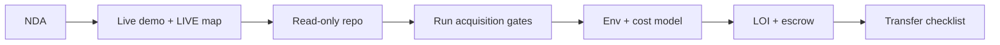

# 20 — Buyer Overview

Canonical facts: [`MASTER_INDEX.md`](./MASTER_INDEX.md).

---

## Good fit

| Buyer type | Why |
|------------|-----|
| Commerce / comparison / affiliate strategics | Decision layer over multi-merchant offers |
| Shopping-assistant / AI product teams | Inherit Phase A + calibration instead of greenfield |
| Technical acquirers | Runnable Next.js app + documented transfer |
| Platforms considering embed | Option to API-ize rank/calibrate post-close |

---

## Poor fit (without eyes open)

| Buyer type | Why |
|------------|-----|
| Needs proven ARR now | Pre-revenue in-repo |
| Needs exclusive inventory | Catalog not owned |
| Wants zero SaaS vendors | SerpAPI/Clerk/Supabase/Vercel material |
| Expects all experimental AI live | Flags default OFF; `/analytics` unfinished |

---

## Diligence path

---

## What to pay for

**Pay for:** Phase A authority, decision calibration, merchant diversity, truth foundations, working search UI, stabilization patterns, regression corpus.  

**Do not pay for:** dormant flag forests as if live; unverified traction; catalog ownership fantasy.

---

## Commercial reminder

**Pre-revenue** software/IP asset per repository evidence. Upside depends on buyer distribution and execution after close.

Return to [`MASTER_INDEX.md`](./MASTER_INDEX.md).
