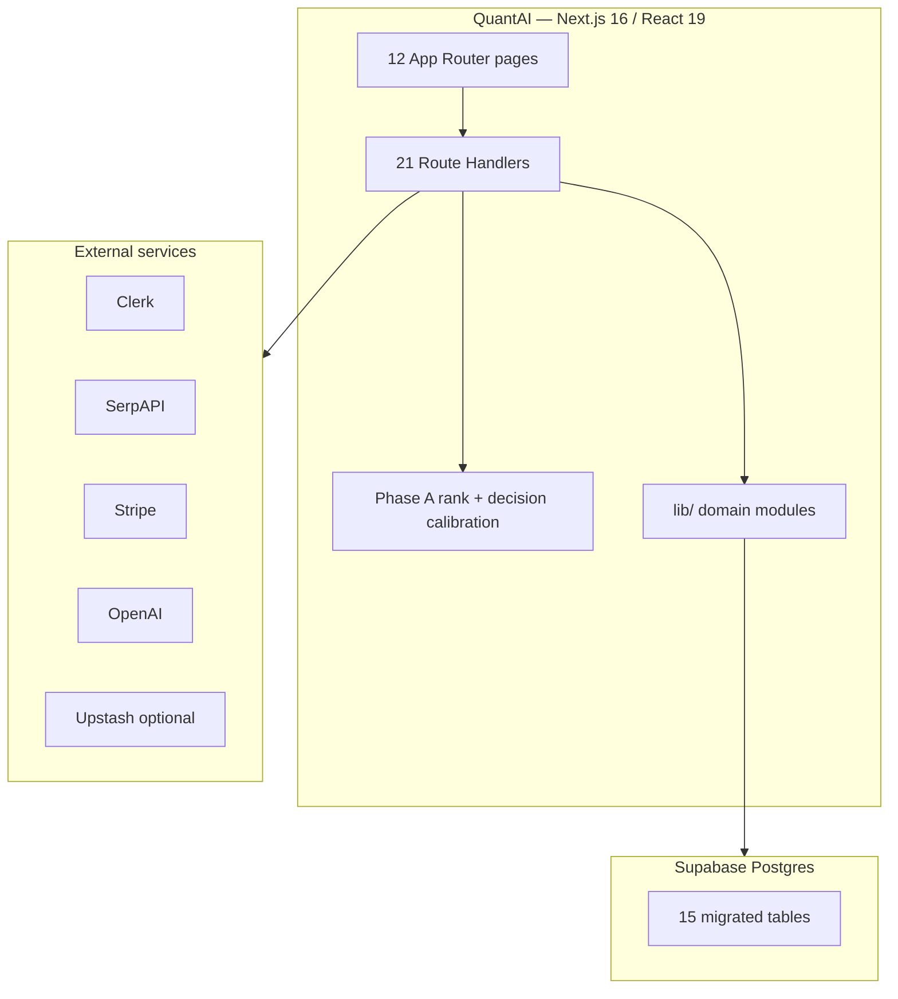

# QuantAI Acquisition Data Room — Master Index

| Field | Value |
|-------|--------|
| **Product brand** | QuantAI |
| **npm package** | `smartbuy@0.1.0` (`private: true`) |
| **Audience** | Investors and technical buyers (typically under NDA) |
| **Evidence rule** | Only repository-proven statements |
| **Commercial status** | **Pre-revenue** — no verified ARR, MRR, customers, or traffic in-repo |

This folder is the diligence homepage.

---

## Canonical facts (use identically everywhere)

| Fact | Verified value | Evidence |
|------|----------------|----------|
| App Router pages | **12** `page.tsx` files | `app/**/page.tsx` |
| API route handlers | **21** `route.ts` files | `app/api/**/route.ts` |
| SQL migrations | **7** | `supabase/migrations/` |
| Postgres tables created | **15** | `create table` in migrations |
| `*Engine.ts` in `lib/intelligence` | **151** | file count |
| Top-level `lib/` directories | **42** | directory count |
| Top-level `components/` directories | **23** | directory count |
| Search UI components | **17** `.tsx` in `components/search` | file count |
| Framework | Next.js **16.2.4**, React **19.2.4** | `package.json` |
| Auth entrypoint | `proxy.ts` (`clerkMiddleware`) — **no** `middleware.ts` | repo root |
| Plans (code) | Free **€0** · Pro **€19** · Premium id `premium` display name **Power Buyer** **€49** | `lib/subscription/plans.ts` |
| Plan caps (searches/day) | 20 / 120 / 400 | same |
| AI turns/day (coded) | 12 / 80 / 250 | same |
| Recommendation labels | `BUY` · `STRONG BUY` · `BEST VALUE` · `COMPARE` · `AVOID` | `canonicalDecisionCalibration.ts` |
| Final ranking authority | Phase A — `lib/truth/canonicalSearchRank.ts` | source |
| Discovery upstream | SerpAPI (`SERPAPI_KEY`) | search fetch path |
| Hosting config | Vercel cron daily → `/api/cron/refresh-listings` | `vercel.json` |

**Terminology rules**

- Say **Phase A** for canonical rank authority (not “the AI ranks results”).  
- Say **decision calibration** for shopper labels (not “LLM labels”).  
- Say **LIVE** vs **DORMANT** per `docs/LIVE_CAPABILITY_MAP.md`.  
- Say **pre-revenue** unless seller provides external financials.  
- Say **Premium (Power Buyer)** when referring to the €49 plan.

---

## Start here

1. [01 — Executive Summary](./01_Executive_Summary.md)  
2. [20 — Buyer Overview](./20_Buyer_Overview.md)  
3. [LIVE capability map](../../docs/LIVE_CAPABILITY_MAP.md) *(critical)*  
4. [07 — Search and Ranking](./07_Search_and_Ranking_System.md)  

---

## Document map

| # | Document |
|---|----------|
| 01 | [Executive Summary](./01_Executive_Summary.md) |
| 02 | [Product Overview](./02_Product_Overview.md) |
| 03 | [Features](./03_Features.md) |
| 04 | [System Architecture](./04_System_Architecture.md) |
| 05 | [Technical Stack](./05_Technical_Stack.md) |
| 06 | [AI and Intelligence System](./06_AI_and_Intelligence_System.md) |
| 07 | [Search and Ranking System](./07_Search_and_Ranking_System.md) |
| 08 | [Database Architecture](./08_Database_Architecture.md) |
| 09 | [API Overview](./09_API_Overview.md) |
| 10 | [Frontend Architecture](./10_Frontend_Architecture.md) |
| 11 | [Backend Architecture](./11_Backend_Architecture.md) |
| 12 | [Security](./12_Security.md) |
| 13 | [Deployment Guide](./13_Deployment_Guide.md) |
| 14 | [Infrastructure](./14_Infrastructure.md) |
| 15 | [Repository Structure](./15_Repository_Structure.md) |
| 16 | [Transfer Checklist](./16_Transfer_Checklist.md) |
| 17 | [Roadmap](./17_Roadmap.md) |
| 18 | [FAQ](./18_FAQ.md) |
| 19 | [Assets Included](./19_Assets_Included.md) |
| 20 | [Buyer Overview](./20_Buyer_Overview.md) |
| — | [Audit Report](./AUDIT_REPORT.md) |

---

## System snapshot

---

## Companion packs

| Pack | Path |
|------|------|
| Seller narrative | `docs/acquisition/` |
| Public listing kit | `docs/sale-launch/` |
| Buyer data room (legacy) | `docs/FINAL_BUYER_DATA_ROOM.md` |
| Environment / secrets | `docs/ENVIRONMENT.md`, `docs/ACCESS_AND_SECRETS_HANDOVER.md` |
| Moat / risks | `docs/TECHNICAL_MOAT.md`, `docs/BUYER_RISK_REGISTER.md` |

---

## Suggested technical DD order

Executive Summary → System Architecture → Search & Ranking → AI System → Database → API → Security → Deployment → Transfer Checklist → run gates (`test:phase-a-rank-authority`, `test:phase-a-decision-calibration`, `test:phase4-ranking-validation`, `test:merchant-diversity`, build/tsc).
