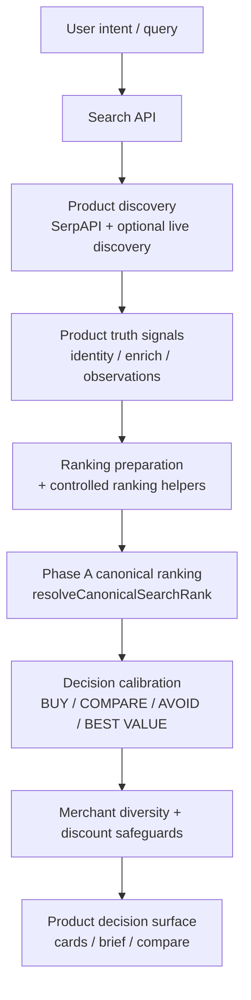

# QuantAI — Buyer Architecture One-Pager

**Brand:** QuantAI · **Code package:** `smartbuy`  
**Purpose:** Explain the production system in ~2 minutes of reading.

---

## Primary production flow

| Stage | Authority |
|-------|-----------|
| Discovery | Upstream listings (SerpAPI). QuantAI does not invent inventory. |
| **Phase A** | **Final product order** for default value sort — `lib/truth/canonicalSearchRank.ts` |
| Calibration | Shopper **labels + confidence** after rank — `lib/ui/canonicalDecisionCalibration.ts` |
| Diversity | Reorders concentration; does not replace Phase A authority |
| Discount | Credible evidence only for promotional chips / value boost |

Client default sort `"value"` **preserves** server Phase A order (no client re-rank).

---

## PRODUCTION CORE

- `POST /api/search` orchestration (`app/api/search/route.ts`)
- Fetch / fusion / enrichment / tray integrity / Phase 92–95 hardening in active path
- Phase A canonical rank + ranking decision records
- Decision calibration + Phase 45 production readiness wiring
- Merchant diversity safeguard + verified discount path
- Results UI: `ProductResultsSurface`, cards, compare, decision brief sync
- Clerk auth, Supabase persistence, Stripe billing routes
- Stabilization: cache, stale-prefer, timeouts, circuit breaker

## SUPPORTING INFRASTRUCTURE

- Vercel hosting + Next `unstable_cache`
- Rate limits (Upstash optional; memory fallback)
- OpenAI for compare/copilot/optional commerce AI (heuristic AI in beta)
- Cron refresh listings
- Analytics event sink (optional)
- Offline regression scripts + CI subset

## DORMANT / EXPERIMENTAL SYSTEMS

Flag-gated stacks default **OFF** (identity foundation apply, trust engine flag, commerce memory, recommendation cognition, autonomous commerce OS/brain/evolution/strategy, controlled activation apply, normalization APPLY, live adaptive signals, etc.).  
When beta stabilization detects all off → **shadow stack skipped** on the search path.

**Do not** describe these as live product features unless flags are explicitly enabled and validated.

Full map: [`LIVE_CAPABILITY_MAP.md`](./LIVE_CAPABILITY_MAP.md).

---

## What buyers should freeze after acquisition

Phase A ranking, decision calibration semantics, card layout, merchant diversity rules, discount authenticity gates — unless a deliberate post-close program exists.
