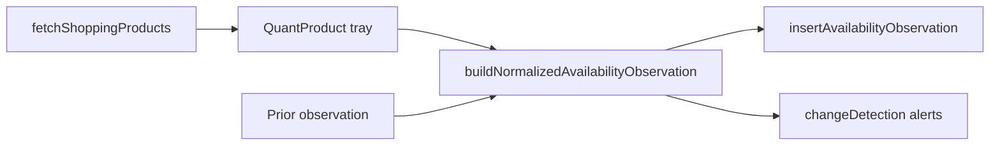

# Phase 1B.2 — Availability Intelligence Layer (Architecture)

**Date:** June 2026  
**Status:** Implemented (library only — no UI, verdict, or cron wiring)

---

## Scope

Pure intelligence modules under `lib/truth/` that transform SerpApi listing signals and refresh match outcomes into normalized `AvailabilityObservationInsert` records compatible with the Phase 1B.1 table.

**Explicitly out of scope for 1B.2:**

- UI changes
- Verdict / BUY READY / Phase 1A truth gate changes
- Cron routes or SerpApi network calls from workers
- Database writes (callers use `insertAvailabilityObservation` in later steps)

---

## Module Map

```
lib/truth/
├── availabilityClassifier.ts      # SerpApi text → IN_STOCK | OUT_OF_STOCK | …
├── freshnessScore.ts              # Age → 100 | 80 | 60 | 30
├── availabilityChangeDetector.ts  # Prior vs next snapshot diff
├── listingRefreshAdapter.ts       # Tray match → normalized observation
├── availabilityIntelligence.ts    # Barrel exports
├── availabilityObservation.ts     # 1B.1 persistence (unchanged wiring)
└── availabilityObservationTypes.ts
```

---

## 1. AvailabilityClassifier

**File:** `lib/truth/availabilityClassifier.ts`

### Output labels (intelligence layer)

| Label | DB `availability` |
|-------|-------------------|
| `IN_STOCK` | `in_stock` |
| `OUT_OF_STOCK` | `out_of_stock` |
| `LIMITED` | `limited` |
| `REMOVED` | `removed` |
| `SELLER_UNAVAILABLE` | `seller_unavailable` |
| `UNKNOWN` | `unknown` |

### SerpApi signal inputs

Parsed from Google Shopping rows via `parseSerpApiAvailabilitySignals()`:

- `extensions[]` (first chip: "In stock", "Out of stock", etc.)
- `condition`, `second_hand`
- `delivery`, `snippet`
- Optional `availability` string field

### Classification priority

1. Structural label from refresh adapter (`REMOVED`, `SELLER_UNAVAILABLE`) — highest priority
2. Out-of-stock / sold-out / unavailable text
3. Limited stock / preorder / backorder
4. In-stock / available / fulfillment present
5. Second-hand without stock signal → `UNKNOWN`
6. Default → `UNKNOWN`

### Key exports

- `classifySerpApiShoppingRow(row)`
- `classifyAvailability({ … })`
- `classifiedLabelToDbStatus()` / `dbStatusToClassifiedLabel()`

---

## 2. Freshness Scoring Engine

**File:** `lib/truth/freshnessScore.ts`

Age computed from `observed_at` relative to reference time (default `now`).

| Age | `freshness_score` | Band |
|-----|-------------------|------|
| &lt; 24h | 100 | `fresh` |
| 24–48h | 80 | `aging` |
| 48–72h | 60 | `stale` |
| &gt; 72h | 30 | `expired` |

Used at observation build time in the refresh adapter. Phase 1B.5 will consume bands in truth gates.

---

## 3. Change Detector

**File:** `lib/truth/availabilityChangeDetector.ts`

Compares `prior` and `next` observation snapshots.

| Change kind | Trigger |
|-------------|---------|
| `stock_in_to_out` | in_stock/limited → out_of_stock/removed/seller_unavailable |
| `stock_out_to_in` | out path → in_stock/limited |
| `stock_became_limited` | in_stock → limited |
| `listing_removed` | → `removed` |
| `seller_disappeared` | → `seller_unavailable` |
| `price_drop_major` | Δ ≤ −8% (default) |
| `price_increase_major` | Δ ≥ +12% (default) |

Alert intents (for 1B.6 watchlist sync): `out_of_stock`, `back_in_stock`, `seller_disappeared`, `listing_removed`, `price_dropped`, `major_price_up`.

---

## 4. Listing Refresh Adapter

**File:** `lib/truth/listingRefreshAdapter.ts`

Does **not** call SerpApi. Callers pass a `QuantProduct[]` tray (from `fetchShoppingProducts` in future cron/search refresh).

### Match algorithm

1. **Exact link** — normalized URL equality (trailing slash, host case)
2. **Fuzzy** — same store + title similarity ≥ 0.90 + optional `referencePrice` within 15%

### Miss classification

| Tray state | Structural label |
|------------|------------------|
| Empty tray | `REMOVED` |
| Target store still present, link missing | `SELLER_UNAVAILABLE` |
| Store absent from tray | `REMOVED` |

### Normalized output

`NormalizedAvailabilityObservation` extends `AvailabilityObservationInsert` with:

- `classifiedLabel`, `classification`, `matchConfidence`
- `changeDetection` (when `prior` snapshot provided)

### Entry points

| Function | Use case |
|----------|----------|
| `buildNormalizedAvailabilityObservation()` | Full match-or-miss pipeline |
| `buildObservationFromMatchedProduct()` | Known matched product |
| `buildObservationFromSerpApiRow()` | Direct row parse |
| `buildObservationFromRefreshMiss()` | Explicit miss |

---

## Data Flow (future 1B.3+)



---

## Integration Boundaries

| Layer | 1B.2 touch? |
|-------|-------------|
| `truthConfidenceGate.ts` | No |
| `productionSafetyEngine.ts` | No |
| `ProductResultsSurface` | No |
| `app/api/cron/*` | Not created |
| `availability_observations` table | Types only; insert in later step |

---

## Next Step: 1B.3

- Cron route + refresh queue
- Call `fetchShoppingProducts` + `buildNormalizedAvailabilityObservation` + `insertAvailabilityObservation`
- Still no verdict gate changes until 1B.5
