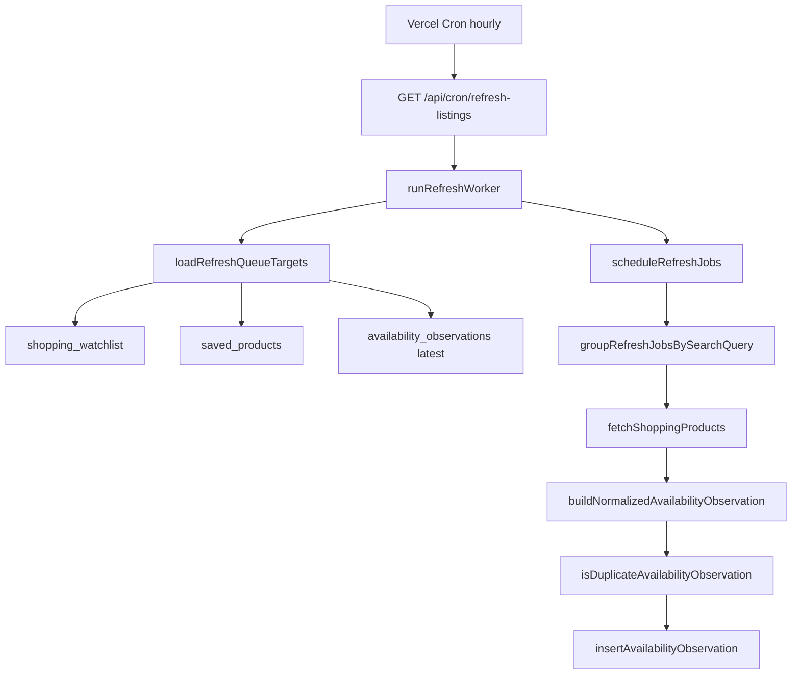

# Phase 1B.3 — Refresh Worker Layer (Architecture)

**Date:** June 2026  
**Status:** Implemented

---

## Objective

Move availability intelligence from passive analysis to **scheduled observation refreshes** without touching UI, search routes, verdicts, BUY READY, or Phase 1A truth gates.

---

## Module Map

```
lib/truth/
├── refreshJobTypes.ts      # Jobs, config, env, search query builder
├── refreshQueue.ts         # Load watchlist + saved → deduped targets
├── refreshScheduler.ts     # Stale-first eligibility + priority + batch cap
├── refreshWorker.ts        # SerpApi fetch → normalize → insert observations
app/api/cron/refresh-listings/route.ts
vercel.json                   # Hourly cron
```

---

## Data Flow



---

## 1. Refresh Queue

Sources (Phase 1B.3):

| Source | Table | Priority |
|--------|-------|----------|
| Watchlist | `shopping_watchlist` | 100 |
| Saved | `saved_products` | 90 |

- Dedupes by normalized listing URL (watchlist wins)
- Attaches latest observation metadata for scheduling

Future (1B.4+): `buy_ready_registry`, `recent_search_listings`

---

## 2. Scheduler

**Eligibility:** `lastObservedAt` age ≥ `REFRESH_MIN_INTERVAL_HOURS` (default 24)

**Priority score:**

```
priority = sourcePriority + min(120, ageHours × 2) + (100 − freshnessScore) × 0.4
```

Stale listings (high age, low freshness) scheduled first. Capped by `REFRESH_BATCH_SIZE` (default 40).

---

## 3. Worker

- Groups jobs by SerpApi search query (one credit per query group)
- Retries fetch up to `REFRESH_MAX_RETRIES`
- Delay `REFRESH_SERPAPI_DELAY_MS` between query groups
- Per-job try/catch — failure isolated to that listing
- Skips insert when observation duplicates prior state (same availability + price + text)
- Writes `source: cron_refresh`

---

## 4. Safety

| Control | Mechanism |
|---------|-----------|
| Rate limiting | Batch cap + inter-query delay |
| Retries | Exponential backoff on SerpApi fetch |
| Failure isolation | Job-level catch; group fetch failure marks group failed |
| Auth | `CRON_SECRET` Bearer on cron route |
| Disable | `REFRESH_ENABLED=false` |
| Dedup jobs | Normalized URL per run |
| Dedup observations | State comparison vs latest row |

---

## Environment

```
CRON_SECRET=
REFRESH_ENABLED=true
REFRESH_BATCH_SIZE=40
REFRESH_STALE_HOURS=24
REFRESH_MIN_INTERVAL_HOURS=24
REFRESH_MAX_RETRIES=2
REFRESH_RETRY_DELAY_MS=800
REFRESH_SERPAPI_DELAY_MS=400
REFRESH_SOURCE_PRIORITY_WATCHLIST=100
REFRESH_SOURCE_PRIORITY_SAVED=90
```

---

## Boundaries (unchanged)

- `app/api/search/route.ts` — not modified
- `truthConfidenceGate.ts` — not modified
- Product UI / cards — not modified

---

## Next: Phase 1C

SKU Identity Layer — stable `sku_id` assignment via canonical identity spine for cross-retailer observation joins.
