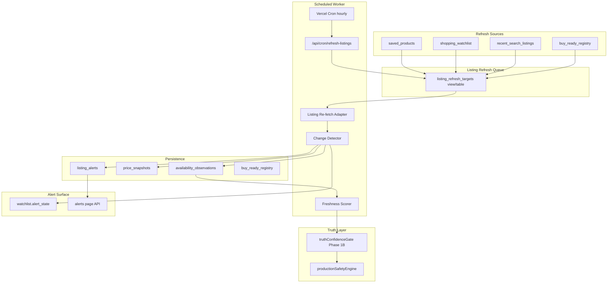
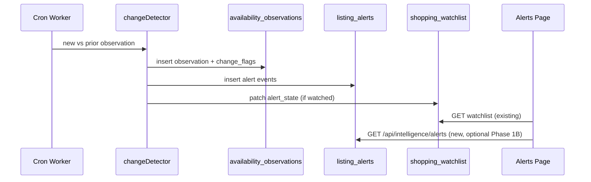

# Phase 1B — Availability Tracking + Snapshot Pipeline

**Date:** June 2026  
**Status:** Architecture (pre-implementation)  
**Depends on:** Phase 1A Truth Confidence Gate (`lib/truth/truthConfidenceGate.ts`)

---

## Executive Summary

Phase 1B closes the **staleness gap**: today, BUY READY verdicts are computed from a single search snapshot with no server-side revalidation. Watchlist rows store `last_checked_at` but nothing updates it after add. `price_snapshots` is written once on watchlist insert. Market memory lives in **client localStorage only**.

Phase 1B introduces:

1. A durable **`availability_observations`** time-series table
2. A **scheduled refresh worker** that re-fetches tracked listings every 24h
3. **Change detection** (stock, removal, seller, price)
4. **Freshness scoring** fed into truth gates
5. **Verdict downgrades** for stale or unavailable listings
6. **Alert event generation** wired into existing watchlist `alert_state`

No UI redesign. Intelligence pipeline + storage + cron only.

---

## Current State (Gap Analysis)

| Asset | Location | Gap |
|-------|----------|-----|
| `price_snapshots` | `20260518190000_launch_retention_billing_attribution.sql` | Price only; no availability; single write on watchlist add |
| `shopping_watchlist` | Same migration | `last_checked_at` never updated by background job |
| `saved_products` | `20250510140000_saved_products_compare_prefs.sql` | No refresh metadata |
| `search_history` | `20250510120000_intelligence_foundation.sql` | Query text only — no listing URLs |
| SerpApi fetch | `app/api/search/lib/fetchShopping.ts` | Query-level Google Shopping; no URL-direct lookup |
| Truth gate | `lib/truth/truthConfidenceGate.ts` | Evidence from search-time intel only; no freshness/availability |
| Alerts UI | `app/(app)/alerts/page.tsx` | Reads watchlist; no push/email; signals never auto-update |
| Cron | — | **None** — no `vercel.json`, no `/api/cron/*` routes |
| BUY READY cache | — | **None** — decisions are ephemeral per search request |

**Root risk:** A listing can show BUY READY for 24h+ after going out of stock, being delisted, or jumping 30% in price.

---

## Target Architecture



---

## 1. Schema Design

### 1.1 `availability_observations` (new)

Primary time-series for listing truth. Append-only; latest row per `(listing_url, source)` drives gates.

```sql
create table public.availability_observations (
  id uuid primary key default gen_random_uuid(),
  user_id text,                          -- nullable for system/cron writes scoped to owner
  listing_url text not null,
  sku_id text not null,                  -- canonical identity key (see §1.3)
  observed_at timestamptz not null default now(),
  availability text not null,            -- enum-like: in_stock | out_of_stock | limited | unknown | removed | seller_unavailable
  availability_text text,                -- raw SerpApi / parsed text
  current_price numeric,
  shipping_price numeric,
  source text not null,                  -- watchlist | saved | search_cache | buy_ready | cron_refresh
  freshness_score numeric not null,      -- 0–100 computed at write time
  change_flags jsonb not null default '[]'::jsonb,  -- e.g. ["price_drop_major","back_in_stock"]
  metadata jsonb not null default '{}'::jsonb       -- store, title, fetch_latency_ms, match_confidence
);

create index availability_obs_listing_observed_idx
  on public.availability_observations (listing_url, observed_at desc);

create index availability_obs_sku_observed_idx
  on public.availability_observations (sku_id, observed_at desc);

create index availability_obs_user_observed_idx
  on public.availability_observations (user_id, observed_at desc)
  where user_id is not null;
```

**RLS:** Same pattern as `price_snapshots` — user owns rows where `user_id` matches JWT `sub`. Service role (cron) bypasses via `supabaseAdmin`.

**Retention:** Keep 90 days per link (prune job monthly) or cap at 50 rows per `(listing_url, user_id)`.

### 1.2 Extend existing tables (minimal)

| Table | New columns | Purpose |
|-------|-------------|---------|
| `shopping_watchlist` | — | Worker updates `last_checked_at`, `last_seen_price`, `alert_state` |
| `saved_products` | `last_checked_at timestamptz`, `sku_id text` | Refresh eligibility + identity join |
| `price_snapshots` | `availability text`, `sku_id text`, `shipping_price numeric` | Align snapshot schema (optional Phase 1B; observations table is canonical) |

### 1.3 `sku_id` definition

Not a retailer GTIN. Use **canonical identity key** from existing engines:

```
sku_id = sha256(normalize(listing_url_host + canonicalKey))[:32]
```

Where `canonicalKey` comes from `createCanonicalProductIdentity(product).canonicalKey` (`lib/intelligence/productIdentity.ts`). Fallback: `normalizeTitleKey(title)` from `marketMemory.ts`.

This ties observations to the same identity spine used in Phase 37/41 without requiring external SKU databases.

### 1.4 `recent_search_listings` (new — required for objective #2)

`search_history` stores queries, not URLs. Add a lightweight cache:

```sql
create table public.recent_search_listings (
  id uuid primary key default gen_random_uuid(),
  user_id text not null,
  search_query text not null,
  listing_url text not null,
  sku_id text not null,
  product jsonb not null,
  verdict_tier text,                     -- tier at capture time
  captured_at timestamptz not null default now(),
  last_refreshed_at timestamptz
);

create unique index recent_search_listings_user_link_uidx
  on public.recent_search_listings (user_id, listing_url);

create index recent_search_listings_refresh_idx
  on public.recent_search_listings (last_refreshed_at nulls first, captured_at desc);
```

**Write path:** Hook in `app/api/search/route.ts` after Phase 45 — for signed-in users, upsert top N tray links (e.g. top 12 by composite rank, max 30 per user rolling).

### 1.5 `buy_ready_registry` (new — required for objective #2)

Server-side cache of active BUY READY signals:

```sql
create table public.buy_ready_registry (
  id uuid primary key default gen_random_uuid(),
  user_id text not null,
  listing_url text not null,
  sku_id text not null,
  search_query text,
  product jsonb not null,
  tier text not null default 'BUY READY',
  truth_confidence numeric,
  captured_at timestamptz not null default now(),
  last_refreshed_at timestamptz,
  expires_at timestamptz not null default (now() + interval '7 days')
);

create unique index buy_ready_registry_user_link_uidx
  on public.buy_ready_registry (user_id, listing_url);
```

**Write path:** In `sanitizeUniversalDecision` / Phase 45 output path — when final gated tier ∈ `{BUY READY, STRONG BUY, BEST DEAL}`, upsert registry row for authenticated search.

### 1.6 `listing_alerts` (new — alert event log)

```sql
create table public.listing_alerts (
  id uuid primary key default gen_random_uuid(),
  user_id text not null,
  listing_url text not null,
  sku_id text not null,
  alert_type text not null,              -- price_dropped | back_in_stock | seller_disappeared | out_of_stock | major_price_up
  severity text not null default 'info',   -- info | action
  payload jsonb not null default '{}'::jsonb,
  read_at timestamptz,
  created_at timestamptz not null default now()
);

create index listing_alerts_user_created_idx
  on public.listing_alerts (user_id, created_at desc);
```

Watchlist `alert_state` remains the **denormalized latest signal** for fast Alerts page reads; `listing_alerts` is the audit trail.

---

## 2. Listing Re-fetch Strategy

**Constraint:** SerpApi Google Shopping has no stable “fetch by merchant URL” API. `fetchShoppingProducts` is query-based only.

### Recommended adapter: `lib/truth/listingRefreshAdapter.ts`

**Algorithm per target listing:**

1. Load cached `product` JSON (title, store, link, search_query).
2. Build constrained query: `"{title}" {store}` (truncate title to 80 chars).
3. Call existing `fetchShoppingProducts(query, canonicalQuery)`.
4. **Match** candidate row:
   - Exact `link` match (normalized URL), OR
   - Same host + `combinedTitleSimilarity` ≥ 0.90 + price within 15%
5. If no match → `availability = 'removed'` (listing not found in fresh search universe).
6. Parse availability via existing `parseAvailability` (`fetchShopping.ts`).
7. If store present in tray but target link missing → `seller_unavailable` (seller delisted this SKU).

**Fallback tiers:**

| Match confidence | Action |
|------------------|--------|
| ≥ 0.95 link match | Full observation write |
| 0.85–0.95 title+store | Write with `metadata.match_confidence` + lower freshness |
| < 0.85 | `availability = 'unknown'`; do not trigger back-in-stock alerts |

**Cost control:**

- 1 SerpApi credit ≈ 1 re-search (up to 60 results).
- Default batch: **40 listings per cron invocation** (configurable `REFRESH_BATCH_SIZE`).
- Stagger: only rows where `last_checked_at` / `last_refreshed_at` is NULL or > 24h ago.

**Future (Phase 1C):** SerpApi `google_product` engine if `product_id` captured from immersive results.

---

## 3. Scheduled Refresh Worker

### 3.1 Runtime

| Option | Verdict |
|--------|---------|
| Vercel Cron → Next.js route | **Recommended** — matches existing deployment; no new infra |
| Dedicated worker / Supabase Edge | Defer — adds ops surface |
| Client-side polling | Reject — unreliable, drains SerpApi from browsers |

### 3.2 Route: `app/api/cron/refresh-listings/route.ts`

```
GET /api/cron/refresh-listings
Authorization: Bearer ${CRON_SECRET}
```

- Validate `CRON_SECRET` (same pattern as other Vercel cron routes).
- `export const maxDuration = 60` (or platform max).
- Idempotent per run via `refresh_run_id` in logs.

### 3.3 `vercel.json` (new)

```json
{
  "crons": [
    {
      "path": "/api/cron/refresh-listings",
      "schedule": "0 * * * *"
    }
  ]
}
```

Hourly cron + 24h staleness gate ⇒ each listing refreshed roughly once per day. Priority queue ensures watchlist/saved refresh before search cache.

### 3.4 Refresh queue prioritization

Union query with priority score:

| Source | Priority | Max per user per run |
|--------|----------|----------------------|
| `shopping_watchlist` | 100 | 20 |
| `saved_products` | 90 | 15 |
| `buy_ready_registry` | 80 | 10 |
| `recent_search_listings` | 50 | 10 |

Order: `priority DESC, last_refreshed_at ASC NULLS FIRST`. Dedupe by `listing_url` (one fetch serves multiple users if same URL — write one observation per user_id for RLS).

### 3.5 Module layout

```
lib/truth/
  listingRefreshAdapter.ts      # SerpApi re-search + match
  availabilityClassifier.ts     # raw text → availability enum
  changeDetector.ts             # diff vs last observation
  freshnessScore.ts             # 0–100 score
  availabilityTruthGate.ts      # Phase 1B gate extensions
  refreshQueue.ts               # SQL union + batch selection
```

---

## 4. Change Detection

Compare new observation vs **latest prior** `availability_observations` row for same `(listing_url, user_id)`.

| Event | Detection rule | Alert type |
|-------|----------------|------------|
| Out of stock | `in_stock` → `out_of_stock` | `out_of_stock` |
| Back in stock | `out_of_stock` → `in_stock` | `back_in_stock` |
| Removed listing | match fails → `removed` | `seller_disappeared` (if was in_stock) |
| Seller unavailable | store gone from tray, link gone | `seller_disappeared` |
| Major price drop | `Δprice / prior ≥ 0.08` (8%) | `price_dropped` |
| Major price up | `Δprice / prior ≥ 0.12` (12%) | `major_price_up` (info only) |

Thresholds env-configurable:

```
REFRESH_PRICE_DROP_PCT=0.08
REFRESH_PRICE_MAJOR_UP_PCT=0.12
```

`change_flags` on observation row mirrors detected events. Watchlist `alert_state` updated:

```typescript
{
  signal: "price_dropped" | "back_in_stock" | "seller_disappeared" | "out_of_stock" | "tracking_market",
  previousPrice, currentPrice, dropPct,
  availability, freshnessScore,
  updatedAt
}
```

---

## 5. Freshness Scoring

`freshnessScore` (0–100) computed at observation write:

```
base = 100
ageHours = hours since observed_at (0 at write)
agePenalty = min(70, ageHours * 2.5)          # −50 at 20h, −70 cap at 28h+
matchPenalty = (1 - matchConfidence) * 30   # fuzzy match discount
availPenalty = removed ? 90 : out_of_stock ? 40 : unknown ? 25 : 0
sourceBonus = cron_refresh ? 5 : search_cache ? 0 : 3

freshnessScore = clamp(base - agePenalty - matchPenalty - availPenalty + sourceBonus, 0, 100)
```

**Gate input:** `listingAgeHours` from latest observation `observed_at`. Stale threshold: **24h**.

| Freshness band | Meaning |
|----------------|---------|
| 80–100 | Fresh — full truth weight |
| 50–79 | Aging — BUY READY allowed with flag |
| 20–49 | Stale — BUY READY → WAIT |
| 0–19 | Dead — BUY READY → INSUFFICIENT DATA |

---

## 6. Verdict Gates (Phase 1B extensions)

Extend `TruthEvidenceSources` in `truthConfidenceGate.ts`:

```typescript
listingAgeHours: number;
availabilityStatus: "in_stock" | "out_of_stock" | "limited" | "unknown" | "removed" | "seller_unavailable";
freshnessScore: number;
```

### Gate rules (additive to Phase 1A)

| Condition | Action |
|-----------|--------|
| `listingAgeHours > 24` AND tier ∈ buy tiers | `BUY READY` → `WAIT`; gate `stale_listing_24h` |
| `availabilityStatus ∈ {out_of_stock, removed, seller_unavailable}` AND tier ∈ buy tiers | tier → `WAIT`, verdict → `INSUFFICIENT DATA`; gate `listing_unavailable` |
| `freshnessScore < 20` | Same as unavailable |
| `freshnessScore 20–49` AND tier = `BUY READY` | Downgrade to `WAIT` only (verdict stays `WAIT`, not insufficient) |

### Read path integration

1. **Search-time (live):** Observation written synchronously from SerpApi response → `listingAgeHours = 0`, availability from row. No stale gate on fresh search.
2. **Saved/watchlist re-display:** New API `GET /api/intelligence/availability?link=` returns latest observation; client passes into decision rebuild OR server merges before Phase 45.
3. **Production safety:** `applyTruthGateToDecision` called after Phase 1B bundle attached to `productIntelligence`.

New alignment flags: `phase1b_freshness_gate`, `phase1b_stale_listing`, `phase1b_unavailable_listing`.

---

## 7. Alert Generation Pipeline



**Phase 1B scope:** DB events + `alert_state` sync. Email/push deferred to Phase 1D.

**New route (optional):** `GET /api/intelligence/alerts` — returns `listing_alerts` last 30 days merged with watchlist.

---

## 8. API Surface

| Route | Method | Auth | Purpose |
|-------|--------|------|---------|
| `/api/cron/refresh-listings` | GET | `CRON_SECRET` | Scheduled batch refresh |
| `/api/intelligence/availability` | GET | User | Latest observation for link(s) |
| `/api/intelligence/alerts` | GET | User | Alert event feed |
| `/api/search` | POST | User | **Modify:** upsert `recent_search_listings` + `buy_ready_registry` |
| `/api/intelligence/watchlist` | POST | User | **Modify:** seed initial observation on add |

---

## 9. Search Pipeline Hooks

### 9.1 On search completion (`app/api/search/route.ts`)

For authenticated users:

1. Upsert `recent_search_listings` for top tray rows.
2. For gated BUY READY+ decisions, upsert `buy_ready_registry`.
3. Insert `availability_observations` row per product with `source: 'search_cache'`, `observed_at: now`.

### 9.2 On watchlist add (existing route)

After `price_snapshots` insert, also insert `availability_observations` with parsed availability from product JSON.

### 9.3 On decision display (Phase 45)

`applyTruthGateToDecision` receives `listingObservation` looked up by link (in-memory from search tray or DB fetch for saved/watchlist views).

---

## 10. Cost, Limits, and Failure Modes

| Risk | Mitigation |
|------|------------|
| SerpApi credit burn | Batch cap 40/run; 24h min interval; dedupe URLs across users |
| Cron timeout | Process batch sequentially with 12s timeout per fetch; resume next hour |
| False removed signals | Require 2 consecutive `removed` observations before `seller_disappeared` alert |
| Match ambiguity | Lower freshness; no positive alerts on fuzzy match |
| Supabase not configured | Worker no-ops with log; search-time observations skipped gracefully |
| RLS blocking cron | Use `supabaseAdmin` service role only in worker |

**Env vars (new):**

```
CRON_SECRET=
REFRESH_BATCH_SIZE=40
REFRESH_STALE_HOURS=24
REFRESH_PRICE_DROP_PCT=0.08
REFRESH_PRICE_MAJOR_UP_PCT=0.12
REFRESH_ENABLED=true
```

---

## 11. Implementation Phases (within 1B)

| Step | Deliverable | Est. |
|------|-------------|------|
| **1B.1** | Migration: `availability_observations`, `recent_search_listings`, `buy_ready_registry`, `listing_alerts` | 1 PR |
| **1B.2** | `lib/truth/*` modules: classifier, freshness, change detector, refresh adapter | 1 PR |
| **1B.3** | Cron route + `vercel.json` + refresh queue | 1 PR |
| **1B.4** | Search/watchlist write hooks + observation read API | 1 PR |
| **1B.5** | Extend `truthConfidenceGate` + wire Phase 45 / `productionSafetyEngine` | 1 PR |
| **1B.6** | Alert state sync + `scripts/test-phase1b-availability.mjs` | 1 PR |

**Build gate:** `npm run build` + `npx tsc --noEmit` after each step.

---

## 12. Testing Strategy

| Test | Method |
|------|--------|
| Freshness formula | Unit tests on `freshnessScore.ts` |
| Change detection | Unit tests with fixture observation pairs |
| Stale gate | `test-phase1b`: BUY READY + 25h age → WAIT |
| Unavailable gate | out_of_stock → INSUFFICIENT DATA |
| Cron auth | Reject missing `CRON_SECRET` |
| Watchlist sync | Mock refresh → `alert_state.signal = price_dropped` |
| No regression | Existing Phase 1A truth gate tests still pass |

---

## 13. Relation to `price_snapshots`

| | `price_snapshots` | `availability_observations` |
|--|-------------------|----------------------------|
| Purpose | Price history chart | Truth / availability / freshness |
| Write frequency | Watchlist add + worker | Search + watchlist + worker |
| Phase 1B | Continue writing on price change | **Canonical** for gates |

Long-term (Phase 1C): materialized view `listing_latest_truth` joining both. Phase 1B keeps both to avoid breaking `commercePriceHistoryEngine` sample counts.

---

## 14. Success Criteria

- [ ] Every watchlist/saved/BUY READY listing re-checked within 24h when `REFRESH_ENABLED=true`
- [ ] `availability_observations` row exists for each refreshed listing
- [ ] BUY READY downgrades to WAIT when latest observation is > 24h old
- [ ] BUY READY downgrades to INSUFFICIENT DATA when `out_of_stock` / `removed` / `seller_unavailable`
- [ ] Watchlist `alert_state` updates on price drop, back in stock, seller disappeared
- [ ] No new user-visible “verified” language (Phase 1A policy holds)
- [ ] `npm run build` passes

---

## 15. Open Decisions (confirm before code)

1. **Vercel plan** — Cron requires Pro on Vercel. Confirm plan or use external ping (e.g. cron-job.org → `/api/cron/refresh-listings`).
2. **Cross-user URL dedup** — One SerpApi fetch per unique URL per run (recommended: yes).
3. **Double-confirm removed** — Require 2 consecutive `removed` before alert (recommended: yes).
4. **Recent search cap** — 30 listings per user rolling (recommended).
5. **Shipping price** — SerpApi often lacks numeric shipping; store `null` unless parsed from `delivery` text.

---

*Next step: implementation per §11 after approval.*
