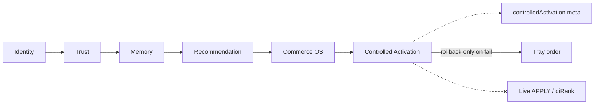

# Controlled Activation Infrastructure Report

**Generated:** 2026-05-21  
**Status:** Complete (code + CI; no production deploy)  
**Discipline:** Canary prep only · global APPLY blocked · no UI changes · no live ranking mutation

---

## Executive summary

QuantAI now has a **controlled activation infrastructure** under `lib/governance/controlledActivation/` that gates any future commerce cognition mutation behind:

- Deterministic 1% (configurable) canary routing
- Category / merchant / confidence scopes
- Mutation governance (8 pre-mutation checks)
- Emergency rollback + cognition freeze
- Shadow-only recommendation apply contracts (max 12% influence cap — prep only)
- Anti-manipulation and diversity protection

**Verdict:** Infrastructure ready for shadow telemetry and governance review. **Not** ready for first live canary mutation until checklist in §10 is complete.

---

## Deliverables map

| # | Deliverable | Path |
|---|-------------|------|
| 1 | Canary activation kernel | `canary/canaryActivationKernel.ts` |
| 2 | Bounded mutation router | `canary/boundedMutationRouter.ts` |
| 3 | Activation traffic allocator | `canary/activationTrafficAllocator.ts` |
| 4 | Deterministic mutation gate | `canary/deterministicMutationGate.ts` |
| 5 | Mutation governance kernel | `mutation/mutationGovernanceKernel.ts` |
| 6 | Ranking safety evaluator | `mutation/rankingSafetyEvaluator.ts` |
| 7 | Replay mutation validator | `mutation/replayMutationValidator.ts` |
| 8 | Commerce mutation auditor | `mutation/commerceMutationAuditor.ts` |
| 9 | Emergency rollback kernel | `rollback/emergencyRollbackKernel.ts` |
| 10 | Cognition freeze controller | `rollback/cognitionFreezeController.ts` |
| 11 | Deterministic state restore | `rollback/deterministicStateRestore.ts` |
| 12 | Bounded recommendation influence | `influence/boundedRecommendationInfluence.ts` |
| 13 | Anti-manipulation governor | `influence/antiManipulationGovernor.ts` |
| 14 | Diversity protection kernel | `influence/diversityProtectionKernel.ts` |
| 15 | Shadow recommendation mutation | `apply/shadowRecommendationMutation.ts` |
| 16 | Apply contracts | `apply/deterministicRecommendationApplyContracts.ts` |
| 17 | Activation replay | `replay/activationReplayContracts.ts`, `deterministicActivationExecution.ts` |
| 18 | Entry point | `buildControlledActivation.ts` |

**Search integration:** After Phase 8 autonomous commerce OS; exports `controlledActivation` / `controlledActivationShadow` meta. Rollback restores link order only when governance fails or emergency disable — never live APPLY.

---

## Canary readiness

| Capability | Status |
|------------|--------|
| 1% traffic routing | `QUANTAI_CANARY_ACTIVATION_PERCENT=0.01` (bucket 0–99 of 10000) |
| Category scope | `QUANTAI_CANARY_CATEGORY_SCOPE` |
| Merchant scope | `QUANTAI_CANARY_MERCHANT_SCOPE` |
| Confidence gate | min 0.55 cognition confidence |
| Emergency disable | `QUANTAI_CANARY_EMERGENCY_DISABLE=true` |
| Global APPLY | **Hard-blocked** — `canaryPercent` forced to 0 if APPLY env true |
| Live mutation | **None** — `mutationAllowed: "shadow_only"` only |

```bash
QUANTAI_CONTROLLED_ACTIVATION_ENABLED=true
QUANTAI_CONTROLLED_ACTIVATION_OBSERVABILITY=true
QUANTAI_CANARY_ACTIVATION_PERCENT=0.01
QUANTAI_NORMALIZATION_APPLY=false
QUANTAI_CANARY_EMERGENCY_DISABLE=false
```

---

## Mutation governance readiness

Pre-mutation checks (all must pass for shadow prep):

| Check | Validator |
|-------|-----------|
| Replay determinism | `replayMutationValidator` |
| Trust integrity | `commerceMutationAuditor` |
| False-collapse rate | commerceId spread |
| Merchant diversity | `rankingSafetyEvaluator` |
| Latency budget | input `latencyBudgetOk` |
| Recommendation stability | diversity ≥ 0.25 |
| Cognition confidence | ≥ 0.45 |
| Ranking safety | top drift ≤ 1 |

Hard-blocks also: production mutation policy, anti-manipulation governor.

---

## Rollback guarantees

| Capability | Mechanism |
|------------|-----------|
| Instant rollback | `restoreProductOrder` from `preMutationLinks` |
| Replay restoration | `restoreId` + stack fingerprint |
| Mutation freeze | `cognitionFreezeController` |
| Trust-state restore | Rollback to baseline tray order (shadow) |
| Activation isolation | Emergency disable + freeze |

---

## Bounded cognition guarantees

| Bound | Value |
|-------|-------|
| Max recommendation influence | 12% (`maxInfluence01: 0.12`) |
| Live apply | `false` (contract) |
| Ranking mutation flag | always `false` |
| Activation fingerprint | `act_*` |

---

## Production risk analysis

| Risk | Level | Mitigation |
|------|-------|------------|
| Global APPLY | **Blocked** | `readControlledActivationFlags` zeros canary if APPLY set |
| Production ranking mutation | **Blocked** | `resolveGlobalMutationPolicy` hard-block |
| Uncontrolled canary | Low | Percent + scope + confidence gates |
| Rollback order change | Low | Only on governance failure |
| UI exposure | **None** | Meta only |

---

## Blockers before first live canary

1. **Explicit live-apply flag** — e.g. `QUANTAI_RECOMMENDATION_LIVE_APPLY` + double confirm (not created).
2. **2+ weeks shadow soak** — `controlledActivationShadow` metrics in production.
3. **Human review** — governance `blockedReasons` false-positive audit.
4. **P95 latency** — activation stage under budget with full stack enabled.
5. **Executive sign-off** — product + eng on 1% canary scope.

---

## Emergency recovery checklist

- [ ] Set `QUANTAI_CANARY_EMERGENCY_DISABLE=true`
- [ ] Verify `controlledActivation.meta.emergencyDisabled` in meta
- [ ] Confirm tray order matches `preMutationLinks` (rollback path)
- [ ] Clear cognition freeze in ops runbook: `clearCognitionFreeze()` (deploy hook / script)
- [ ] Verify `QUANTAI_NORMALIZATION_APPLY=false`
- [ ] Re-run `npm run test:rollback` on incident branch
- [ ] Document incident in architecture audit log

---

## Observability

| Meta key | Contents |
|----------|----------|
| `controlledActivation` | Canary, governance, fingerprint |
| `controlledActivationShadow` | Canary telemetry, mutation confidence, rollback metrics, failure reasons |

Pipeline trace: `controlled_activation`.

---

## CI validation (executed)

| Command | Result |
|---------|--------|
| `npm run build` | PASS |
| `npm run test` | PASS |
| `npm run test:canary` | PASS |
| `npm run test:rollback` | PASS |
| `npm run test:governance-safety` | PASS |
| `npm run test:replay-determinism` | PASS (full suite) |

**Meta lifecycle:** `PASS controlled_activation_wired`, `PASS controlled_activation_module`.

---

## Architecture



---

## What controlled activation did NOT do

- Enable global `QUANTAI_NORMALIZATION_APPLY`
- Mutate all production traffic
- Redesign UI or add chatbot
- Add vector retrieval or autonomous agents
- Apply shadow recommendation influence to live ranking

---

## Sign-off

Controlled activation infrastructure is **complete** for canary preparation and shadow observability. First live canary mutation remains **blocked** until governance checklist and executive sign-off.
