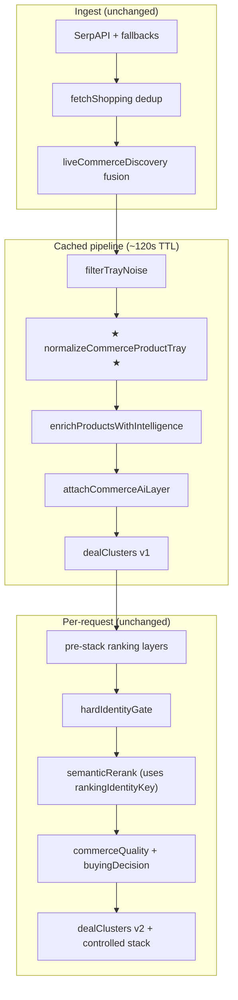
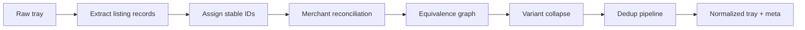

# Phase 0: Canonical Commerce Identity / Product Normalization

**Program:** QuantAI Stabilization Sprint (Phase 0)  
**Priority:** #1 — Core foundation before retrieval, embeddings, or Phase 7  
**Scope:** Product normalization only — no UI, no agents, no memory expansion, no new intelligence layers

---

## 1. Executive Summary

The architecture audit identified **product normalization + canonical listing identity** as the **single highest ROI search-quality intervention**. QuantAI today has fragmented dedup logic (feed title dedup, fusion URL dedup, semantic rerank link dedup) and per-row `qiCanonicalIdentity` — but **no unified normalization pipeline** that assigns stable commerce IDs, collapses duplicates, and propagates identity through ranking.

Phase 0 Priority #1 establishes the **Canonical Commerce Identity layer** — the core foundation of the Commerce Intelligence OS:

| Capability | Status (before) | Status (Phase 0) |
|------------|-----------------|------------------|
| Stable commerce IDs | Per-row `qcp_*` after enrichment only | **`qcid_*` before enrichment** |
| Duplicate detection | Scattered, inconsistent keys | **Unified dedup pipeline** |
| Variant collapse | Partial (`variantNormalization.ts`) | **Variant-key representatives** |
| Cross-merchant equivalence | Tray-local union-find exists in `unifiedMarketMatching` | **OS-level equivalence graph** |
| Ranking identity | Link + title prefix | **`rankingIdentityKey`** |
| Production safety | N/A | **OFF by default, shadow-first** |

**Implementation location:** `lib/intelligence/normalization/`  
**Integration hook:** `enrichProductsWithIntelligence()` — before scoring  
**Ranking hook:** `semanticRerankSearchResults()` — dedup by `rankingIdentityKey`

---

## 2. Architecture Plan

### 2.1 Layer classification

| Layer class | Phase 0 role |
|-------------|--------------|
| **Infrastructure** | Normalization flags, tray meta telemetry, migration gates |
| **Intelligence** | Identifier extraction (GTIN/SKU/MPN), variant spine |
| **Ranking** | Representative selection, dedup before composite scoring |
| **Cognition / Governance / Simulation** | **Not in scope** |
| **UX** | **Not in scope** — meta only |

### 2.2 Module architecture

```
lib/intelligence/normalization/
├── types.ts                    # QiNormalizedCommerceIdentity, tray meta
├── flags.ts                    # QUANTAI_NORMALIZATION_* env
├── canonicalId.ts              # Stable ID strategy (qcid_, qcfg_, qcec_, qlk_, qrk_)
├── merchantReconciliation.ts   # Same-store near-duplicate detection
├── equivalenceGraph.ts         # Union-find cross-merchant clustering
├── variantCollapse.ts          # Variant-key representative selection
├── dedupPipeline.ts            # Multi-stage dedup orchestration
├── normalizeProductTray.ts       # Public entry: normalizeCommerceProductTray()
└── index.ts
```

### 2.3 Design principles (audit-aligned)

1. **Deterministic** — same listing input → same IDs (FNV-1a hashes, no randomness)
2. **Pre-retrieval** — normalization before any embedding or retrieval kernel
3. **Identifier-anchored** — GTIN/UPC/SKU/MPN/ASIN strengthen commerce ID when present
4. **Variant-preserving** — collapse duplicates, **not** different storage/color variants
5. **Shadow-safe** — default OFF; shadow mode attaches meta without tray mutation
6. **Composable** — reuses `createCanonicalProductIdentity`, `identityMatchScore`, `variantNormalization`

### 2.4 Relationship to existing identity planes

| Existing | Phase 0 normalization | Relationship |
|----------|----------------------|--------------|
| `createCanonicalProductIdentity()` | `variantKey` source | **Reused** |
| `buildQiCanonicalIdentity()` | Post-enrichment confidence triple | **Downstream** — runs after normalization |
| `unifiedMarketMatching` | Equivalence clustering | **Conceptually aligned** — normalization is earlier, lighter, always-on |
| `clusterEngine` / `buildDealClusters` | Deal grouping | **Future:** consume `equivalenceClassId` |
| `semanticRerank` link dedup | Ranking dedup | **Upgraded** to `rankingIdentityKey` |

---

## 3. Data Flow

### 3.1 Pipeline position



### 3.2 Normalization internal flow



### 3.3 Per-product data attached

```typescript
QuantProduct.qiNormalizedCommerce = {
  commerceId: "qcid_a1b2c3",           // variant-level stable ID
  familyGraphId: "qcfg_d4e5f6",        // brand + model family
  equivalenceClassId: "qcec_g7h8i9",   // cross-merchant cluster
  listingKey: "qlk_...",               // per-listing fingerprint
  variantKey: "apple::iphone15|s128|...", // canonical spine
  rankingIdentityKey: "qrk_...",       // ranking dedup key
  isRepresentative: true,
  duplicateOfLink: null,
  collapseReason: "none",
  merchantReconciled: false,
  identifierAnchors: ["8801234567890"],
  normalizationVersion: "p0.1"
}
```

Tray-level: `QuantProduct.qiNormalizationMeta` (duplicated per row when enabled).

---

## 4. Normalization Strategy

### 4.1 Stage 1 — Listing extraction

For each product in tray:

1. Extract identifiers via `extractProductIdentity()` (GTIN/UPC/SKU/MPN/ASIN from title blob)
2. Build canonical spine via `createCanonicalProductIdentity()` → `variantKey`
3. Assign `listingKey`, `commerceId`, `familyGraphId`

### 4.2 Stage 2 — Duplicate detection

| Duplicate type | Detection rule | Collapse reason |
|----------------|----------------|-----------------|
| **Exact listing duplicate** | Same `listingKey` | `exact_listing_duplicate` |
| **Same-merchant near-duplicate** | Same store + title sim ≥ 0.92 + price within 3% | `same_merchant_near_duplicate` |
| **Cross-merchant equivalent** | Same `commerceId` or union-find cluster (identity match ≥ 0.78) | `cross_merchant_equivalent` |
| **Variant-key duplicate** | Same `variantKey`, multiple offers | `variant_collapse` |

### 4.3 Stage 3 — Variant collapsing policy

**Collapse:** multiple listings representing the **same variant** (same storage/color/condition spine)  
**Preserve:** different variant fingerprints within same family (128GB vs 256GB both remain)

Representative selection score:
```
score = rating×10 + log10(reviews+1) − price×0.001
```
Highest score wins within duplicate group.

### 4.4 Stage 4 — Merchant listing reconciliation

Same-store duplicates reconciled **before** cross-merchant equivalence — prevents one merchant flooding top-N with identical offers.

### 4.5 Modes

| Mode | Tray mutation | Cross-merchant collapse | Use case |
|------|:-------------:|:-----------------------:|----------|
| `shadow` | No | Detect only | Production default rollout |
| `meta_only` | No | Detect only | Telemetry-only observation |
| `dedup` | Yes (if APPLY) | No | Remove exact/same-store dupes |
| `collapse` | Yes (if APPLY) | Yes | Full equivalence collapse |

---

## 5. Canonical ID Strategy

### 5.1 ID hierarchy

| ID | Prefix | Scope | Derivation |
|----|--------|-------|------------|
| **Listing key** | `qlk_` | Single listing | `fnv1a(store::link)` or `fnv1a(store::title::price)` |
| **Commerce ID** | `qcid_` | Variant equivalent | `fnv1a(identifiers \| variantKey)` |
| **Family graph ID** | `qcfg_` | Brand + model | `fnv1a(brandKey::modelKey)` |
| **Equivalence class** | `qcec_` | Tray cluster | `fnv1a(sorted commerceIds)` |
| **Ranking identity** | `qrk_` | Ranking dedup | `fnv1a(commerceId::store::listingKey)` |

### 5.2 Stability guarantees

- **Deterministic:** FNV-1a hex — no UUIDs, no timestamps
- **Deployment-stable:** same inputs → same IDs across requests (tray-local equivalence class varies by tray membership — documented limitation for Phase 0)
- **Identifier-anchored:** when GTIN/SKU present, commerce ID prefers sorted identifier string over title-derived spine
- **Versioned:** `normalizationVersion: "p0.1"` for migration tracking

### 5.3 Phase 0 limitations (explicit)

- Equivalence class IDs are **tray-local** (not global graph yet)
- No persistent cross-session product graph storage
- No embedding similarity
- Title-derived identifiers only (no structured feed GTIN fields yet)

**Phase 1+ path:** persistent canonical graph store keyed by `qcid_*` (out of Phase 0 scope).

---

## 6. Ranking Integration Plan

### 6.1 Enrichment integration (primary)

**File:** `lib/intelligence/enrichProducts.ts`  
**Hook:** After `filterTrayNoise`, before `computeListStats`

```typescript
const { products: normalizedTray, meta } = normalizeCommerceProductTray(productsIn, searchQuery);
const trayInput = normFlags.enabled ? normalizedTray : productsIn;
```

When `QUANTAI_NORMALIZATION_APPLY=true` and mode is `dedup`/`collapse`, duplicate representatives are **removed before composite scoring** — ranking sees deduped tray.

### 6.2 Semantic rerank integration (secondary)

**File:** `lib/search/semanticReranker.ts`  
**Change:** `dedupeListings()` prefers `qiNormalizedCommerce.rankingIdentityKey` over link+title key.

Ensures post-cache rerank respects normalization IDs when enrichment ran with normalization enabled.

### 6.3 Future integrations (planned, not Phase 0 code)

| Consumer | Integration | Phase |
|----------|-------------|-------|
| `buildDealClusters` | Group by `equivalenceClassId` | 0.2 |
| `buildSearchIntelligence` | Hero pick per equivalence class | 0.2 |
| `applyHardIdentityGate` | Use `commerceId` for family breadth | 0.3 |
| Search route meta | Export `qiNormalizationMeta` in response | 0.2 |
| Stale meta fix | Rebuild clusters after controlled stack | Phase 0 parallel track |

---

## 7. Migration Safety Plan

### 7.1 Rollout stages

| Stage | Env config | Risk | Duration |
|-------|------------|------|----------|
| **0 — Disabled** | `ENABLED=false` (default) | Zero | Current production |
| **1 — Shadow** | `ENABLED=true`, `MODE=shadow`, `APPLY=false` | Zero ranking change | 2 weeks |
| **2 — Meta observe** | `MODE=meta_only`, `APPLY=false` | Zero ranking change | 1 week |
| **3 — Dedup canary** | `MODE=dedup`, `APPLY=true`, 5% traffic | Low | 2 weeks |
| **4 — Collapse canary** | `MODE=collapse`, `APPLY=true`, 5% traffic | Medium | 2 weeks |
| **5 — Production** | `MODE=dedup`, `APPLY=true`, 100% | Controlled | Ongoing |

### 7.2 Safety gates

- [ ] `npm run test:normalization` green in CI
- [ ] Shadow mode: `top3DuplicateRateBefore` vs `After` logged — no tray size change
- [ ] Apply mode: replay integrity on eval partitions (existing search eval scripts)
- [ ] p95 latency regression < 5% with normalization enabled
- [ ] Emergency rollback: `QUANTAI_NORMALIZATION_ENABLED=false` (instant, no deploy)

### 7.3 What will NOT change in Phase 0

- Controlled P5–P6.9 layers (remain OFF)
- UI / shopper-facing surfaces
- Persona / session memory
- Retrieval / embeddings
- SerpAPI fetch logic (normalization is post-fetch)

### 7.4 Rollback procedure

1. Set `QUANTAI_NORMALIZATION_ENABLED=false` in environment
2. Redeploy or hot-reload env (Next.js server)
3. Cached trays (~120s TTL) refresh automatically
4. Verify `qiNormalizedCommerce` absent in meta

---

## 8. Measurable Ranking Improvement Metrics

### 8.1 Primary metrics (Phase 0 acceptance)

| Metric | Definition | Target | Measurement |
|--------|------------|--------|-------------|
| **Top-3 duplicate rate** | `1 − (unique keys in top3 / 3)` | **↓ ≥ 40%** on multi-retailer eval set | `qiNormalizationMeta.top3DuplicateRateBefore/After` |
| **Tray duplicate count** | Listings removed as non-representative | **↓ ≥ 25%** avg on eval set | `duplicateListingCount / inputCount` |
| **Equivalence group coverage** | Queries with ≥1 cross-merchant group | **≥ 60%** multi-retailer queries | `equivalenceGroupCount > 0` |
| **Unique commerce IDs** | Distinct `qcid_*` per tray | ↑ vs raw listing count | `uniqueCommerceIdCount` |
| **Ranking diversity score** | Unique `familyGraphId` in top-5 | **↑ ≥ 20%** | Eval script (Phase 0.2) |

### 8.2 Secondary metrics

| Metric | Target |
|--------|--------|
| Normalization latency p95 | < 3ms per tray (≤ 40 products) |
| False collapse rate | < 2% on golden eval set (manual review) |
| Identifier anchor rate | ≥ 10% listings with GTIN/SKU extracted |
| Semantic rerank dedup alignment | 100% use `rankingIdentityKey` when normalization enabled |

### 8.3 Eval commands

```bash
npm run test:normalization          # Unit sanity (no network)
npm run test:search-eval            # Ranking eval (when shadow/compare wired)
npm run test:golden-search          # Smoke queries
```

### 8.4 Shadow comparison protocol

1. Enable `MODE=shadow`, `APPLY=false`
2. Log `top3DuplicateRateBefore` and `top3DuplicateRateAfter` per query
3. **`After` in shadow = computed dedup without removal** — shows potential lift
4. When `After` shows ≥ 40% improvement on ≥ 70% of eval queries → proceed to Stage 3

---

## 9. Implementation Roadmap

### Sprint 1 (Complete — foundation)

| # | Deliverable | Status |
|---|-------------|--------|
| 1.1 | Architecture plan (this document) | ✅ |
| 1.2 | `lib/intelligence/normalization/` module | ✅ |
| 1.3 | `enrichProducts` integration hook | ✅ |
| 1.4 | `semanticRerank` rankingIdentityKey dedup | ✅ |
| 1.5 | Env flags + `.env.example` | ✅ |
| 1.6 | `npm run test:normalization` | ✅ |

### Sprint 2 (Next)

| # | Deliverable | Owner |
|---|-------------|-------|
| 2.1 | Export `qiNormalizationMeta` in search route response meta | Search platform |
| 2.2 | `buildDealClusters` consumes `equivalenceClassId` | Search quality |
| 2.3 | Eval script: top-3 duplicate rate on golden query set | Search quality |
| 2.4 | Shadow mode production observation (2 weeks) | SRE |

### Sprint 3 (Parallel Phase 0 tracks)

| # | Deliverable | Owner |
|---|-------------|-------|
| 3.1 | Stale meta fix (rebuild clusters post-controlled stack) | Search platform |
| 3.2 | Lazy-eval disabled layers | Search platform |
| 3.3 | `test:intent-full-stack` | CI |
| 3.4 | Dedup canary at 5% traffic | SRE |

---

## 10. Environment Configuration

```bash
# Default — no behavior change
QUANTAI_NORMALIZATION_ENABLED=false
QUANTAI_NORMALIZATION_MODE=shadow
QUANTAI_NORMALIZATION_APPLY=false

# Shadow observation (recommended first enablement)
QUANTAI_NORMALIZATION_ENABLED=true
QUANTAI_NORMALIZATION_MODE=shadow
QUANTAI_NORMALIZATION_APPLY=false

# Active dedup (canary)
QUANTAI_NORMALIZATION_ENABLED=true
QUANTAI_NORMALIZATION_MODE=dedup
QUANTAI_NORMALIZATION_APPLY=true
```

---

## 11. Anti-Patterns (Phase 0)

| Do NOT | Why |
|--------|-----|
| Add embeddings for dedup | Audit: garbage-in before normalization |
| Build normalization as P6.x meta layer | Wrong layer class; adds latency without foundation |
| Collapse different storage variants | Destroys size/color choice in results |
| Enable collapse mode at 100% without canary | Cross-merchant false positives |
| UI "dedup badges" | Visibility without proven ranking lift |
| Skip shadow mode | No baseline metrics for rollback decisions |

---

## 12. Success Criteria (Phase 0 Priority #1 exit)

- [x] Normalization module implemented and wired to enrichment
- [x] Stable commerce ID strategy documented and coded
- [x] Shadow-safe defaults (OFF)
- [x] Sanity tests passing
- [ ] Shadow production observation complete (2 weeks)
- [ ] Top-3 duplicate rate ↓ ≥ 40% on eval set with APPLY enabled
- [ ] False collapse rate < 2% on golden set
- [ ] Deal clusters consume equivalence class IDs

**After exit:** Proceed to Phase 0 parallel tracks (stale meta, lazy-eval, full-stack CI) and Phase 1 persistent canonical graph RFC.

---

*QuantAI is a Commerce Intelligence OS. Normalization is the core foundation — everything else builds on canonical commerce identity.*
