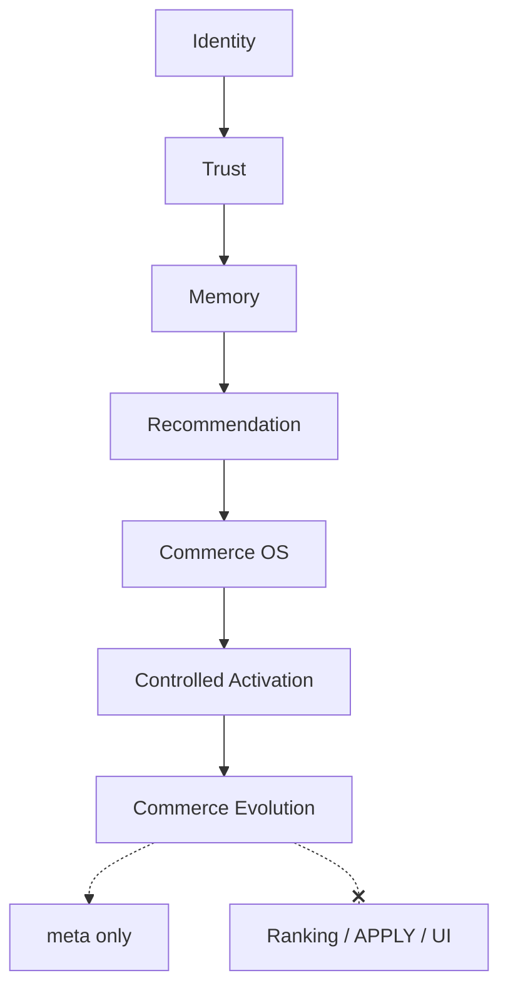

# Phase 10 — Adaptive Commerce Evolution Report

**Generated:** 2026-05-21  
**Status:** Complete (code + CI; no production deploy)  
**Discipline:** Shadow-only · no APPLY · no ranking mutation · no agents · no vector DB · no UI changes

---

## Executive summary

Phase 10 adds **adaptive commerce evolution infrastructure** under `lib/intelligence/commerceEvolution/`, enabling QuantAI to reason about long-horizon commerce change without mutating production ranking:

- Seasonal evolution + market timing adaptation
- Lifecycle phases (discovery → comparison → commitment → replacement)
- Intent transitions and taste drift across sessions
- Evolution memory graph (bounded)
- Temporal recommendation reasoning (shadow horizons)
- Governance-safe adaptation boundaries tied to controlled activation
- Shadow evolution candidates only

**Verdict:** Ready for shadow telemetry. **Not** ready for live evolution-driven mutation until canary prerequisites below are met.

---

## Deliverables map

| # | Deliverable | Path |
|---|-------------|------|
| 1 | Bounded evolution engine | `engine/boundedEvolutionEngine.ts` |
| 2 | Evolution memory graph | `memory/evolutionMemoryGraph.ts` |
| 3 | Commerce lifecycle intelligence | `lifecycle/commerceLifecycleIntelligence.ts` |
| 4 | Intent transition tracker | `intent/intentTransitionTracker.ts` |
| 5 | Seasonal commerce evolution | `market/seasonalCommerceEvolution.ts` |
| 6 | Market timing adapter | `market/marketTimingAdapter.ts` |
| 7 | Evolving taste shift detector | `taste/evolvingTasteShiftDetector.ts` |
| 8 | Temporal recommendation reasoning | `temporal/temporalRecommendationReasoning.ts` |
| 9 | Evolution adaptation boundaries | `governance/evolutionAdaptationBoundaries.ts` |
| 10 | Shadow evolution candidates | `candidates/shadowEvolutionCandidates.ts` |
| 11 | Evolution explainability | `explain/evolutionExplainability.ts` |
| 12 | Replay contracts | `replay/evolutionReplayContracts.ts` |
| 13 | Entry point | `buildCommerceEvolution.ts` |

**Search integration:** After controlled activation; before tray rebuild. **No** product order mutation.

---

## Production shadow flags

```bash
# Phase 10 evolution (shadow meta)
QUANTAI_COMMERCE_EVOLUTION_ENABLED=true
QUANTAI_COMMERCE_EVOLUTION_OBSERVABILITY=true

# Full stack shadow (recommended)
QUANTAI_CONTROLLED_ACTIVATION_ENABLED=true
QUANTAI_CANARY_ACTIVATION_PERCENT=0.01
QUANTAI_AUTONOMOUS_COMMERCE_OS_ENABLED=true
QUANTAI_RECOMMENDATION_COGNITION_ENABLED=true
QUANTAI_COMMERCE_MEMORY_ENABLED=true
QUANTAI_TRUST_ENGINE_ENABLED=true
QUANTAI_IDENTITY_FOUNDATION_ENABLED=true
QUANTAI_NORMALIZATION_APPLY=false
```

---

## Canary prerequisites (before live evolution influence)

1. Controlled activation shadow soak complete (2+ weeks).
2. `controlledActivation.governance.approved` rate stable on canary bucket.
3. Evolution `governanceAllowed` true on >80% of canary-eligible requests in shadow meta.
4. No increase in tray-order rollback rate from activation layer.
5. Explicit `QUANTAI_EVOLUTION_LIVE_APPLY` flag **not created** — requires separate sign-off.
6. P95 `commerce_evolution` latency within search budget.

---

## Evolution governance checklist

- [ ] `QUANTAI_NORMALIZATION_APPLY=false` in all environments
- [ ] `QUANTAI_CANARY_EMERGENCY_DISABLE` runbook tested
- [ ] Evolution blocked when activation in-canary + governance fails
- [ ] `tasteDrift01` > 0.85 blocks shadow candidates
- [ ] `evolutionConfidence01` < 0.4 blocks shadow candidates
- [ ] All `shadowCandidates[].rankingMutation === false` in CI
- [ ] Replay twin-run green (`npm run test:evolution`)
- [ ] No UI/card changes from evolution meta
- [ ] Executive sign-off for any future live apply flag

---

## Bounded cognition guarantees

| Bound | Limit |
|-------|-------|
| Evolution graph nodes | 20 |
| Shadow candidates | 8 |
| Cognition bytes cap | 12288 |
| Fingerprint | `evo_*` |
| `applyFree` / `rankingMutation` | always false |

---

## Replay guarantees

- `buildEvolutionReplayFingerprint` — deterministic FNV-1a
- `assertEvolutionReplayDeterministic` — twin-run in CI
- Contracts: `embeddingFree`, `vectorDbFree`, `agentFree`, `applyFree`

---

## Production risk analysis

| Risk | Level | Mitigation |
|------|-------|------------|
| Ranking mutation | **None** | Products array order unchanged |
| Global APPLY | **None** | No apply path |
| UI drift | **None** | Meta export only |
| Taste over-fitting | Medium | Drift cap + governance |
| Seasonal false positives | Medium | Shadow calibration |

---

## Observability

| Meta key | Contents |
|----------|----------|
| `commerceEvolution` | Confidence, lifecycle, fingerprint, orchestration |
| `commerceEvolutionShadow` | Seasonal, intent transition, taste evolution, candidates, explain sample |

Pipeline trace: `commerce_evolution`.

---

## CI validation

| Command | Result |
|---------|--------|
| `npm run build` | PASS |
| `npm run test` | PASS |
| `npm run test:evolution` | PASS |
| `npm run test:replay-determinism` | PASS |
| `npm run test:governance-safety` | PASS |

---

## Full shadow stack (Phases 4–10)



---

## Sign-off

Phase 10 adaptive commerce evolution is **complete** for shadow deployment. Live evolution-driven adaptation remains **blocked** until controlled activation canary prerequisites and evolution governance checklist are satisfied.
