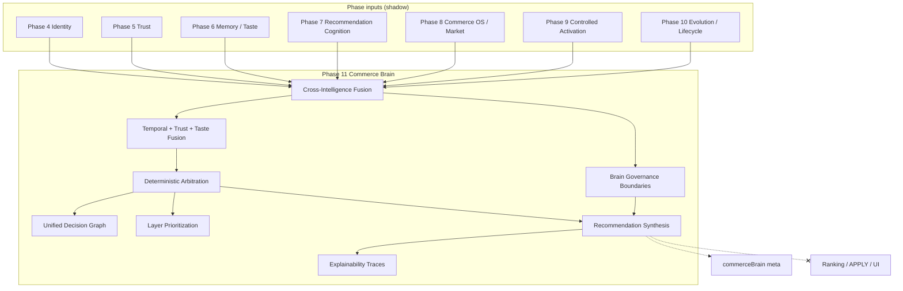

# Phase 11 — Unified Commerce Brain Report

**Generated:** 2026-05-21  
**Status:** Complete (code + CI; no production deploy)  
**Discipline:** Shadow-only · no APPLY · no ranking mutation · no agents · no vector DB · no UI changes

---

## Executive summary

Phase 11 unifies QuantAI intelligence Phases 4–10 into a **bounded deterministic commerce reasoning brain** under `lib/intelligence/commerceBrain/`:

- Cross-intelligence signal fusion (up to 24 signals)
- Temporal + trust + taste fusion layer
- Deterministic arbitration (primary/secondary layer)
- Unified commerce decision graph
- Intelligence prioritization
- Shadow recommendation synthesis (max 15% influence cap)
- Multi-layer explainability traces
- Governance boundaries tied to activation + evolution

**Verdict:** Ready for shadow telemetry and replay audit. **Not** ready for live brain-driven influence until governance activation checklist is complete.

---

## Unified intelligence graph



---

## Deliverables map

| # | Deliverable | Path |
|---|-------------|------|
| 1 | Unified reasoning kernel | `kernel/unifiedReasoningKernel.ts` |
| 2 | Bounded brain orchestration | `orchestrator/boundedCommerceBrainOrchestration.ts` |
| 3 | Cross-intelligence fusion | `fusion/crossIntelligenceSignalFusion.ts` |
| 4 | Temporal/trust/taste fusion | `fusion/temporalTrustTasteFusion.ts` |
| 5 | Deterministic arbitration | `arbitration/deterministicIntelligenceArbitration.ts` |
| 6 | Unified decision graph | `graph/unifiedCommerceDecisionGraph.ts` |
| 7 | Intelligence prioritization | `prioritize/commerceIntelligencePrioritization.ts` |
| 8 | Recommendation synthesis | `synthesis/deterministicRecommendationSynthesis.ts` |
| 9 | Brain governance | `governance/brainOrchestrationBoundaries.ts` |
| 10 | Explainability | `explain/brainExplainability.ts` |
| 11 | Replay contracts | `replay/brainReplayContracts.ts` |
| 12 | Entry point | `buildUnifiedCommerceBrain.ts` |

**Search integration:** After Phase 10 evolution; before tray rebuild. **Never** mutates product order.

---

## Production shadow flags

```bash
# Phase 11 brain (master fusion layer)
QUANTAI_COMMERCE_BRAIN_ENABLED=true
QUANTAI_COMMERCE_BRAIN_OBSERVABILITY=true
QUANTAI_COMMERCE_BRAIN_MAX_INFLUENCE=0.15

# Full intelligence stack (recommended)
QUANTAI_IDENTITY_FOUNDATION_ENABLED=true
QUANTAI_TRUST_ENGINE_ENABLED=true
QUANTAI_COMMERCE_MEMORY_ENABLED=true
QUANTAI_RECOMMENDATION_COGNITION_ENABLED=true
QUANTAI_AUTONOMOUS_COMMERCE_OS_ENABLED=true
QUANTAI_CONTROLLED_ACTIVATION_ENABLED=true
QUANTAI_CANARY_ACTIVATION_PERCENT=0.01
QUANTAI_COMMERCE_EVOLUTION_ENABLED=true
QUANTAI_NORMALIZATION_APPLY=false
```

---

## Canary prerequisites

1. All Phases 4–10 shadow-enabled in target environment.
2. Controlled activation soak complete (1% bucket stable).
3. Brain `governanceAllowed` rate >85% on canary-eligible traffic.
4. `maxInfluence01` telemetry stable ≤ 0.15.
5. No increase in activation rollback rate after brain enable.
6. No `QUANTAI_COMMERCE_BRAIN_LIVE_APPLY` flag (not created).
7. P95 `commerce_brain` stage within search latency budget.

---

## Governance activation checklist

- [ ] `QUANTAI_NORMALIZATION_APPLY=false`
- [ ] Brain disabled in emergency (`QUANTAI_COMMERCE_BRAIN_ENABLED=false` rollback)
- [ ] `synthesis.rankingMutation === false` in all responses (CI enforced)
- [ ] `meta.maxInfluence01 <= 0.15` cap verified
- [ ] Replay fingerprints stable twin-run (`npm run test:brain`)
- [ ] Activation governance failure blocks brain synthesis influence
- [ ] Evolution governance failure blocks brain synthesis influence
- [ ] No UI/card changes from brain meta
- [ ] Executive sign-off before any live influence flag

---

## Replay determinism audit

| Layer | Fingerprint prefix | Validated in brain governance |
|-------|-------------------|------------------------------|
| Trust | `trp_` | Yes |
| Recommendation | `rcp_` | Yes |
| Evolution | `evo_` | Yes |
| Brain output | `brn_` | Twin-run CI |

Contract: `applyFree`, `rankingMutation: false`, `maxInfluence01: 0.15`.

---

## Safety guarantees

| Constraint | Enforcement |
|------------|-------------|
| No ranking mutation | Products array unchanged |
| No APPLY | `applyFree` contract + no apply code path |
| Bounded influence | `QUANTAI_COMMERCE_BRAIN_MAX_INFLUENCE` + synthesis cap |
| No recursive loops | Governance checks recommendation safety blocks |
| Anti-manipulation | Inherits activation + recommendation guards |

---

## Observability

| Meta key | Contents |
|----------|----------|
| `commerceBrain` | Confidence, arbitration, synthesis, fingerprint |
| `commerceBrainShadow` | Fused signals, decision graph, explain traces, governance |

Pipeline trace: `commerce_brain`.

---

## CI validation

| Command | Result |
|---------|--------|
| `npm run build` | PASS |
| `npm run test` | PASS |
| `npm run test:brain` | PASS |
| `npm run test:signal-fusion` | PASS |
| `npm run test:replay-determinism` | PASS |
| `npm run test:governance-safety` | PASS |

---

## Sign-off

Phase 11 unified commerce brain is **complete** for shadow deployment. Live brain-driven commerce influence remains **blocked** until canary prerequisites and governance checklist are satisfied.
