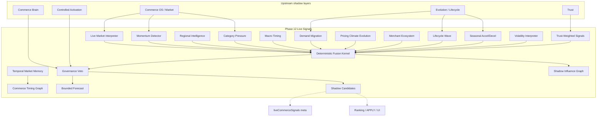

# Phase 12 — Live Adaptive Commerce Signals Report

**Generated:** 2026-05-21  
**Status:** Complete (code + CI; no production deploy)  
**Discipline:** Shadow-only · no APPLY · no ranking mutation · no agents · no vector DB · no UI changes

---

## Executive summary

Phase 12 adds **live adaptive commerce signal infrastructure** under `lib/intelligence/liveAdaptiveCommerceSignals/` (distinct from tray-level `liveCommerceSignals.ts`), enabling QuantAI to interpret real-world commerce movement in shadow mode without mutating rankings or product order.

Capabilities delivered:

- Live market signal interpretation
- Commerce momentum detection
- Regional commerce dynamics
- Category trend pressure
- Macro commerce timing
- Demand-shift detection
- Pricing climate evolution
- Merchant ecosystem movement
- Lifecycle wave intelligence
- Seasonal acceleration / deceleration
- Commerce volatility interpretation
- Trust-weighted market signals
- Deterministic live signal fusion kernel
- Replay-safe temporal market memory (input-derived)
- Bounded adaptive commerce forecasting
- Shadow-only signal influence graph + candidates

**Verdict:** Ready for shadow telemetry and replay audit. **Not** ready for live signal-driven influence until governance checklist is complete.

---

## Live commerce signal graph



---

## Deliverables map

| # | Deliverable | Path |
|---|-------------|------|
| 1 | Bounded live signal engine | `engine/boundedLiveSignalEngine.ts` |
| 2 | Deterministic fusion kernel | `kernel/deterministicSignalFusionKernel.ts` |
| 3 | Commerce timing graph | `graph/commerceTimingGraph.ts` |
| 4 | Regional intelligence | `signals/regionalCommerceIntelligence.ts` |
| 5 | Market pressure analyzer | `pressure/marketPressureAnalyzer.ts` |
| 6 | Demand migration tracker | `demand/demandMigrationTracker.ts` |
| 7 | Replay contracts | `replay/liveSignalReplayContracts.ts` |
| 8 | Governance arbitration | `governance/governanceSignalArbitration.ts` |
| 9 | Signal explainability | `explain/signalExplainability.ts` |
| 10 | Shadow candidates | `candidates/shadowLiveSignalCandidates.ts` |
| 11 | Entry point | `buildLiveCommerceSignals.ts` (`buildLiveAdaptiveCommerceSignals`) |

**Search integration:** After Phase 11 commerce brain; before tray rebuild. **Never** mutates product order.

---

## Production shadow flags

```bash
# Phase 12 live signals
QUANTAI_LIVE_COMMERCE_SIGNALS_ENABLED=true
QUANTAI_LIVE_COMMERCE_SIGNALS_OBSERVABILITY=true
QUANTAI_LIVE_COMMERCE_SIGNALS_MAX_INFLUENCE=0.12

# Recommended upstream stack
QUANTAI_COMMERCE_BRAIN_ENABLED=true
QUANTAI_COMMERCE_EVOLUTION_ENABLED=true
QUANTAI_AUTONOMOUS_COMMERCE_OS_ENABLED=true
QUANTAI_TRUST_ENGINE_ENABLED=true
QUANTAI_CONTROLLED_ACTIVATION_ENABLED=true
QUANTAI_NORMALIZATION_APPLY=false
```

---

## Canary prerequisites

1. Phases 8–11 shadow-enabled and stable in target environment.
2. Brain `governanceAllowed` rate >85% on canary traffic.
3. Live signals `governanceAllowed` rate >80% with volatility band telemetry stable.
4. `maxInfluence01` telemetry ≤ 0.12 (Phase 12 cap).
5. No increase in activation rollback rate after live signals enable.
6. No `QUANTAI_LIVE_COMMERCE_SIGNALS_LIVE_APPLY` flag (not created).
7. P95 `live_commerce_signals` stage within search latency budget.

---

## Governance activation checklist

- [ ] `QUANTAI_NORMALIZATION_APPLY=false`
- [ ] Live signals disabled in emergency (`QUANTAI_LIVE_COMMERCE_SIGNALS_ENABLED=false`)
- [ ] All `shadowCandidates[].rankingMutation === false` (CI enforced)
- [ ] `meta.maxInfluence01 <= 0.12` cap verified
- [ ] Twin-run replay stable (`npm run test:live-signals`)
- [ ] Activation governance veto blocks forecast + candidates
- [ ] Brain governance veto blocks forecast + candidates
- [ ] Evolution governance veto blocks forecast + candidates
- [ ] Elevated volatility + low confidence triggers veto
- [ ] No UI/card changes from live signals meta
- [ ] Executive sign-off before any live influence flag

---

## Replay determinism audit

| Layer | Fingerprint prefix | Veto on failure |
|-------|-------------------|-----------------|
| Trust | `trp_` | Yes |
| Brain | `brn_` | Yes |
| Live signals output | `lcs_` | Twin-run CI |

Contract: `applyFree`, `rankingMutation: false`, `maxInfluence01: 0.12`.

Temporal market memory is **input-derived only** (query + tray fingerprint) — no session mutation across twin runs.

Macro timing uses UTC calendar month; twin-run tests pin `Date.UTC` where needed.

---

## Market signal safety report

| Risk | Mitigation |
|------|------------|
| Ranking mutation | Products array unchanged; `rankingMutation: false` on all candidates |
| Live APPLY | No apply code path; `applyFree` replay contract |
| Recursive feedback | No write-back to session or ranking; read-only upstream meta |
| Uncontrolled adaptation | Bounded forecast cap 0.85; governance veto on low confidence |
| Trust manipulation | Trust-weighted downscale on fake discount alerts |
| Volatility spikes | `elevated_volatility_guard` veto when confidence < 0.45 |
| Influence overflow | `QUANTAI_LIVE_COMMERCE_SIGNALS_MAX_INFLUENCE` hard cap 0.15 |

---

## Observability

| Meta key | Contents |
|----------|----------|
| `liveCommerceSignals` | Confidence, volatility band, forecast, fingerprint |
| `liveCommerceSignalsShadow` | Fused signals, timing graph, influence edges, explain traces |

Pipeline trace: `live_commerce_signals`.

---

## CI validation

| Command | Expected |
|---------|----------|
| `npm run build` | PASS |
| `npm run test` | PASS |
| `npm run test:live-signals` | PASS |
| `npm run test:signal-fusion` | PASS |
| `npm run test:replay-determinism` | PASS |
| `npm run test:governance-safety` | PASS |

---

## Sign-off

Phase 12 live adaptive commerce signals are **complete** for shadow deployment. Live signal-driven commerce influence remains **blocked** until canary prerequisites and governance checklist are satisfied.
