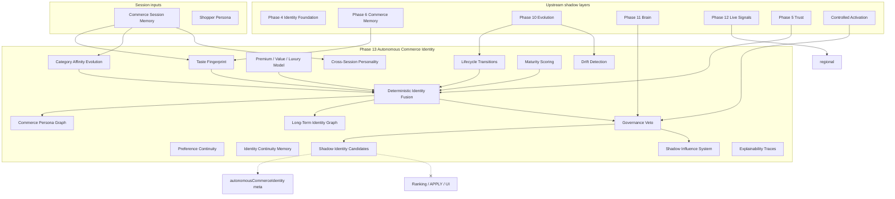

# Phase 13 — Autonomous Commerce Identity Report

**Generated:** 2026-05-21  
**Status:** Complete (code + CI; no production deploy)  
**Discipline:** Shadow-only · no APPLY · no ranking mutation · no agents · no vector DB · no UI changes

---

## Executive summary

Phase 13 adds a **persistent commerce identity intelligence layer** under `lib/intelligence/autonomousCommerceIdentity/`, distinct from Phase 4 product identity foundation (`lib/intelligence/identity/`).

QuantAI can now model long-term buying identity deterministically: taste fingerprint, category affinity evolution, premium/value/luxury bands, cross-session persona, lifecycle transitions, maturity, intent persistence, drift detection, and shadow recommendation candidates — all without mutating rankings.

**Verdict:** Ready for shadow telemetry. Live identity-driven influence remains **blocked** until governance checklist is complete.

---

## Identity graph diagram



---

## Deliverables map

| # | Deliverable | Path |
|---|-------------|------|
| 1 | Identity orchestration kernel | `kernel/identityOrchestrationKernel.ts` |
| 2 | Deterministic identity fusion | `fusion/deterministicIdentityFusionEngine.ts` |
| 3 | Commerce persona graph | `graph/commercePersonaGraph.ts` |
| 4 | Long-term identity graph | `graph/longTermCommerceIdentityGraph.ts` |
| 5 | Bounded evolution tracker | `evolution/boundedIdentityEvolutionTracker.ts` |
| 6 | Identity continuity memory | `memory/identityContinuityMemory.ts` |
| 7 | Governance arbitration | `governance/identityArbitration.ts` |
| 8 | Shadow candidates | `candidates/shadowIdentityRecommendationCandidates.ts` |
| 9 | Replay contracts | `replay/identityReplayContracts.ts` |
| 10 | Entry point | `buildAutonomousCommerceIdentity.ts` |

**Search integration:** After Phase 12 live signals; before tray rebuild.

---

## Production shadow flags

```bash
QUANTAI_AUTONOMOUS_COMMERCE_IDENTITY_ENABLED=true
QUANTAI_AUTONOMOUS_COMMERCE_IDENTITY_OBSERVABILITY=true
QUANTAI_AUTONOMOUS_COMMERCE_IDENTITY_MAX_INFLUENCE=0.10
```

---

## Canary prerequisites

1. Phases 4–12 shadow stack stable in target environment.
2. Session memory merge verified (`commerceSessionMemory` round-trip).
3. Identity `governanceAllowed` rate >80% on canary traffic.
4. Drift band `elevated` rate <5% without governance veto.
5. `maxInfluence01` telemetry ≤ 0.10.
6. No `QUANTAI_AUTONOMOUS_COMMERCE_IDENTITY_LIVE_APPLY` flag (not created).
7. P95 `autonomous_commerce_identity` stage within latency budget.

---

## Governance activation checklist

- [ ] `QUANTAI_NORMALIZATION_APPLY=false`
- [ ] Emergency rollback: `QUANTAI_AUTONOMOUS_COMMERCE_IDENTITY_ENABLED=false`
- [ ] All shadow candidates `rankingMutation === false`
- [ ] `meta.maxInfluence01 <= 0.10` verified
- [ ] Twin-run replay (`npm run test:commerce-identity`)
- [ ] Identity memory replay (`npm run test:identity-memory`)
- [ ] Activation / brain / live-signals governance vetoes enforced
- [ ] Elevated drift + low confidence triggers veto
- [ ] No UI changes from identity meta
- [ ] Executive sign-off before live influence

---

## Replay determinism audit

| Layer | Fingerprint prefix | Veto on failure |
|-------|-------------------|-----------------|
| Trust | `trp_` | Yes |
| Brain | `brn_` | Yes |
| Live signals | `lcs_` | Yes |
| Commerce identity | `aci_` | Twin-run CI |

Contract: `applyFree`, `rankingMutation: false`, `maxInfluence01: 0.10`.

Identity continuity memory key `icm_*` is derived from session fields only (no hidden server writes).

---

## Identity safety report

| Risk | Mitigation |
|------|------------|
| Ranking mutation | Products array unchanged |
| Live APPLY | No apply path; replay contract |
| Recursive self-reinforcement | Read-only upstream; no write-back to ranking |
| Hidden mutation | `rankingMutation: false` on all candidates |
| Influence overflow | Cap 0.10 env (hard max 0.12) |
| Drift instability | `identity_drift_guard` veto |
| Trust manipulation | Trust-aware axis downweight |
| Explainability gap | Mandatory `explain` + `traceExamples` in meta |

---

## Deterministic identity trace examples

When enabled, `autonomousCommerceIdentityShadow.explainSample.traceExamples` may include:

```
taste:0.42
premium:0.38
category:0.55
maturity:0.31
intent:0.25
trust:0.56
```

Governance pass:

```
whyGovernance: ["governance_pass"]
whyFusion: ["deterministic_identity_fusion", "axes_10"]
```

Governance veto (example):

```
whyGovernance: ["brain_governance_veto"]
whyFusion: ["fusion_shadow_only_veto"]
```

---

## CI validation

| Command | Expected |
|---------|----------|
| `npm run build` | PASS |
| `npm run test` | PASS |
| `npm run test:identity` | PASS (Phase 4 product identity) |
| `npm run test:commerce-identity` | PASS (Phase 13) |
| `npm run test:identity-memory` | PASS (Phase 13) |
| `npm run test:replay-determinism` | PASS |
| `npm run test:governance-safety` | PASS |

---

## Sign-off

Phase 13 autonomous commerce identity is **complete** for shadow deployment. Live identity-driven recommendation apply remains **blocked**.
