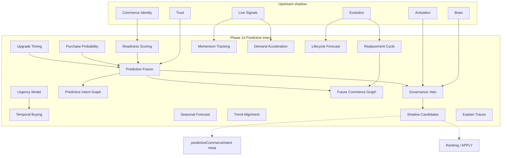

# Phase 14 — Predictive Commerce Intent Report

**Generated:** 2026-05-21  
**Status:** Complete (code + CI; no production deploy)  
**Discipline:** Shadow-only · deterministic · no APPLY · no ranking mutation · no agents · no vector DB · no UI changes

---

## Executive summary

Phase 14 adds **predictive commerce intent intelligence** under `lib/intelligence/predictiveCommerceIntent/`, distinct from tray-level `predictiveCommerceIntelligence.ts` (ranking helper) and `lib/intent/` runtime layers.

QuantAI can now forecast buying intent, readiness, purchase probability, replacement/upgrade timing, urgency, momentum, and lifecycle futures — all in shadow meta with governance veto and replay fingerprints.

**Verdict:** Ready for shadow telemetry. Live predictive apply remains **blocked**.

---

## Predictive graph diagram



---

## Deliverables map

| # | Deliverable | Path |
|---|-------------|------|
| 1 | Predictive intent kernel | `kernel/predictiveIntentKernel.ts` |
| 2 | Prediction fusion engine | `fusion/deterministicPredictionFusionEngine.ts` |
| 3 | Predictive intent graph | `graph/predictiveIntentGraph.ts` |
| 4 | Future commerce graph | `graph/futureCommerceGraph.ts` |
| 5 | Lifecycle forecasting | `forecast/lifecycleForecastingEngine.ts` |
| 6 | Timing orchestrator | `timing/commerceTimingOrchestrator.ts` |
| 7 | Governance arbitration | `governance/predictionArbitration.ts` |
| 8 | Replay contracts | `replay/predictionReplayContracts.ts` |
| 9 | Entry point | `buildPredictiveCommerceIntent.ts` |

**Search integration:** After Phase 13 commerce identity; before tray rebuild.

---

## Production shadow flags

```bash
QUANTAI_PREDICTIVE_COMMERCE_INTENT_ENABLED=true
QUANTAI_PREDICTIVE_COMMERCE_INTENT_OBSERVABILITY=true
QUANTAI_PREDICTIVE_COMMERCE_INTENT_MAX_INFLUENCE=0.10
```

---

## Canary prerequisites

1. Phases 10–13 shadow stack stable.
2. `governanceAllowed` rate >80% on canary traffic.
3. `predictionConfidence01` stable; readiness/purchase probability telemetry bounded.
4. `maxInfluence01` ≤ 0.10.
5. No `QUANTAI_PREDICTIVE_COMMERCE_INTENT_LIVE_APPLY` (not created).
6. P95 `predictive_commerce_intent` within latency budget.

---

## Governance activation checklist

- [ ] `QUANTAI_NORMALIZATION_APPLY=false`
- [ ] Emergency rollback: `QUANTAI_PREDICTIVE_COMMERCE_INTENT_ENABLED=false`
- [ ] All candidates `rankingMutation === false`
- [ ] `meta.maxInfluence01 <= 0.10`
- [ ] Twin-run replay (`npm run test:predictive-intent`)
- [ ] Forecasting modules (`npm run test:forecasting`)
- [ ] Activation/brain/identity/live-signals vetoes enforced
- [ ] Low confidence triggers veto
- [ ] No UI changes from predictive meta
- [ ] Executive sign-off before live influence

---

## Replay determinism audit

| Layer | Prefix | Veto |
|-------|--------|------|
| Trust | `trp_` | Yes |
| Brain | `brn_` | Yes |
| Commerce identity | `aci_` | Yes |
| Predictive output | `pci_` | Twin-run CI |

Predictive memory key `rpm_*` is query + interaction-count derived only.

---

## Forecasting safety report

| Risk | Mitigation |
|------|------------|
| Ranking mutation | Products unchanged |
| Live APPLY | `applyFree` contract; no apply path |
| Recursive feedback | Read-only upstream; no write-back |
| Influence overflow | Cap 0.10 (hard 0.12) |
| Overconfident forecasts | Future-state cap 0.85; governance veto |
| Trust gaming | Trust-aware fusion downweight |

---

## Deterministic prediction examples

Trace examples (shadow meta):

```
readiness:0.52
purchase_probability:0.48
upgrade:0.65
urgency:0.55
temporal:0.44
```

Governance pass:

```
whyGovernance: ["governance_pass"]
whyFusion: ["deterministic_prediction_fusion", "axes_13"]
```

Future state labels: `high_intent_future` | `moderate_intent_future` | `low_intent_future`

---

## CI validation

| Command | Expected |
|---------|----------|
| `npm run build` | PASS |
| `npm run test` | PASS |
| `npm run test:predictive-intent` | PASS |
| `npm run test:forecasting` | PASS |
| `npm run test:replay-determinism` | PASS |
| `npm run test:governance-safety` | PASS |

---

## Sign-off

Phase 14 predictive commerce intent is **complete** for shadow deployment.
