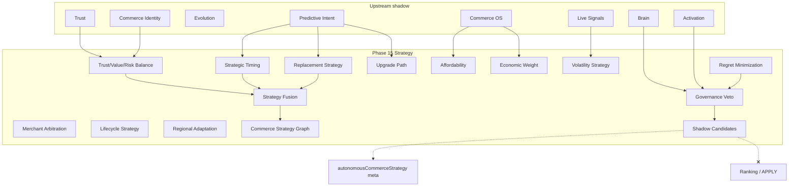

# Phase 15 — Autonomous Commerce Strategy Report

**Generated:** 2026-05-21  
**Status:** Complete (code + CI; no production deploy)  
**Discipline:** Shadow-only · deterministic · no APPLY · no ranking mutation · no agents · no vector DB · no UI changes

---

## Executive summary

Phase 15 adds **autonomous commerce strategy intelligence** under `lib/intelligence/autonomousCommerceStrategy/`, synthesizing trust/value/risk balance, timing, replacement/upgrade paths, affordability, economic climate, merchant arbitration, volatility, lifecycle, and pressure signals into bounded shadow strategies.

Distinct from Phase 8 `boundedStrategyEngine` (commerce OS internal) and tray `predictiveCommerceIntelligence.ts`.

**Verdict:** Ready for shadow telemetry. Live strategy apply remains **blocked**.

---

## Strategy graph diagram



---

## Deliverables map

| # | Deliverable | Path |
|---|-------------|------|
| 1 | Autonomous strategy kernel | `kernel/autonomousStrategyKernel.ts` |
| 2 | Strategy fusion engine | `fusion/deterministicStrategyFusionEngine.ts` |
| 3 | Commerce strategy graph | `graph/commerceStrategyGraph.ts` |
| 4 | Strategic timing orchestrator | `timing/strategicTimingOrchestrator.ts` |
| 5 | Trust-risk arbitration | `arbitration/trustRiskArbitrationEngine.ts` |
| 6 | Regret minimization | `regret/regretMinimizationEngine.ts` |
| 7 | Bounded strategist | `strategist/boundedCommerceStrategist.ts` |
| 8 | Governance arbitration | `governance/strategyArbitration.ts` |
| 9 | Entry point | `buildAutonomousCommerceStrategy.ts` |

**Search integration:** After Phase 14 predictive intent; before tray rebuild.

---

## Production shadow flags

```bash
QUANTAI_AUTONOMOUS_COMMERCE_STRATEGY_ENABLED=true
QUANTAI_AUTONOMOUS_COMMERCE_STRATEGY_OBSERVABILITY=true
QUANTAI_AUTONOMOUS_COMMERCE_STRATEGY_MAX_INFLUENCE=0.10
```

---

## Canary prerequisites

1. Phases 8–14 shadow stack stable.
2. Strategy `governanceAllowed` rate >80%.
3. `regretScore01` telemetry stable; elevated regret triggers veto.
4. `maxInfluence01` ≤ 0.10.
5. No `QUANTAI_AUTONOMOUS_COMMERCE_STRATEGY_LIVE_APPLY` (not created).
6. P95 `autonomous_commerce_strategy` within latency budget.

---

## Governance activation checklist

- [ ] `QUANTAI_NORMALIZATION_APPLY=false`
- [ ] Emergency rollback: `QUANTAI_AUTONOMOUS_COMMERCE_STRATEGY_ENABLED=false`
- [ ] All candidates `rankingMutation === false`
- [ ] `meta.maxInfluence01 <= 0.10`
- [ ] Twin-run replay (`npm run test:commerce-strategy`)
- [ ] Fusion modules (`npm run test:commerce-strategy-fusion`)
- [ ] Upstream governance vetoes enforced
- [ ] Regret threshold veto verified
- [ ] No UI changes from strategy meta
- [ ] Executive sign-off before live influence

---

## Replay determinism audit

| Layer | Prefix | Veto |
|-------|--------|------|
| Trust | `trp_` | Yes |
| Brain | `brn_` | Yes |
| Predictive | `pci_` | Yes |
| Strategy output | `acs_` | Twin-run CI |

Strategy memory key `rsm_*` is query + primaryStrategy derived only.

---

## Strategy safety report

| Risk | Mitigation |
|------|------------|
| Ranking mutation | Products unchanged |
| Live APPLY | `applyFree` contract |
| Recursive feedback | Read-only upstream |
| Influence overflow | Cap 0.10 |
| High regret | `regret_threshold_exceeded` veto |
| Trust manipulation | Trust-weighted fusion |

---

## Deterministic strategy examples

Trace examples:

```
trust_value_risk:0.58
timing:0.52
affordability:0.48
merchant:0.61
```

Primary strategies: `timing_first` | `trust_value_balanced` | `affordability_guarded` | `axis_<id>`

Governance pass:

```
whyGovernance: ["governance_pass"]
whyFusion: ["deterministic_strategy_fusion"]
```

---

## CI validation

| Command | Expected |
|---------|----------|
| `npm run build` | PASS |
| `npm run test` | PASS |
| `npm run test:commerce-strategy` | PASS (Phase 15) |
| `npm run test:commerce-strategy-fusion` | PASS (Phase 15) |
| `npm run test:strategy` | PASS (legacy strategy audit suite) |
| `npm run test:replay-determinism` | PASS |
| `npm run test:governance-safety` | PASS |

---

## Sign-off

Phase 15 autonomous commerce strategy is **complete** for shadow deployment.
