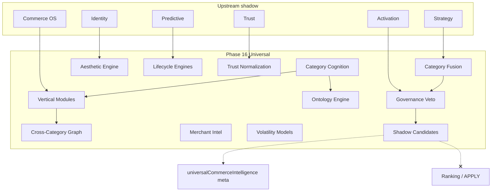
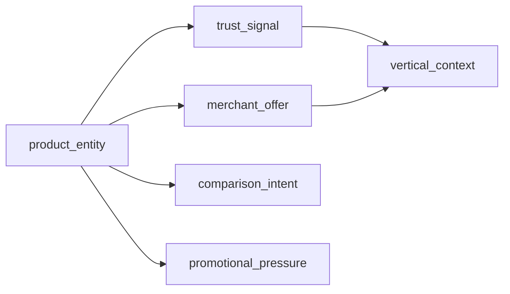

# Phase 16 — Universal Commerce Intelligence Report

**Generated:** 2026-05-21  
**Status:** Complete (code + CI; no production deploy)  
**Discipline:** Shadow-only · deterministic · no APPLY · no ranking mutation · no agents · no vector DB · no UI changes

---

## Executive summary

Phase 16 adds **universal commerce intelligence** under `lib/intelligence/universalCommerceIntelligence/`, enabling QuantAI to reason across fashion, luxury, beauty, furniture/home, automotive, sports/outdoor, watches/jewelry, gaming, and electronics — beyond electronics-only heuristics.

Integrates with existing `categoryBehaviorProfiles.ts` for deterministic vertical psychology weights. All outputs are shadow meta with governance veto and replay fingerprints (`uci_`).

**Verdict:** Ready for shadow telemetry. Live universal apply remains **blocked**.

---

## Universal commerce graph



---

## Ontology diagram



Nodes are query-triggered and vertical-scoped (max 12 nodes).

---

## Deliverables map

| # | Deliverable | Path |
|---|-------------|------|
| 1 | Universal commerce kernel | `kernel/universalCommerceKernel.ts` |
| 2 | Category cognition | `cognition/universalCategoryCognition.ts` |
| 3 | Vertical modules | `verticals/categoryIntelligenceModules.ts` |
| 4 | Cross-category graph | `graph/crossCategoryIntelligenceGraph.ts` |
| 5 | Ontology engine | `ontology/universalCommerceOntology.ts` |
| 6 | Category fusion | `fusion/deterministicCategoryFusion.ts` |
| 7 | Governance | `governance/cognitionArbitration.ts` |
| 8 | Entry point | `buildUniversalCommerceIntelligence.ts` |

**Search integration:** After Phase 15 strategy; before tray rebuild.

---

## Production shadow flags

```bash
QUANTAI_UNIVERSAL_COMMERCE_INTELLIGENCE_ENABLED=true
QUANTAI_UNIVERSAL_COMMERCE_INTELLIGENCE_OBSERVABILITY=true
QUANTAI_UNIVERSAL_COMMERCE_INTELLIGENCE_MAX_INFLUENCE=0.10
```

---

## Canary prerequisites

1. Phases 8–15 shadow stack stable.
2. `dominantVertical` telemetry distribution sane (no 100% `general`).
3. `governanceAllowed` rate >80%.
4. `maxInfluence01` ≤ 0.10.
5. No `QUANTAI_UNIVERSAL_COMMERCE_INTELLIGENCE_LIVE_APPLY` (not created).
6. P95 `universal_commerce_intelligence` within latency budget.

---

## Governance activation checklist

- [ ] `QUANTAI_NORMALIZATION_APPLY=false`
- [ ] Emergency rollback flag off
- [ ] All candidates `rankingMutation === false`
- [ ] Twin-run replay (`npm run test:universal-commerce`)
- [ ] Category modules (`npm run test:category-intelligence`)
- [ ] Ontology (`npm run test:ontology`)
- [ ] Upstream strategy/predictive/identity vetoes enforced
- [ ] No UI changes from universal meta

---

## Replay determinism audit

| Layer | Prefix | Veto |
|-------|--------|------|
| Trust | `trp_` | Yes |
| Strategy | `acs_` | Yes |
| Predictive | `pci_` | Yes |
| Universal output | `uci_` | Twin-run CI |

Memory key `rum_*` is query + dominantVertical derived only.

---

## Universal intelligence safety report

| Risk | Mitigation |
|------|------------|
| Ranking mutation | Products unchanged |
| Cross-vertical bleed | Dominant vertical + bounded fusion |
| Trust gaming | Category-calibrated trust normalization |
| Influence overflow | Cap 0.10 |
| Vertical hallucination | Query + tray slug heuristics only (no LLM) |

---

## Category reasoning examples

Query: `nike dress summer outfit fashion` → `dominantVertical: fashion`

Query: `skincare serum makeup beauty` → `dominantVertical: beauty`

Query: `luxury watch rolex designer` → `dominantVertical: luxury` or `watches_jewelry`

Trace example:

```
category_cognition:fashion:0.52
trust:fashion:0.61
aesthetic:fashion:0.48
ontology:fashion:0.35
```

---

## CI validation

| Command | Expected |
|---------|----------|
| `npm run build` | PASS |
| `npm run test` | PASS |
| `npm run test:universal-commerce` | PASS |
| `npm run test:category-intelligence` | PASS |
| `npm run test:ontology` | PASS (Phase 16) |
| `npm run test:replay-determinism` | PASS |
| `npm run test:governance-safety` | PASS |

---

## Sign-off

Phase 16 universal commerce intelligence is **complete** for shadow deployment.
