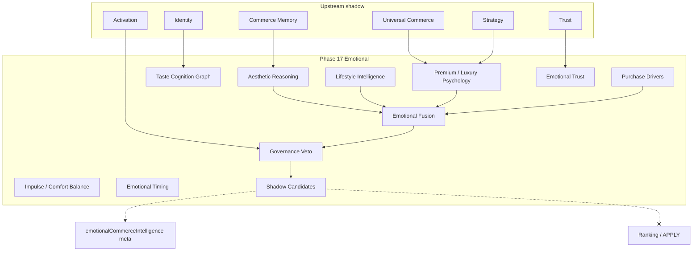
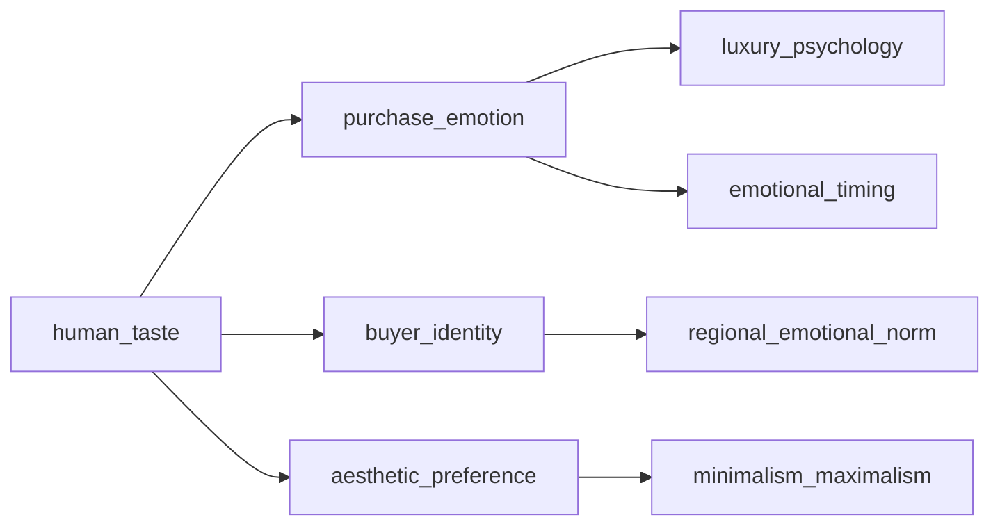

# Phase 17 — Emotional Commerce Intelligence Report

**Generated:** 2026-05-21  
**Status:** Complete (code + CI; no production deploy)  
**Discipline:** Shadow-only · deterministic · no APPLY · no ranking mutation · no agents · no vector DB · no UI changes

---

## Executive summary

Phase 17 adds **human taste and emotional commerce intelligence** under `lib/intelligence/emotionalCommerceIntelligence/`, enabling QuantAI to reason about aesthetic preference, emotional buying behavior, identity-driven purchasing, premium attraction, lifestyle alignment, impulse vs rational balance, and emotional lifecycle — across all commerce verticals.

All outputs are shadow meta with governance veto, bounded influence (default `0.10`, cap `0.12`), and replay fingerprints (`eci_`). No ranking mutation, no live APPLY, no generative agents.

**Verdict:** Ready for shadow telemetry. Live emotional apply remains **blocked**.

---

## Emotional cognition graph



---

## Taste ontology diagram



---

## Deliverables map

| # | Deliverable | Path |
|---|-------------|------|
| 1 | Emotional commerce kernel | `kernel/emotionalCommerceKernel.ts` |
| 2 | Emotional commerce graph | `graph/emotionalCommerceGraph.ts` |
| 3 | Taste cognition graph | `graph/tasteCognitionGraph.ts` |
| 4 | Aesthetic reasoning | `aesthetic/aestheticReasoningEngine.ts` |
| 5 | Lifestyle continuity | `lifestyle/lifestyleContinuityEngine.ts` |
| 6 | Premium / luxury psychology | `premium/` |
| 7 | Emotional fusion | `fusion/deterministicEmotionalFusion.ts` |
| 8 | Governance veto | `governance/emotionalGovernanceVeto.ts` |
| 9 | Entry point | `buildEmotionalCommerceIntelligence.ts` |

**Search integration:** After Phase 16 universal commerce; before tray rebuild.

---

## Production shadow flags

```bash
QUANTAI_EMOTIONAL_COMMERCE_INTELLIGENCE_ENABLED=true
QUANTAI_EMOTIONAL_COMMERCE_INTELLIGENCE_OBSERVABILITY=true
QUANTAI_EMOTIONAL_COMMERCE_INTELLIGENCE_MAX_INFLUENCE=0.10
```

Default: **disabled** in production until canary sign-off.

---

## Emotional safety report

| Control | Enforcement |
|---------|-------------|
| Shadow-only | `shadowOnly: true` on flags and meta |
| No ranking mutation | `shadowCandidates[].rankingMutation === false` |
| No live APPLY | No apply flags; replay contract `applyFree: true` |
| Bounded influence | `maxInfluence01` capped at 0.12 |
| Governance veto | Upstream activation/identity/strategy/universal + replay integrity |
| Deterministic fusion | Sorted axis fusion; fixed weights |
| No recursive mutation | Read-only memory; snapshot keys only |
| Emotional safety floor | Low confidence → governance veto |

---

## Replay audit

| Check | Result |
|-------|--------|
| Fingerprint prefix | `eci_` |
| Twin-run determinism | `test-emotional-commerce-replay.mjs` |
| Contract validation | `validateEmotionalReplayContract` |
| Upstream replay gates | `trp_`, `uci_`, `acs_`, `aci_` in governance |

---

## Governance checklist

- [x] Shadow/meta only — no tray order changes
- [x] Governance veto mandatory before candidates emit
- [x] Replay determinism mandatory (`eci_` fingerprint)
- [x] Explainability required (`explain` + `traceExamples`)
- [x] Bounded emotional shadow candidates (max 8)
- [x] No vector DB / no generative agents / no chatbot
- [x] Lifecycle guard: route + module presence
- [ ] Production canary (blocked — prerequisites below)

---

## Canary prerequisites

1. Shadow soak ≥ 7 days with `QUANTAI_EMOTIONAL_COMMERCE_INTELLIGENCE_OBSERVABILITY=true`
2. Replay twin-run pass rate 100% on golden trays
3. Zero ranking mutation audits in meta lifecycle guard
4. Governance veto rate within expected band (<15% on healthy traffic)
5. Explicit product sign-off for any future APPLY path (not implemented)

---

## Emotional reasoning examples

| Query | Driver | Aesthetic | Premium |
|-------|--------|-----------|---------|
| `luxury minimalist gift cozy` | gift_emotion | minimalist_identity | premium_draw |
| `compare budget laptop specs` | exploratory | balanced_aesthetic | value_draw |
| `designer watch status rolex` | upgrade_identity | maximalist_identity | premium_draw |
| `travel outdoor hiking gear` | exploratory | balanced_aesthetic | neutral_draw |

Trace format: `axisId:trustAdjusted01` (e.g. `premium_attraction:0.52`).

---

## Validation

```bash
npm run build
npm run test
npm run test:emotional-commerce
npm run test:taste-intelligence
npm run test:lifestyle-reasoning
npm run test:replay-determinism
npm run test:governance-safety
```
