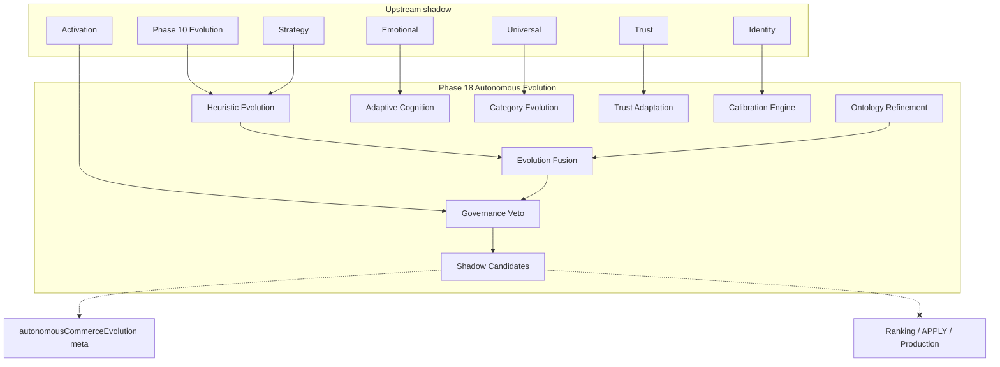
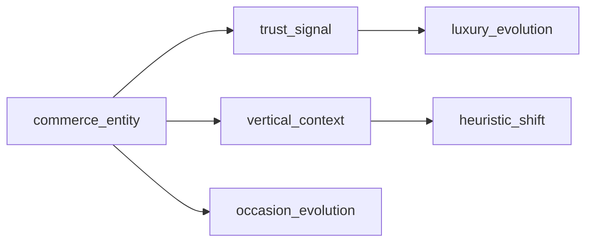

# Phase 18 — Autonomous Commerce Evolution Report

**Generated:** 2026-05-21  
**Status:** Complete (code + CI; no production deploy)  
**Discipline:** Shadow-only · deterministic · no APPLY · no ranking mutation · no production mutation · no self-modifying logic

---

## Executive summary

Phase 18 adds **autonomous commerce evolution** under `lib/intelligence/autonomousCommerceEvolution/`, distinct from Phase 10 `commerceEvolution/` (session/seasonal adaptation). Phase 18 synthesizes bounded evolution of heuristics, ontology, cognition, strategy, category intelligence, trust, lifecycle, regional norms, and long-term memory patterns — all as shadow meta with governance veto and replay fingerprints (`ace_`).

**Verdict:** Ready for shadow telemetry. Live evolution apply and any production self-write remain **blocked**.

---

## Evolution cognition graph



---

## Ontology evolution diagram



---

## Deliverables map

| # | Deliverable | Path |
|---|-------------|------|
| 1 | Autonomous evolution kernel | `kernel/autonomousEvolutionKernel.ts` |
| 2 | Evolution graph | `graph/deterministicEvolutionGraph.ts` |
| 3 | Ontology refinement | `ontology/ontologyRefinementEngine.ts` |
| 4 | Heuristic evolution | `heuristic/commerceHeuristicEvolution.ts` |
| 5 | Evolution fusion | `fusion/deterministicEvolutionFusion.ts` |
| 6 | Governance veto | `governance/evolutionGovernanceVeto.ts` |
| 7 | Entry point | `buildAutonomousCommerceEvolution.ts` |

**Search integration:** After Phase 17 emotional commerce; before tray rebuild.

---

## Production shadow flags

```bash
QUANTAI_AUTONOMOUS_COMMERCE_EVOLUTION_ENABLED=true
QUANTAI_AUTONOMOUS_COMMERCE_EVOLUTION_OBSERVABILITY=true
QUANTAI_AUTONOMOUS_COMMERCE_EVOLUTION_MAX_INFLUENCE=0.10
```

Default: **disabled**. Max influence capped at **0.12**.

---

## Evolution safety report

| Control | Enforcement |
|---------|-------------|
| Shadow-only | `shadowOnly: true` on flags and meta |
| No ranking mutation | `rankingMutation: false` on all candidates |
| No production mutation | Replay contract `productionMutation: false` |
| No self-modifying logic | Replay contract `selfModifying: false` |
| Bounded deltas | Heuristic/strategy deltas capped ≤ 0.08 |
| Governance veto | Upstream phases + replay integrity (`evo_`, `eci_`, `uci_`, …) |
| Deterministic fusion | Fixed axis weights, sorted output |

---

## Replay audit

| Check | Result |
|-------|--------|
| Fingerprint prefix | `ace_` |
| Twin-run determinism | `test-evolution-engine-replay.mjs` |
| Contract validation | `validateEvolutionReplayContract` |
| Phase 10 integrity | `evo_` prefix gate in governance |

---

## Governance checklist

- [x] Shadow/meta only
- [x] No live APPLY
- [x] No ranking mutation
- [x] No production code mutation
- [x] Replay determinism (`ace_`)
- [x] Explainability + trace examples
- [x] Bounded shadow candidates (max 8)
- [x] Lifecycle guard wired
- [ ] Production canary (blocked)

---

## Canary prerequisites

1. Shadow soak with observability enabled (≥ 7 days)
2. 100% replay twin-run on golden trays
3. Zero ranking/production mutation in audits
4. Governance veto rate within band
5. Explicit sign-off before any evolution APPLY (not implemented)

---

## Evolution reasoning examples

| Query | Heuristic | Calibration | Vertical |
|-------|-----------|-------------|----------|
| `compare vs laptop specs` | comparison_heuristic | adapting | electronics |
| `luxury watch evolution ontology` | balanced_heuristic | elevated | luxury |
| `deal sale discount tv` | value_heuristic | stable | general |

Trace: `heuristic:0.42`, `ontology:0.38`, `temporal:0.31` (axis:trustAdjusted01).

---

## Validation

```bash
npm run build
npm run test
npm run test:evolution-engine
npm run test:ontology-evolution
npm run test:heuristic-evolution
npm run test:replay-determinism
npm run test:governance-safety
```

**Note:** `test:evolution` remains Phase 10; Phase 18 uses `test:evolution-engine`.
