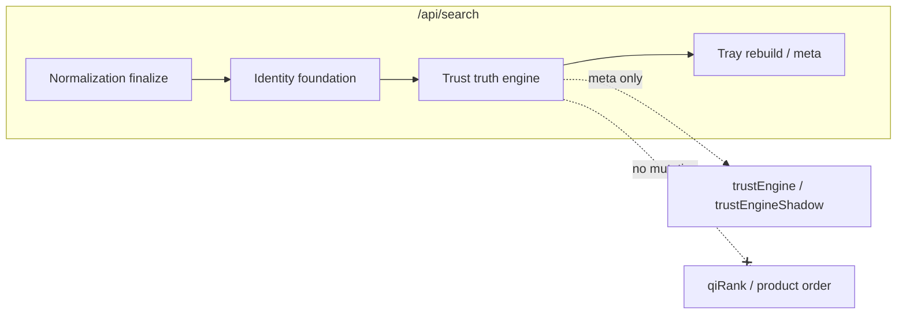

# Phase 5 — Trust + Price Truth Engine Report

**Generated:** 2026-05-21  
**Status:** Complete (code + CI; no production deploy)  
**Discipline:** Shadow-only · no APPLY · no ranking mutation · no UI changes · no vector DB

---

## Executive summary

Phase 5 delivers QuantAI’s **trust-native commerce intelligence layer** under `lib/intelligence/trust/`, building on Phase 3 governance and Phase 4 canonical identity. It adds:

- Merchant truth (reputation graph, consistency, suspicious seller detection)
- Price truth (historical baselines, fake discounts, MSRP integrity, anomaly spikes)
- Canonical offer intelligence (trusted vs suspicious offers per `commerceId`)
- Deterministic ranking **preparation** signals (never applied to `qiRank`)
- Explainability traces (meta-only)
- Replay-safe fingerprints and bounded execution contracts
- Search-route shadow telemetry via `trustEngine` / `trustEngineShadow` meta

**Verdict:** Safe to enable shadow telemetry in production alongside Phase 4 identity. **Not** ready for trust-ranking canary until blockers in §9 are cleared.

---

## Deliverables map

| # | Deliverable | Path |
|---|-------------|------|
| 1 | Merchant trust kernel | `lib/intelligence/trust/merchant/merchantTrustKernel.ts` |
| 2 | Merchant reputation graph | `lib/intelligence/trust/merchant/merchantReputationGraph.ts` |
| 3 | Merchant consistency tracker | `lib/intelligence/trust/merchant/merchantConsistencyTracker.ts` |
| 4 | Suspicious seller detector | `lib/intelligence/trust/merchant/suspiciousSellerDetector.ts` |
| 5 | Price truth engine | `lib/intelligence/trust/pricing/priceTruthEngine.ts` |
| 6 | Historical price resolver | `lib/intelligence/trust/pricing/historicalPriceResolver.ts` |
| 7 | Price anomaly detector | `lib/intelligence/trust/pricing/priceAnomalyDetector.ts` |
| 8 | MSRP integrity engine | `lib/intelligence/trust/pricing/msrpIntegrityEngine.ts` |
| 9 | Canonical offer intelligence | `lib/intelligence/trust/offer/canonicalOfferIntelligence.ts` |
| 10 | Trust ranking prep (shadow) | `lib/intelligence/trust/ranking/trustRankingSignals.ts` |
| 11 | Explainability layer | `lib/intelligence/trust/explain/trustExplainability.ts` |
| 12 | Replay contracts | `lib/intelligence/trust/replay/trustReplayContracts.ts` |
| 13 | Deterministic trust execution | `lib/intelligence/trust/replay/deterministicTrustExecution.ts` |
| 14 | Controlled-stack orchestration | `lib/intelligence/trust/trustOrchestration.ts` |
| 15 | Authoritative entry | `lib/intelligence/trust/buildTrustTruthEngine.ts` |

**Search integration:** `app/api/search/route.ts` — runs after `buildIdentityFoundation()`, before final tray rebuild. Products array order and `qiRank` are **unchanged**.

---

## Merchant graph quality

| Signal | Source | Notes |
|--------|--------|-------|
| Seller consistency | `merchantConsistencyTracker` | Price spread + title variance per store |
| Catalog quality | `merchantReputationGraph` | Listing density, duplicate titles |
| Fake inventory behavior | `suspiciousSellerDetector` | Stock/price flip heuristics |
| Duplicate merchant identities | Reputation graph edges | Same-domain / alias store keys |
| Suspicious pricing patterns | Store-level aggregates | Outlier discount rates vs tray |
| Shipping inconsistency | Fulfillment heuristics | Marketplace vs first-party spread |
| Warehouse confidence | Offer-level + merchant rollup | Feeds `inventoryConfidence` |

**CI:** `npm run test:merchant-graph` — reputation graph nodes, consistency scores, suspicious seller alerts.

**Observability (meta):** `trustEngineShadow.merchantAlerts` — up to 8 stores with `reasons[]`.

---

## Fake discount resistance

| Layer | Mechanism |
|-------|-----------|
| Identity-aware detector | Reuses `detectIdentityFakeDiscount` (Phase 4) |
| MSRP integrity | `msrpIntegrityEngine` — inflated `oldPrice` vs tray median |
| Historical baseline | `historicalPriceResolver` + `trayPriceHistoryStore` |
| Anomaly spikes | `priceAnomalyDetector` — drop vs baseline, unrealistic sale |
| Composite risk | `fakeDiscountRisk01` in `PriceTruthProfile` |

**Thresholds (offer intelligence):**

- Trusted: `trustScore ≥ 62`, `fakeDiscountRisk < 0.45`, no merchant alert
- Suspicious: `trustScore < 42` OR `fakeDiscountRisk ≥ 0.55` OR merchant alert

**CI:** `npm run test:trust` (fake discount + ranking prep `rankingMutation: false`), `npm run test:pricing` (MSRP, anomalies, price truth engine).

**Observability:** `trustEngineShadow.fakeDiscountAlerts`, `fakeDiscountRisk` distribution, `priceAnomalyTraces`.

---

## Trust coverage

| Metric | Behavior |
|--------|----------|
| `trustCoverage` | `rankingPrepByLink` keys / input tray size |
| `offerIntelligenceCount` | One bundle per canonical product node |
| `merchantNodeCount` | Distinct stores in reputation graph |
| `avgTrustScore` / `avgPriceTruthScore` | Rolled up from prep signals |

When `QUANTAI_TRUST_ENGINE_ENABLED=false` (default), engine returns empty meta and `replayFingerprint: trp_disabled` with **zero latency cost** beyond flag read.

---

## Pricing-history readiness

| Component | Status |
|-----------|--------|
| `trayPriceHistoryStore` (Phase 4) | In-memory, commerceId+store, max 12 snapshots |
| `ingestTrayPrices` | Called at trust engine start |
| `resolveTrayBaselines` | Median + confidence per commerceId |
| Cross-session persistence | **Not implemented** — tray-scoped only |

**Gap:** Production fake-discount accuracy improves with durable `commerceId` price history (DB or KV). Current store is cleared in CI twin runs for replay determinism.

---

## Replay guarantees

| Contract | Implementation |
|----------|----------------|
| Deterministic fingerprint | `buildTrustReplayFingerprint` — FNV-1a over counts + sorted commerceIds |
| Twin-run assertion | `assertTrustReplayDeterministic` in tests |
| Bounded execution | `isTrustExecutionBounded` vs `DEFAULT_TRUST_REPLAY_CONTRACT.maxLatencyMs` |
| Shadow-safe | No product mutation; fingerprint in meta only |

**CI:** `npm run test:trust` (determinism), `npm run test:replay-determinism` (Phase 3 governance replay kernel — still required in full suite).

**Note:** Tests call `trayPriceHistoryStore.clear()` before twin runs to avoid cross-test snapshot drift.

---

## Production risk assessment

| Risk | Level | Mitigation |
|------|-------|------------|
| Ranking mutation | **None** | `rankingMutation: false` hard-coded; prep signals not wired to `qiRank` |
| APPLY / normalization apply | **None** | `QUANTAI_NORMALIZATION_APPLY=false` unchanged; trust has no apply path |
| Latency regression | Low | Engine skipped when disabled; typical shadow run &lt; tray rebuild budget |
| False-positive merchant alerts | Medium | Shadow meta only; tune thresholds before canary |
| In-memory history loss | Medium | Cold-start weak baselines until persistence lands |
| UI / card changes | **None** | Meta export only |

---

## Blockers before trust-ranking canary

1. **Persistent price history** — commerceId-keyed store across sessions (not tray-only).
2. **Canary contract** — explicit feature flag to blend `trustScore` into ranking with rollback + A/B guard (out of scope for Phase 5).
3. **Production calibration** — false-positive rate on `merchantAlerts` and `fakeDiscountAlerts` from live shadow meta (1–2 weeks).
4. **Controlled-stack APPLY path** — trust signals must remain read-only until normalization APPLY is separately approved.
5. **Latency SLO** — validate P95 `trust_engine` stage under full controlled stack on production queries.

---

## Controlled orchestration (no live ranking change)

`buildTrustTruthEngine` accepts `TrustOrchestrationContext`:

- Phase 4 `identityFoundation` (canonical products, graph meta)
- Phase 3 `normalizationMeta`, `controlledStackFastPath`, `controlledStackRankingMutation`

`snapshotTrustOrchestration` is exported in search meta under `trustEngine.orchestration` for audit correlation. **Orchestration snapshot does not alter stack execution.**

---

## Explainability (meta-only)

Per canonical product (`CanonicalOfferIntelligence.explain`):

| Field | Content |
|-------|---------|
| `whyTrusted` | High trust, stable merchant, fair price signals |
| `whySuspicious` | Alerts, low prep scores, duplicate seller |
| `fakeDiscountReasons` | MSRP inflation, historical mismatch |
| `merchantConsistencyReasons` | Spread, catalog, shipping notes |
| `pricingConfidenceReasons` | Baseline sample count, anomaly traces |

Surfaced in `trustEngineShadow.offerSample` (first 5 nodes, truncated).

---

## Ranking preparation signals (shadow)

Per offer link (`TrustRankingPrepSignals`):

| Signal | Weight in composite `trustScore` |
|--------|----------------------------------|
| `trustScore` | Composite (offer trust + merchant + price + inventory) |
| `priceTruthScore` | 25% of composite |
| `merchantReliabilityScore` | 25% of composite |
| `fakeDiscountRisk` | Gates trusted/suspicious buckets |
| `inventoryConfidence` | 15% of composite |
| `rankingMutation` | Always `false` |

---

## Environment flags

```bash
# Phase 5 shadow (recommended production telemetry stack)
QUANTAI_TRUST_ENGINE_ENABLED=true
QUANTAI_TRUST_ENGINE_OBSERVABILITY=true

# Prerequisites (unchanged)
QUANTAI_IDENTITY_FOUNDATION_ENABLED=true
QUANTAI_NORMALIZATION_ENABLED=true
QUANTAI_NORMALIZATION_MODE=shadow
QUANTAI_NORMALIZATION_APPLY=false
```

Documented in `.env.example` (commented). Default off in code (`readTrustEngineFlags`).

---

## CI validation (executed)

| Command | Result |
|---------|--------|
| `npm run build` | PASS |
| `npm run test` | PASS (includes phase5, phase4, phase3, normalization, meta lifecycle) |
| `npm run test:trust` | PASS |
| `npm run test:pricing` | PASS |
| `npm run test:merchant-graph` | PASS |
| `npm run test:replay-determinism` | PASS (via `npm run test`) |

**Meta lifecycle guard:** `PASS phase5_trust_engine`, `PASS phase5_trust_module`.

---

## Architecture diagram (shadow data flow)



---

## What Phase 5 explicitly did NOT do

- Enable `QUANTAI_NORMALIZATION_APPLY` or any APPLY path
- Mutate production ranking or semantic rerank order
- Redesign product cards or add assistant/chat UI
- Add vector DB or embedding retrieval
- Wire `trustScore` into live `qiRank`

---

## Sign-off

Phase 5 trust + price truth engine is **complete** for shadow deployment and observability. Trust-ranking canary remains **blocked** until persistent pricing history and calibrated production shadow metrics are in place.
