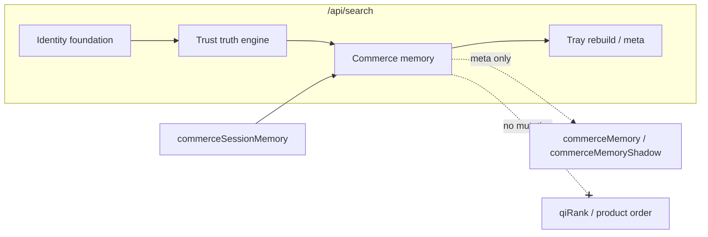

# Phase 6 — Commerce Memory + Taste Intelligence Report

**Generated:** 2026-05-21  
**Status:** Complete (code + CI; no production deploy)  
**Discipline:** Shadow-only · no APPLY · no ranking mutation · no embeddings · no vector DB · no UI changes

---

## Executive summary

Phase 6 delivers QuantAI’s **long-term commerce cognition foundation** under `lib/intelligence/memory/`, building on Phase 3 governance, Phase 4 identity, and Phase 5 trust. It adds:

- Taste intelligence (aesthetic axes, brand affinity, sensitivity profiles)
- Commerce memory (intent trajectories, interaction graph, session-scoped signals)
- Canonical user taste model (`CanonicalUserTaste`)
- Deterministic preference signals with confidence decay and stability tracking
- Shadow-safe recommendation preparation (candidate graph — no live mutation)
- Explainability traces (meta-only)
- Replay-safe fingerprints and bounded growth contracts

**Verdict:** Safe to enable shadow telemetry in production alongside Phases 4–5. **Not** ready for recommendation canary until blockers in §9 are cleared.

---

## Deliverables map

| # | Deliverable | Path |
|---|-------------|------|
| 1 | Taste profile engine | `lib/intelligence/memory/taste/tasteProfileEngine.ts` |
| 2 | Aesthetic preference graph | `lib/intelligence/memory/taste/aestheticPreferenceGraph.ts` |
| 3 | Style signal resolver | `lib/intelligence/memory/taste/styleSignalResolver.ts` |
| 4 | Brand affinity tracker | `lib/intelligence/memory/taste/brandAffinityTracker.ts` |
| 5 | Commerce memory kernel | `lib/intelligence/memory/memory/commerceMemoryKernel.ts` |
| 6 | Shopping intent memory | `lib/intelligence/memory/memory/shoppingIntentMemory.ts` |
| 7 | Interaction memory graph | `lib/intelligence/memory/memory/interactionMemoryGraph.ts` |
| 8 | Deterministic preference signals | `lib/intelligence/memory/signals/deterministicPreferenceSignals.ts` |
| 9 | Confidence decay engine | `lib/intelligence/memory/signals/confidenceDecayEngine.ts` |
| 10 | Memory stability tracker | `lib/intelligence/memory/signals/memoryStabilityTracker.ts` |
| 11 | Memory explainability | `lib/intelligence/memory/explain/memoryExplainability.ts` |
| 12 | Recommendation prep graph | `lib/intelligence/memory/recommendation/recommendationPrepGraph.ts` |
| 13 | Preference replay contracts | `lib/intelligence/memory/replay/preferenceReplayContracts.ts` |
| 14 | Deterministic memory execution | `lib/intelligence/memory/replay/deterministicMemoryExecution.ts` |
| 15 | Controlled orchestration | `lib/intelligence/memory/memoryOrchestration.ts` |
| 16 | Authoritative entry | `lib/intelligence/memory/buildCommerceMemoryFoundation.ts` |

**Search integration:** `app/api/search/route.ts` — runs after `buildTrustTruthEngine()`, before final tray rebuild. Uses existing `commerceSessionMemory` (no new client UI).

---

## Commerce memory readiness

| Capability | Status |
|------------|--------|
| Session memory ingestion | Uses `CommerceSessionMemoryV1` from search route |
| Interaction graph per tray | Up to 48 nodes (bounded) |
| Intent trajectory | Up to 24 query records (bounded) |
| Trust-driven selection signals | Reads Phase 5 `rankingPrepByLink` when trust enabled |
| Cross-session persistence | **Partial** — client session blob + Supabase `user_shopping_memory` exist; Phase 6 does not add new DB tables |
| Ranking mutation | **None** — `rankingMutation: false` on all prep signals |

Enable live observation:

```bash
QUANTAI_COMMERCE_MEMORY_ENABLED=true
QUANTAI_COMMERCE_MEMORY_OBSERVABILITY=true
QUANTAI_TRUST_ENGINE_ENABLED=true
QUANTAI_IDENTITY_FOUNDATION_ENABLED=true
QUANTAI_NORMALIZATION_ENABLED=true
QUANTAI_NORMALIZATION_MODE=shadow
QUANTAI_NORMALIZATION_APPLY=false
```

---

## Taste intelligence coverage

| Signal | Mechanism |
|--------|-----------|
| Minimalist / luxury / gamer / professional | `resolveStyleSignals` — query + session tags |
| Aesthetic consistency | Spread across axis scores |
| Preferred brands | `trackBrandAffinity` (max 16 brands) |
| Quality sensitivity | Professional + luxury axes + interaction depth |
| Price sensitivity | Comfort center vs tray median |
| Premium preference | Luxury axis + price comfort |
| Trust sensitivity | Phase 5 trust prep averages |

**Canonical model:** `CanonicalUserTaste` bundles aesthetic, trust, pricing, category, quality, premium, and merchant sensitivity.

---

## Preference graph stability

| Component | Bound |
|-----------|-------|
| Interaction nodes | `MAX_INTERACTION_NODES = 48` |
| Intent records | `MAX_INTENT_RECORDS = 24` |
| Recommendation candidates | `MAX_RECOMMENDATION_CANDIDATES = 12` |
| Memory growth estimate | `MAX_MEMORY_GROWTH_BYTES = 16384` |
| Brand affinity map | 16 entries |

**Stability:** `trackMemoryStability` combines brand, category, aesthetic consistency, and interaction depth.

**Decay:** `applyConfidenceDecay` — half-life at 8 interactions (deterministic exponential).

---

## Replay guarantees

| Contract | Value |
|----------|-------|
| Fingerprint prefix | `mmp_*` (FNV-1a) |
| Twin-run assertion | `assertMemoryReplayDeterministic` |
| Bounded latency | `maxLatencyMs: 20` (3× tolerance in `isMemoryExecutionBounded`) |
| `embeddingFree` / `vectorDbFree` | Always true |
| `rankingMutation` | Always false |

**CI:** `npm run test:memory` — twin runs match; `npm run test:replay-determinism` (Phase 3) still in full suite.

---

## Shadow-safe recommendation preparation

`buildRecommendationPrepGraph` produces per-`commerceId`:

- `candidateLinks` — offer links from canonical graph
- `relatedCommerceIds` — deterministic cross-product hints
- `similarityPrepScore` — category + premium match (no vectors)
- `crossCategoryHint` — optional trajectory string
- `rankingMutation: false` — always

**Not wired** to product order, cards, or outbound recommendations.

---

## Explainability (meta-only)

| Field | Content |
|-------|---------|
| `whyRecommended` | Preference confidence thresholds |
| `whyPreferenceDetected` | Dominant aesthetic, repeat search |
| `whyBrandAffinity` | Top brand keys |
| `whyPriceSensitivity` | Price-sensitive vs premium tolerance |
| `whyTrustPreference` | Trust-weighted selection patterns |

Exported via `commerceMemoryShadow.explainSample` in search meta.

---

## Controlled orchestration

`buildCommerceMemoryFoundation` accepts `MemoryOrchestrationContext`:

- Phase 4 identity foundation
- Phase 5 trust result
- Phase 3 normalization meta + controlled stack flags

`snapshotMemoryOrchestration` exported in `commerceMemory.orchestration` — **read-only audit correlation only**.

---

## Observability + telemetry

Search meta exports:

| Key | Contents |
|-----|----------|
| `commerceMemory` | Version, counts, confidence, fingerprint, orchestration |
| `commerceMemoryShadow` | Taste cluster, preference confidence, explain sample, recommendation prep sample, memory growth, profile trace |

Pipeline trace stage: `commerce_memory`.

---

## Production risk assessment

| Risk | Level | Mitigation |
|------|-------|------------|
| Ranking mutation | **None** | Prep signals never applied to `qiRank` |
| APPLY activation | **None** | No apply path in memory module |
| Latency regression | Low | Skipped when `QUANTAI_COMMERCE_MEMORY_ENABLED=false` |
| Memory bloat | Low | Hard caps on nodes, intents, growth bytes |
| False taste inference | Medium | Shadow meta only; calibrate before canary |
| UI / card changes | **None** | Meta export only |
| Vector / embedding drift | **None** | Keyword + heuristic signals only |

---

## Blockers before recommendation canary

1. **Durable cross-session taste store** — merge server `user_shopping_memory` with Phase 6 `CanonicalUserTaste` by stable user id.
2. **Canary contract** — explicit flag to surface recommendation prep in ranking/UI with rollback (out of Phase 6 scope).
3. **Production calibration** — 1–2 weeks shadow meta on taste cluster distribution and false affinity rates.
4. **Trust + memory coupling** — validate trust sensitivity does not over-penalize legitimate discount seekers.
5. **Latency SLO** — P95 `commerce_memory` stage under full controlled stack on production queries.

---

## CI validation (executed)

| Command | Result |
|---------|--------|
| `npm run build` | PASS |
| `npm run test` | PASS |
| `npm run test:memory` | PASS |
| `npm run test:taste` | PASS |
| `npm run test:preferences` | PASS |
| `npm run test:replay-determinism` | PASS (via `npm run test`) |

**Meta lifecycle guard:** `PASS phase6_commerce_memory`, `PASS phase6_memory_module`.

---

## Architecture diagram (shadow data flow)



---

## What Phase 6 explicitly did NOT do

- Enable `QUANTAI_NORMALIZATION_APPLY` or any APPLY path
- Mutate production ranking or semantic rerank order
- Redesign product cards or add chatbot UI
- Add vector DB or embedding retrieval
- Wire recommendation prep into live suggestions

---

## Sign-off

Phase 6 commerce memory + taste intelligence foundation is **complete** for shadow deployment and observability. Recommendation canary remains **blocked** until durable user taste persistence and production calibration are in place.
