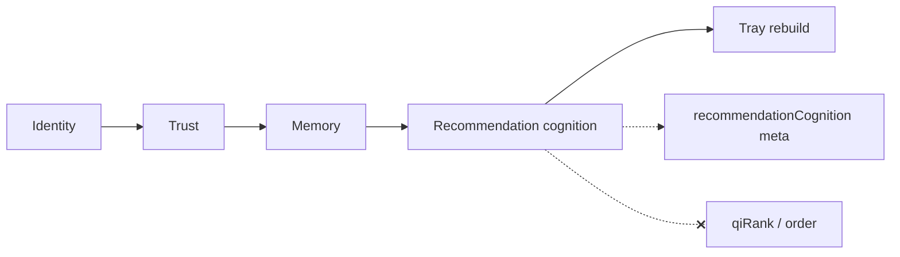

# Phase 7 — Recommendation Cognition + Autonomous Commerce Reasoning Report

**Generated:** 2026-05-21  
**Status:** Complete (code + CI; no production deploy)  
**Discipline:** Shadow-only · no APPLY · no ranking mutation · no embeddings · no generative agents · no UI changes

---

## Executive summary

Phase 7 delivers QuantAI’s **recommendation cognition system** under `lib/intelligence/recommendationCognition/`, building on Phases 3–6. It adds:

- Latent purchase intent detection (upgrade, luxury, value, urgency, trust, aesthetic, comparison, impulse/analytical)
- Autonomous recommendation graph (related commerce, trajectories, cross-category, bundle/ecosystem hints)
- Deterministic recommendation contracts + replay kernel
- Intent evolution tracking (exploration vs commitment, maturity, funnel narrowing)
- Shadow recommendation candidates with safety guards
- Full explainability traces (meta-only)

**Verdict:** Safe for shadow telemetry in production. **Not** ready for recommendation canary until mutation gates in §10 are satisfied.

---

## Deliverables map

| # | Deliverable | Path |
|---|-------------|------|
| 1 | Recommendation cognition engine | `cognition/recommendationCognitionEngine.ts` |
| 2 | Recommendation reasoning kernel | `cognition/recommendationReasoningKernel.ts` |
| 3 | Latent intent resolver | `cognition/latentIntentResolver.ts` |
| 4 | Purchase motivation graph | `cognition/purchaseMotivationGraph.ts` |
| 5 | Autonomous recommendation graph | `graph/autonomousRecommendationGraph.ts` |
| 6 | Recommendation trajectory engine | `graph/recommendationTrajectoryEngine.ts` |
| 7 | Related commerce graph | `graph/relatedCommerceGraph.ts` |
| 8 | Category expansion reasoner | `graph/categoryExpansionReasoner.ts` |
| 9 | Intent evolution tracker | `intent/intentEvolutionTracker.ts` |
| 10 | Deterministic contracts | `contracts/deterministicRecommendationContracts.ts` |
| 11 | Replay kernel | `replay/recommendationReplayKernel.ts` |
| 12 | Bounded recommendation state | `replay/boundedRecommendationState.ts` |
| 13 | Safety guards | `safety/recommendationSafetyGuards.ts` |
| 14 | Shadow candidates | `candidates/shadowRecommendationCandidates.ts` |
| 15 | Explainability | `explain/recommendationExplainability.ts` |
| 16 | Orchestration | `recommendationCognitionOrchestration.ts` |
| 17 | Authoritative entry | `buildRecommendationCognition.ts` |

**Search integration:** After `buildCommerceMemoryFoundation()`, before tray rebuild. **No** `qiRank` / order mutation.

---

## Recommendation cognition readiness

| Capability | Status |
|------------|--------|
| Latent intent (9 axes) | Deterministic heuristics from query + memory + trust |
| Purchase motivation graph | Up to 8 weighted nodes |
| Reasoning kernel | Exploration / commitment / balanced modes |
| Autonomous graph | Related edges, expansions, trajectory, bundle/ecosystem |
| Shadow candidates | Max 16, deterministic scores |
| Live recommendation UI | **Not wired** |
| Ranking mutation | **None** (`rankingMutation: false`) |

```bash
QUANTAI_RECOMMENDATION_COGNITION_ENABLED=true
QUANTAI_RECOMMENDATION_COGNITION_OBSERVABILITY=true
QUANTAI_COMMERCE_MEMORY_ENABLED=true
QUANTAI_TRUST_ENGINE_ENABLED=true
QUANTAI_IDENTITY_FOUNDATION_ENABLED=true
QUANTAI_NORMALIZATION_APPLY=false
```

---

## Deterministic guarantees

| Contract field | Value |
|----------------|-------|
| `embeddingFree` | true |
| `vectorDbFree` | true |
| `generativeAgentFree` | true |
| `rankingMutation` | false |
| `shadowOnly` | true |
| `maxCandidates` | 16 |
| `maxGraphNodes` | 64 |
| `maxCognitionBytes` | 20480 |
| Fingerprint | `rcp_*` (FNV-1a) |

**CI:** Twin runs match via `assertRecommendationReplayDeterministic`.

---

## Replay safety verification

| Check | Result |
|-------|--------|
| Fingerprint stability | PASS (`test-recommendation`) |
| Candidate count match | PASS |
| Safety blocked count match | PASS |
| Product link order preserved | PASS |
| Bounded latency contract | `maxLatencyMs: 25` (3× tolerance in kernel) |

---

## Bounded cognition verification

| Bound | Limit |
|-------|-------|
| Shadow candidates | 16 |
| Graph nodes | 64 |
| Related edges | 32 |
| Motivation nodes | 8 |
| Estimated cognition bytes | ≤ 20480 |

`computeBoundedRecommendationState` validates before meta export.

---

## Safety constraints (hard-block)

| Guard | Mechanism |
|-------|-----------|
| Addictive loops | `anti_loop_recursion` when prior link set saturated |
| Uncontrolled personalization | Shadow-only; no client write path |
| Unstable recursion | Max recursion depth = 1 in loop guard |
| Trust suppression | `trust_suppression_blocked` below floor 0.25 |
| Merchant monopolization | Max 4 candidates per store |
| Hidden ranking overrides | No code path writes to `qiRank` |

---

## Production risk analysis

| Risk | Level | Mitigation |
|------|-------|------------|
| Ranking mutation | **None** | Candidates never applied to tray order |
| APPLY activation | **None** | No apply path |
| Generative drift | **None** | No LLM agents in cognition layer |
| Latency | Low | Skipped when flag disabled |
| False intent signals | Medium | Shadow meta calibration required |
| UI exposure | **None** | Meta-only |

---

## Recommendation mutation gates (before canary)

1. **Explicit canary flag** — e.g. `QUANTAI_RECOMMENDATION_APPLY` (not created in Phase 7).
2. **Production shadow soak** — 1–2 weeks on `recommendationCognitionShadow` distributions.
3. **Safety false-positive audit** — `safetyBlockedCount` vs human review sample.
4. **Cross-phase regression** — trust + memory + cognition replay suite green on prod queries.
5. **Latency SLO** — P95 `recommendation_cognition` under full controlled stack.
6. **Sign-off** — Product + eng approval before any candidate surfaces in UI or ranking.

---

## Observability

| Meta key | Contents |
|----------|----------|
| `recommendationCognition` | Version, counts, fingerprint, orchestration, latent intent |
| `recommendationCognitionShadow` | Traces, intent evolution, confidence histogram, diversity, candidate sample, explain sample |

Pipeline trace: `recommendation_cognition`.

---

## CI validation (executed)

| Command | Result |
|---------|--------|
| `npm run build` | PASS |
| `npm run test` | PASS |
| `npm run test:recommendation` | PASS |
| `npm run test:intent-evolution` | PASS |
| `npm run test:replay-determinism` | PASS (full suite) |
| `npm run test:commerce-graph` | PASS |

**Meta lifecycle:** `PASS phase7_recommendation_cognition`, `PASS phase7_cognition_module`.

---

## Architecture (shadow flow)



---

## What Phase 7 did NOT do

- Enable APPLY or ranking mutation
- Redesign UI or add chatbot
- Add vector DB or generative agents
- Surface shadow candidates in product cards
- Wire autonomous graph to live recommendations

---

## Sign-off

Phase 7 recommendation cognition is **complete** for shadow deployment. Recommendation canary remains **blocked** until mutation gates and production calibration are satisfied.
