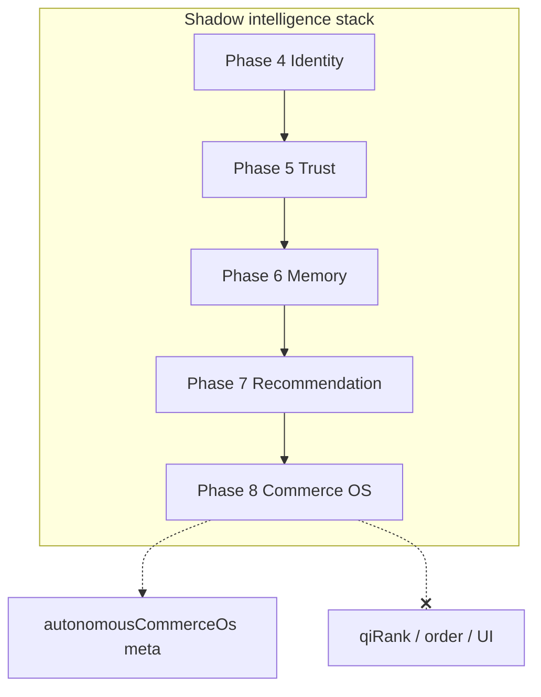

# Phase 8 — Autonomous Commerce Operating System Report

**Generated:** 2026-05-21  
**Status:** Complete (code + CI; no production deploy)  
**Discipline:** Shadow-only · no APPLY · no ranking mutation · no embeddings · no autonomous agents · no UI changes

---

## Executive summary

Phase 8 delivers QuantAI’s **bounded autonomous commerce operating system** under `lib/intelligence/autonomousCommerce/`, unifying Phases 4–7 into a deterministic cognition orchestration layer:

- Market awareness (seasonal demand, pricing pressure, scarcity, volatility, anomalies, momentum, launch cycles, saturation)
- Economic context (inflation sensitivity, premium compression, value migration, regional dynamics, affordability)
- Autonomous commerce kernel + bounded strategy engine + deterministic planner
- Canonical commerce intelligence graph (trust + memory + recommendation + market + economic)
- Strategic recommendation layers (upgrade timing, ecosystem completion, replacement cycle — shadow only)
- Commerce safety governance (anti-manipulation, anti-monopoly, trust floor)

**Verdict:** Safe for shadow telemetry. **Not** ready for autonomous recommendation canary until governance gates in §10 pass.

> **Naming note:** Phase 8 `market/marketAwarenessEngine.ts` is **shadow cognition only** and does not replace `lib/intelligence/marketAwareness.ts` (existing tray ranking helper).

---

## Deliverables map

| # | Deliverable | Path |
|---|-------------|------|
| 1 | Market awareness engine | `market/marketAwarenessEngine.ts` |
| 2 | Market condition resolver | `market/marketConditionResolver.ts` |
| 3 | Commerce environment graph | `market/commerceEnvironmentGraph.ts` |
| 4 | Trend pressure analyzer | `market/trendPressureAnalyzer.ts` |
| 5 | Autonomous commerce kernel | `orchestrator/autonomousCommerceKernel.ts` |
| 6 | Commerce decision orchestrator | `orchestrator/commerceDecisionOrchestrator.ts` |
| 7 | Bounded strategy engine | `orchestrator/boundedStrategyEngine.ts` |
| 8 | Deterministic commerce planner | `orchestrator/deterministicCommercePlanner.ts` |
| 9 | Economic signal interpreter | `economic/economicSignalInterpreter.ts` |
| 10 | Pricing climate analyzer | `economic/pricingClimateAnalyzer.ts` |
| 11 | Affordability context engine | `economic/affordabilityContextEngine.ts` |
| 12 | Regional commerce dynamics | `economic/regionalCommerceDynamics.ts` |
| 13 | Canonical commerce intelligence graph | `graph/canonicalCommerceIntelligenceGraph.ts` |
| 14 | Autonomous recommendation strategy | `strategy/autonomousRecommendationStrategy.ts` |
| 15 | Commerce safety governance | `governance/commerceSafetyGovernance.ts` |
| 16 | Explainability | `explain/commerceOsExplainability.ts` |
| 17 | Replay contracts | `replay/orchestrationReplayContracts.ts` |
| 18 | Deterministic orchestration execution | `replay/deterministicOrchestrationExecution.ts` |
| 19 | Authoritative entry | `buildAutonomousCommerceOs.ts` |

**Search pipeline:** Identity → Trust → Memory → Recommendation cognition → **Autonomous commerce OS** → tray rebuild.

---

## Autonomous commerce readiness

| Capability | Status |
|------------|--------|
| Market cognition | 8 condition axes + environment graph |
| Economic cognition | 6 economic axes + pricing climate |
| Strategic layers | Max 6, `rankingMutation: false` |
| Unified cognition graph | Max 24 nodes across layers |
| Ranking / qiRank mutation | **None** |
| Generative agents | **None** |
| Vector retrieval | **None** |

```bash
QUANTAI_AUTONOMOUS_COMMERCE_OS_ENABLED=true
QUANTAI_AUTONOMOUS_COMMERCE_OS_OBSERVABILITY=true
QUANTAI_RECOMMENDATION_COGNITION_ENABLED=true
QUANTAI_COMMERCE_MEMORY_ENABLED=true
QUANTAI_TRUST_ENGINE_ENABLED=true
QUANTAI_NORMALIZATION_APPLY=false
```

---

## Orchestration safety verification

| Guard | Mechanism |
|-------|-----------|
| Trust suppression | Block scarcity layers when avg trust below floor |
| Merchant favoritism | Flag low volatility + high layer count |
| Economic exploitation | Block value-retention when discount anomaly ≥ 0.7 |
| Unstable recursion | Cap allowed layers at 6 |
| Hidden ranking mutation | No code path mutates products array order |

---

## Bounded cognition verification

| Bound | Limit |
|-------|-------|
| Cognition graph nodes | 24 |
| Strategy layers | 6 |
| Environment nodes | 16 |
| Cognition bytes | 24576 |
| Replay fingerprint | `aco_*` |

---

## Replay guarantees

| Check | CI |
|-------|-----|
| Twin-run fingerprint | `test-commerce-orchestration` |
| Contract validation | `DEFAULT_ORCHESTRATION_REPLAY_CONTRACT` |
| Link order preserved | commerce orchestration test |
| Phase 3 replay kernel | `test:replay-determinism` in full suite |

---

## Production risk analysis

| Risk | Level | Mitigation |
|------|-------|------------|
| Ranking mutation | **None** | Shadow meta only |
| APPLY | **None** | No apply path |
| Agent drift | **None** | `agentFree: true` contract |
| Latency | Low | Skipped when flag off |
| Market false positives | Medium | Shadow calibration required |
| Confusion with ranking `marketAwareness` | Low | Separate module path |

---

## Blockers before autonomous recommendation canary

1. **Explicit mutation gate** — `QUANTAI_AUTONOMOUS_COMMERCE_APPLY` (not created).
2. **Production shadow soak** — 2+ weeks on `autonomousCommerceOsShadow`.
3. **Safety audit** — human review of `safetyBlockedCount` vs ground truth.
4. **Cross-phase replay** — full stack replay on prod query sample.
5. **Latency SLO** — P95 `autonomous_commerce_os` stage.
6. **Governance sign-off** — checklist below.

---

## Governance gate checklist

- [ ] `QUANTAI_NORMALIZATION_APPLY=false` in production
- [ ] No `qiRank` wiring from Phase 8 outputs
- [ ] No UI/card changes from OS meta
- [ ] Trust floor violations reviewed (< 0.2 avg trust scenarios)
- [ ] Discount anomaly blocks calibrated
- [ ] Replay twin-run green on golden + prod sample
- [ ] Executive sign-off for canary flag creation

---

## Observability

| Meta key | Contents |
|----------|----------|
| `autonomousCommerceOs` | Version, graph/layer counts, fingerprint, orchestration |
| `autonomousCommerceOsShadow` | Market traces, economic telemetry, orchestration metrics, strategic telemetry, explain sample, bounded cognition |

Pipeline trace: `autonomous_commerce_os`.

---

## CI validation (executed)

| Command | Result |
|---------|--------|
| `npm run build` | PASS |
| `npm run test` | PASS |
| `npm run test:market-awareness` | PASS |
| `npm run test:economic-context` | PASS |
| `npm run test:commerce-orchestration` | PASS |
| `npm run test:replay-determinism` | PASS (full suite) |
| `npm run test:governance-safety` | PASS |

**Meta lifecycle:** `PASS phase8_autonomous_commerce_os`, `PASS phase8_commerce_os_module`.

---

## Architecture (shadow stack)



---

## What Phase 8 did NOT do

- Enable APPLY or mutate ranking
- Redesign UI or add chatbot
- Add vector DB or generative agents
- Replace existing `applyMarketAwarenessRanking` behavior
- Wire strategic layers to live recommendations

---

## Sign-off

Phase 8 autonomous commerce OS is **complete** for shadow deployment. Autonomous recommendation canary remains **blocked** until governance gates and production calibration are satisfied.
