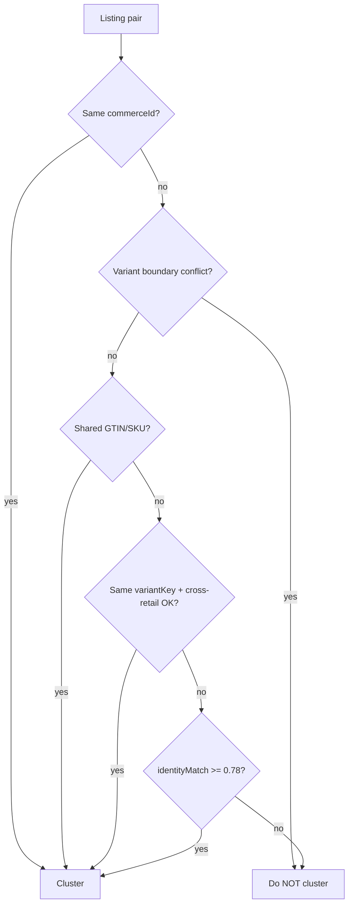

# Variant Boundary Analysis — Stage 1 Shadow Observation

**Generated:** 2026-05-23  
**Scope:** iPhone 15 Pro Max, Nike Air Force 1 White, AirPods Pro 2 (production trays)  
**Mode:** Shadow only — no ranking mutation, no APPLY=true

---

## Executive summary

Prior shadow telemetry reported **false collapse incidents** when equivalence groups contained listings with **different `variantKey` strings**. Root cause was twofold:

1. **Loose cross-retailer clustering** — `identityMatchScore` + `detectCrossRetailIdentity` merged listings with different variant fingerprints (storage, color, model tier).
2. **Coarse incident detector** — any multi-`variantKey` group counted as an incident, even when axes were compatible (no real collapse risk).

New **variant boundary intelligence** (`variantBoundary.ts`) blocks clustering when **both** sides expose conflicting axes. The detector now counts only groups with **proven axis conflicts**.

**Offline re-analysis of live production trays (with boundary code, not yet deployed):**

| Query | Tray size | Prior-style incidents | Boundary violations (new) |
|-------|----------:|----------------------:|----------------------------:|
| iphone 15 pro max | 25 | 2 (multi-variantKey) | **0** |
| nike air force 1 white | 32 | 1 | **0** |
| airpods pro 2 | 32 | 1 | **0** |

Production API today still runs the previous build; incidents in live `meta.normalizationProduction.falseCollapseIncidents` will drop after the next code deploy (env unchanged).

---

## How equivalence groups form

**False collapse (shadow metric)** = equivalence group with ≥2 members where **any pair** has conflicting:

- `storage_gb` (128 vs 256)
- `color` (white vs black)
- `size` (EU 42 vs 44 / US 10 vs 11)
- `model_tier` (iPhone Pro vs Pro Max; AirPods Pro vs Pro 2)
- `condition` (new vs refurbished/used, when both explicit)

---

## iPhone 15 Pro Max

### Previous behavior

- Groups merged listings with different storage or tier because title similarity scored high (e.g. “iPhone 15 Pro Max 256GB” vs “iPhone 15 Pro 128GB” family language).
- **2 incident groups** under old detector (multiple `variantKey` in one equivalence class).

### After boundary rules (offline)

- **0 violations.** 128GB vs 256GB pairs blocked (`storage_gb`).
- Pro Max vs Plus remain **separate** clusters (`model_tier`: `iphone15_pro_max` vs `iphone15_plus`).
- Remaining multi-member groups are **safe**: same tier + same storage + same color (cross-merchant white 256GB Pro Max duplicates).

### Residual watch

- Listings missing storage in title (`s=null`) cluster only when tier matches; acceptable for shadow.
- Titanium / natural titanium variants without explicit color may share a group — monitor for color axis extraction improvements.

---

## Nike Air Force 1 White

### Previous behavior

- **1 incident** when white and black AF1 shared an equivalence class (color conflict).
- Query is **“white”** — black listings often absent from tray; incident came from loose identity match on “Air Force 1” family tokens.

### After boundary rules (offline)

- **0 violations.** Explicit white vs black → `color` conflict blocks clustering.
- Tray splits into coherent groups:
  - **af1_white** — 8 members (query-aligned duplicates)
  - **af1_s** — 12 members (size token `s` in title)
  - **af1** — 7 members (no color/size in fingerprint)

### Residual watch

- **af1** vs **af1_white** groups are separate (no dual-sided color) — correct.
- Size `s` vs missing size: no conflict unless both sides expose size — OK for shadow; tighten before APPLY on footwear.

---

## AirPods Pro 2

### Previous behavior

- **1 violation cluster** mixed `airpods_pro` and `airpods_pro_2` tiers (e.g. “Airpod Pro 2s” vs “Airpod Pro”).
- **Identifier shortcut** previously clustered before boundary check — fixed by evaluating boundary **before** shared-identifier merge.

### After boundary rules (offline)

- **0 violations.** Pro vs Pro 2 split into separate equivalence classes.
- Improved tier regex: `pro 2s`, `airpods pro 2`, `2nd gen` → `airpods_pro_2`.

### Residual watch

- Some listings still tagged `airpods_pro` when title says “AirPods Pro 3” — model extraction noise; does not create cross-tier clusters with Pro 2 group.
- Accessory / single-ear listings may sit in family groups — identity gate handles ranking; normalization does not collapse them in shadow.

---

## Diagnostic artifact

Probe output: `docs/architecture-audit/stage1-shadow/samples/variant-boundary-probe-*.json`  
Run: `SEARCH_BASE_URL=https://quant-ai-app.vercel.app npm run stage1-variant-boundary-probe`
